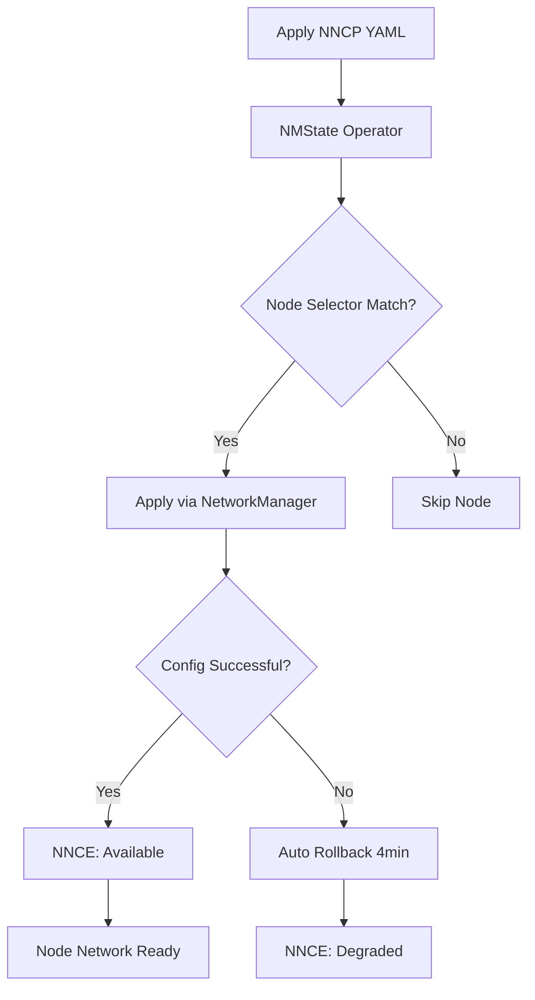

> 💡 **Quick Answer:** NodeNetworkConfigurationPolicy (NNCP) is a Kubernetes CRD from the NMState operator that declaratively configures host networking on worker nodes. Apply VLANs, bonds, bridges, MTU, static IPs, DNS, and SR-IOV interfaces across your cluster using YAML — no SSH required.

## The Problem

Configuring network interfaces on Kubernetes nodes traditionally requires SSH access, Ansible playbooks, or MachineConfig hacks. When you need VLANs for storage traffic, bonds for redundancy, jumbo frames for performance, or SR-IOV for GPU RDMA — managing this across 10, 50, or 500 nodes becomes a nightmare.

Changes are error-prone, inconsistent across nodes, and hard to roll back when something breaks.

## The Solution

### How NNCP Works

NNCP is part of the **kubernetes-nmstate** operator (included by default on OpenShift 4.x). It:

1. You apply a `NodeNetworkConfigurationPolicy` CR
2. NMState operator translates it to NetworkManager config on each matching node
3. Node reports status via `NodeNetworkConfigurationEnactment` (NNCE)
4. If config fails, **automatic rollback** within 4 minutes



### Prerequisites

```bash
# Verify NMState operator is installed
kubectl get pods -n openshift-nmstate
# NAME                                   READY   STATUS
# nmstate-handler-xxxxx                  1/1     Running  (one per node)
# nmstate-operator-xxxxx                 1/1     Running

# Check current node network state
kubectl get nns worker-0 -o yaml | head -50
```

### NNCP Anatomy

Every NNCP has the same structure:

```yaml
apiVersion: nmstate.io/v1
kind: NodeNetworkConfigurationPolicy
metadata:
  name: <descriptive-name>
spec:
  nodeSelector:                    # Which nodes to target
    node-role.kubernetes.io/worker: ""
  maxUnavailable: 1                # Rolling update strategy
  desiredState:                    # Desired network state (NMState format)
    interfaces:
    - name: <interface>
      type: <type>                 # ethernet, bond, vlan, linux-bridge, ovs-bridge
      state: up
      # ... type-specific config
```

### Example 1: VLAN on Physical Interface

```yaml
apiVersion: nmstate.io/v1
kind: NodeNetworkConfigurationPolicy
metadata:
  name: vlan100-storage
spec:
  nodeSelector:
    node-role.kubernetes.io/worker: ""
  desiredState:
    interfaces:
    - name: ens1f0.100
      type: vlan
      state: up
      vlan:
        base-iface: ens1f0
        id: 100
      ipv4:
        enabled: true
        dhcp: false
        address:
        - ip: 10.100.0.10
          prefix-length: 24
```

### Example 2: Active-Backup Bond

```yaml
apiVersion: nmstate.io/v1
kind: NodeNetworkConfigurationPolicy
metadata:
  name: bond0-redundancy
spec:
  nodeSelector:
    node-role.kubernetes.io/worker: ""
  desiredState:
    interfaces:
    - name: bond0
      type: bond
      state: up
      link-aggregation:
        mode: active-backup
        options:
          miimon: "100"
          primary: ens1f0
        port:
        - ens1f0
        - ens1f1
      ipv4:
        enabled: true
        dhcp: true
      mtu: 9000
```

### Example 3: Linux Bridge for VMs (KubeVirt)

```yaml
apiVersion: nmstate.io/v1
kind: NodeNetworkConfigurationPolicy
metadata:
  name: br-vms
spec:
  nodeSelector:
    node-role.kubernetes.io/worker: ""
  desiredState:
    interfaces:
    - name: br-vms
      type: linux-bridge
      state: up
      bridge:
        options:
          stp:
            enabled: false
        port:
        - name: ens2f0
      ipv4:
        enabled: false
```

### Example 4: Jumbo Frames (MTU 9000)

```yaml
apiVersion: nmstate.io/v1
kind: NodeNetworkConfigurationPolicy
metadata:
  name: mtu9000-storage-nics
spec:
  nodeSelector:
    network-role: storage
  desiredState:
    interfaces:
    - name: ens1f0
      type: ethernet
      state: up
      mtu: 9000
    - name: ens1f1
      type: ethernet
      state: up
      mtu: 9000
```

### Example 5: Static IP + DNS + Routes

```yaml
apiVersion: nmstate.io/v1
kind: NodeNetworkConfigurationPolicy
metadata:
  name: static-management
spec:
  nodeSelector:
    node-role.kubernetes.io/worker: ""
  desiredState:
    interfaces:
    - name: ens1f0
      type: ethernet
      state: up
      ipv4:
        enabled: true
        dhcp: false
        address:
        - ip: 192.168.1.10
          prefix-length: 24
    dns-resolver:
      config:
        server:
        - 10.0.0.1
        - 10.0.0.2
        search:
        - cluster.local
        - example.com
    routes:
      config:
      - destination: 10.200.0.0/16
        next-hop-address: 192.168.1.1
        next-hop-interface: ens1f0
```

### Example 6: VLAN on Bond (Production Pattern)

The most common production pattern — bond for redundancy, VLAN for isolation:

```yaml
apiVersion: nmstate.io/v1
kind: NodeNetworkConfigurationPolicy
metadata:
  name: bond0-vlan200-gpu-rdma
spec:
  nodeSelector:
    nvidia.com/gpu.present: "true"
  desiredState:
    interfaces:
    # Bond first
    - name: bond0
      type: bond
      state: up
      link-aggregation:
        mode: 802.3ad
        options:
          miimon: "100"
          lacp_rate: fast
          xmit_hash_policy: layer3+4
        port:
        - ens2f0np0
        - ens2f1np0
      mtu: 9000
    # VLAN on top of bond
    - name: bond0.200
      type: vlan
      state: up
      vlan:
        base-iface: bond0
        id: 200
      ipv4:
        enabled: true
        dhcp: false
        address:
        - ip: 10.200.0.10
          prefix-length: 24
      mtu: 9000
```

### Monitoring Enactments

```bash
# Check policy status
kubectl get nncp
# NAME                  STATUS      REASON
# bond0-redundancy      Available   SuccessfullyConfigured

# Check per-node enactment
kubectl get nnce
# NAME                                STATUS
# worker-0.bond0-redundancy           Available
# worker-1.bond0-redundancy           Available
# worker-2.bond0-redundancy           Progressing

# Debug a failed enactment
kubectl get nnce worker-2.bond0-redundancy -o jsonpath='{.status.conditions}' | jq .

# View the actual applied state on a node
kubectl get nns worker-0 -o jsonpath='{.status.currentState.interfaces}' | jq '.[] | select(.name=="bond0")'
```

### Safe Rollout with maxUnavailable

```yaml
spec:
  maxUnavailable: 1      # Only change 1 node at a time (safest)
  # maxUnavailable: 3    # 3 nodes at a time (faster)
  # maxUnavailable: 50%  # Half the matching nodes at a time
```

### Removing a Configuration

```yaml
# Set interface state to absent to remove it
apiVersion: nmstate.io/v1
kind: NodeNetworkConfigurationPolicy
metadata:
  name: remove-vlan100
spec:
  nodeSelector:
    node-role.kubernetes.io/worker: ""
  desiredState:
    interfaces:
    - name: ens1f0.100
      type: vlan
      state: absent
```

## Common Issues

**NNCE stuck in Progressing**

The NMState handler has a 4-minute timeout. If it can't apply the config, it auto-rolls back. Check `kubectl describe nnce <node>.<policy>` for the error. Most common causes: interface name typo, conflicting IP address, or missing physical port.

**Bond members not found**

Interface names vary across hardware. Use `kubectl get nns <node> -o yaml` to find exact interface names on each node before writing the NNCP. Names like `ens1f0np0` vs `ens1f0` depend on firmware naming.

**VLAN not getting traffic**

Verify the upstream switch port is configured as a trunk allowing your VLAN ID. NNCP configures the host side only — switch configuration is separate.

**MTU mismatch breaks traffic**

MTU must be consistent end-to-end: physical NIC → bond → VLAN → switch → destination. Set MTU on each layer in the NNCP. A single mismatch causes silent packet drops.

**Policy conflicts**

Two NNCPs targeting the same interface on the same node will conflict. Use specific `nodeSelector` labels to avoid overlap, or consolidate into a single NNCP per interface.

## Best Practices

- **Start with `maxUnavailable: 1`** — test on one node before rolling out
- **Use `nodeSelector` labels** — target specific node groups (GPU, storage, compute)
- **Name NNCPs descriptively** — `bond0-vlan200-gpu-rdma` beats `network-config-1`
- **Check `nns` before writing NNCP** — verify exact interface names per node
- **Test in non-production first** — network misconfig can make nodes unreachable
- **Document switch-side config** — NNCP is host-only; trunk/access mode is switch-side
- **Keep NNCPs minimal** — one concern per policy makes rollback granular
- **Monitor NNCE status** — set up alerts for Degraded enactments

## Key Takeaways

- NNCP declaratively manages node networking — no SSH, no Ansible, no MachineConfig
- Supports VLANs, bonds, bridges, SR-IOV, MTU, static IPs, DNS, and routes
- Automatic rollback within 4 minutes if configuration fails
- Use `nodeSelector` + `maxUnavailable` for safe rolling network changes
- Always verify interface names with `kubectl get nns` before applying
- Production pattern: bond → VLAN → static IP with jumbo frames for storage/RDMA traffic
