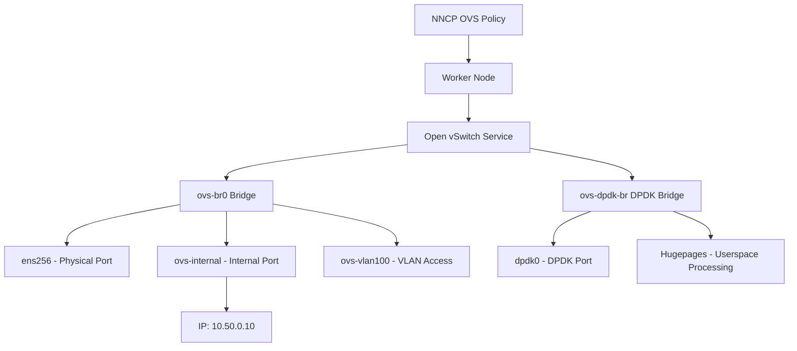

> 💡 **Quick Answer:** Define an `ovs-bridge` interface in your NNCP with physical NICs as ports. Use `ovs-interface` type for the bridge's internal interface to assign IPs. For DPDK, configure `dpdk` options with hugepages on the ports.

## The Problem

Linux bridges have limitations for advanced networking:

- **No OpenFlow** — can't program flow rules for complex traffic steering
- **No DPDK** — kernel-based forwarding adds latency for high-performance workloads
- **Limited tunneling** — no native VXLAN/Geneve support for overlay networks
- **No QoS** — limited traffic shaping and policing capabilities

Open vSwitch (OVS) provides a programmable, high-performance virtual switch that integrates with SDN controllers and supports DPDK for userspace packet processing.

## The Solution

### Step 1: Simple OVS Bridge

```yaml
apiVersion: nmstate.io/v1
kind: NodeNetworkConfigurationPolicy
metadata:
  name: worker-ovs-bridge
spec:
  nodeSelector:
    node-role.kubernetes.io/worker: ""
  desiredState:
    interfaces:
      # OVS Bridge
      - name: ovs-br0
        type: ovs-bridge
        state: up
        bridge:
          options:
            stp: true
          port:
            - name: ens256
      # Internal interface for IP assignment
      - name: ovs-br0-internal
        type: ovs-interface
        state: up
        ipv4:
          enabled: true
          dhcp: false
          address:
            - ip: 10.50.0.10
              prefix-length: 24
        ipv6:
          enabled: false
      # Ensure physical port has no IP
      - name: ens256
        type: ethernet
        state: up
        ipv4:
          enabled: false
        ipv6:
          enabled: false
```

### Step 2: OVS Bridge with Bond

```yaml
apiVersion: nmstate.io/v1
kind: NodeNetworkConfigurationPolicy
metadata:
  name: worker-ovs-bond-bridge
spec:
  nodeSelector:
    node-role.kubernetes.io/worker: ""
  desiredState:
    interfaces:
      - name: ovs-br1
        type: ovs-bridge
        state: up
        bridge:
          options:
            stp: false
          port:
            - name: ovs-bond0
              link-aggregation:
                mode: balance-slb
                port:
                  - name: ens224
                  - name: ens256
      - name: ovs-br1-port
        type: ovs-interface
        state: up
        ipv4:
          enabled: true
          dhcp: false
          address:
            - ip: 10.60.0.10
              prefix-length: 24
```

### Step 3: OVS Bridge with VLAN Access Port

```yaml
apiVersion: nmstate.io/v1
kind: NodeNetworkConfigurationPolicy
metadata:
  name: worker-ovs-vlan
spec:
  nodeSelector:
    node-role.kubernetes.io/worker: ""
  desiredState:
    interfaces:
      - name: ovs-br2
        type: ovs-bridge
        state: up
        bridge:
          port:
            - name: ens256
            - name: ovs-vlan100
              vlan:
                mode: access
                tag: 100
      - name: ovs-vlan100
        type: ovs-interface
        state: up
        ipv4:
          enabled: true
          dhcp: false
          address:
            - ip: 10.100.0.10
              prefix-length: 24
```

### Step 4: DPDK-Enabled OVS Bridge

For high-performance networking with userspace packet processing:

```yaml
apiVersion: nmstate.io/v1
kind: NodeNetworkConfigurationPolicy
metadata:
  name: worker-ovs-dpdk
spec:
  nodeSelector:
    node-role.kubernetes.io/worker: ""
    feature.node.kubernetes.io/cpu-hugepages: "true"
  desiredState:
    ovs-db:
      other_config:
        dpdk-init: "true"
        dpdk-socket-mem: "1024,1024"
        dpdk-hugepage-dir: "/dev/hugepages"
    interfaces:
      - name: ovs-dpdk-br
        type: ovs-bridge
        state: up
        bridge:
          options:
            datapath: "netdev"
          port:
            - name: dpdk0
              dpdk:
                devargs: "0000:03:00.0"
                n-rxq: 4
      - name: ovs-dpdk-internal
        type: ovs-interface
        state: up
        ipv4:
          enabled: true
          dhcp: false
          address:
            - ip: 10.70.0.10
              prefix-length: 24
```

### Step 5: Verify OVS Configuration

```bash
# Check OVS bridges
oc debug node/worker-0 -- chroot /host ovs-vsctl show

# Check OVS ports
oc debug node/worker-0 -- chroot /host ovs-vsctl list-ports ovs-br0

# Check DPDK status
oc debug node/worker-0 -- chroot /host ovs-vsctl get Open_vSwitch . dpdk_initialized

# Check OVS flows
oc debug node/worker-0 -- chroot /host ovs-ofctl dump-flows ovs-br0
```



## Common Issues

### OVS bridge fails to create

```bash
# Verify OVS is running
oc debug node/worker-0 -- chroot /host systemctl status openvswitch

# Check OVS logs
oc debug node/worker-0 -- chroot /host journalctl -u openvswitch -n 30

# On OpenShift, OVN-Kubernetes uses OVS — verify no conflicts
oc debug node/worker-0 -- chroot /host ovs-vsctl list-br
```

### DPDK port not binding

```bash
# Verify hugepages are allocated
oc debug node/worker-0 -- chroot /host cat /proc/meminfo | grep Huge

# Verify DPDK device binding
oc debug node/worker-0 -- chroot /host dpdk-devbind.py --status

# Bind NIC to DPDK-compatible driver
oc debug node/worker-0 -- chroot /host dpdk-devbind.py -b vfio-pci 0000:03:00.0
```

### Conflict with OVN-Kubernetes

```bash
# OpenShift uses br-int and br-ex for OVN
# Don't use these names for your custom bridges
# Use unique names like ovs-br0, ovs-storage, etc.
oc debug node/worker-0 -- chroot /host ovs-vsctl list-br
# Expected: br-ex, br-int (OVN) + your custom bridges
```

## Best Practices

- **Don't conflict with OVN bridges** — avoid names `br-int`, `br-ex`, `br-local` which are used by OVN-Kubernetes
- **Use `ovs-interface` for IP assignment** — never assign IPs directly on the `ovs-bridge`
- **Use `balance-slb` for OVS bonding** — it's the OVS-native equivalent of LACP
- **Enable DPDK only when needed** — it requires hugepages, CPU pinning, and adds operational complexity
- **Monitor with `ovs-vsctl show`** — the primary troubleshooting tool for OVS configuration
- **Keep physical ports IP-free** — all addressing goes on the internal interface

## Key Takeaways

- OVS bridges provide **programmable, high-performance** virtual switching beyond Linux bridges
- Use `ovs-interface` type for the bridge's internal port — this is where you assign IP addresses
- **DPDK-enabled OVS** requires hugepages and `datapath: "netdev"` for userspace packet processing
- Avoid conflicting with OpenShift's OVN-Kubernetes bridges (`br-int`, `br-ex`)
- OVS bonding uses `balance-slb` mode — different from Linux kernel bond modes
