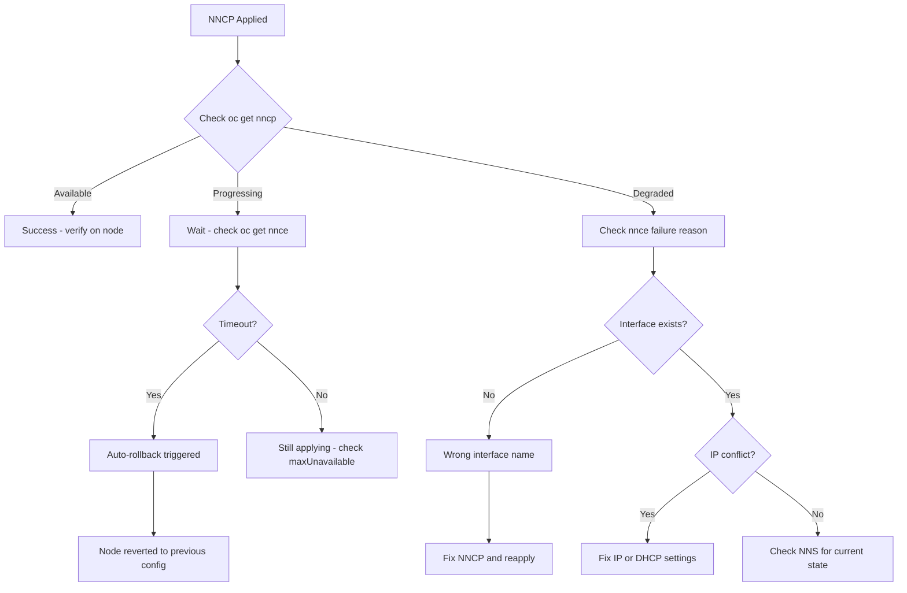

> 💡 **Quick Answer:** Check `NodeNetworkConfigurationEnactment` (NNCE) per node for detailed status. Failed NNCPs auto-rollback after the timeout (default 4 minutes). Use `NodeNetworkState` (NNS) to view current node network state before applying changes.

## The Problem

Network configuration changes on worker nodes are high-risk:

- **Bad config can isolate a node** — lose SSH, API server connectivity, everything
- **Changes affect running workloads** — pods may lose network mid-connection
- **Debugging is hard** — if the node is unreachable, you can't SSH in to fix it
- **Rollback must be automatic** — manual intervention requires physical access

The nmstate operator includes built-in rollback protection, but you need to understand how to use it effectively.

## The Solution

### Step 1: Pre-Flight — Check Current State

Always inspect the current network state before making changes:

```bash
# List all node network states
oc get nodenetworkstate

# View a specific node's full network state
oc get nns worker-0 -o yaml

# Check specific interfaces
oc get nns worker-0 -o jsonpath='{.status.currentState.interfaces[*].name}' | tr ' ' '\n'

# View interface details
oc get nns worker-0 -o yaml | grep -A20 'name: ens224'
```

### Step 2: Monitor NNCP Status

```bash
# Check NNCP status
oc get nncp
# NAME                  STATUS      REASON
# worker-bond-lacp      Available   SuccessfullyConfigured
# worker-vlan-storage   Degraded    FailedToConfigure

# Get detailed conditions
oc get nncp worker-vlan-storage -o yaml | grep -A10 'conditions:'
```

### Step 3: Check Per-Node Enactments

Each NNCP creates a `NodeNetworkConfigurationEnactment` (NNCE) per matching node:

```bash
# List all enactments
oc get nnce

# Filter by policy
oc get nnce -l nmstate.io/policy=worker-bond-lacp

# View detailed failure reason
oc get nnce worker-0.worker-vlan-storage -o yaml

# Common conditions to look for:
# - Failing: true → configuration failed
# - Available: true → successfully applied
# - Progressing: true → still applying
# - Pending: true → waiting for maxUnavailable slot
```

### Step 4: Configure Rollback Timeout

The nmstate operator verifies connectivity after applying changes. If verification fails, it rolls back:

```yaml
apiVersion: nmstate.io/v1
kind: NodeNetworkConfigurationPolicy
metadata:
  name: worker-risky-change
  annotations:
    # Rollback timeout — how long to wait before reverting
    # Default: 240s (4 minutes)
    nmstate.io/rollback-timeout: "120"
spec:
  nodeSelector:
    node-role.kubernetes.io/worker: ""
  # maxUnavailable controls how many nodes apply simultaneously
  maxUnavailable: 1
  desiredState:
    interfaces:
      - name: ens224
        type: ethernet
        state: up
        ipv4:
          enabled: true
          dhcp: false
          address:
            - ip: 10.100.0.10
              prefix-length: 24
```

### Step 5: Controlled Rollout with maxUnavailable

```yaml
apiVersion: nmstate.io/v1
kind: NodeNetworkConfigurationPolicy
metadata:
  name: worker-safe-rollout
spec:
  nodeSelector:
    node-role.kubernetes.io/worker: ""
  # Apply to 1 node at a time
  maxUnavailable: 1
  desiredState:
    interfaces:
      - name: bond0
        type: bond
        state: up
        link-aggregation:
          mode: active-backup
          port:
            - ens224
            - ens256
```

### Step 6: Force Removal of a Failed NNCP

```bash
# Delete a stuck or failed NNCP
oc delete nncp worker-bad-config

# If deletion is stuck, remove finalizer
oc patch nncp worker-bad-config --type=merge \
  -p '{"metadata":{"finalizers":[]}}'

# Verify enactments are cleaned up
oc get nnce | grep worker-bad-config
```

### Step 7: Manual Network Recovery

If a node becomes unreachable despite rollback:

```bash
# If you have console/IPMI access:
# 1. Connect via console
# 2. Check NetworkManager
systemctl status NetworkManager
nmcli connection show
nmcli device status

# 3. Restore previous connection
nmcli connection up "previous-connection-name"

# 4. Or restart NetworkManager to re-apply nmstate
systemctl restart NetworkManager

# From another node, check if the node is recovering
oc get nodes -w
```

### Troubleshooting Decision Tree



## Common Issues

### NNCP stuck in Progressing indefinitely

```bash
# Check if maxUnavailable is blocking
oc get nnce -o wide | grep Pending
# If nodes are Pending, another node is still being configured

# Check operator logs
oc logs -n openshift-nmstate deployment/nmstate-operator --tail=50

# Check handler logs on the specific node
oc logs -n openshift-nmstate -l component=kubernetes-nmstate-handler \
  --field-selector spec.nodeName=worker-0 --tail=50
```

### Rollback happened but node config is wrong

```bash
# The rollback restores the config BEFORE the failed NNCP
# If the pre-existing config was also bad, rollback won't help

# Check what config was rolled back to
oc get nns worker-0 -o yaml

# Apply a corrective NNCP
```

### Cannot delete NNCP — finalizer stuck

```bash
# Force delete by removing finalizer
oc patch nncp stuck-policy --type=json \
  -p '[{"op":"remove","path":"/metadata/finalizers"}]'

# Then delete
oc delete nncp stuck-policy
```

### Multiple NNCPs conflict on same interface

```bash
# List all NNCPs
oc get nncp

# Check which policies affect the same interface
oc get nncp -o yaml | grep -B5 'name: ens224'

# Resolution: consolidate into a single NNCP per interface
# or ensure they configure different aspects
```

## Best Practices

- **Always check `NodeNetworkState` first** — know the current config before changing it
- **Use `maxUnavailable: 1`** for production changes — roll out one node at a time
- **Set shorter rollback timeout for risky changes** — `nmstate.io/rollback-timeout: "60"` for untested configs
- **Test on a single node first** — use `kubernetes.io/hostname` selector before `node-role` selector
- **Never modify the primary cluster interface** via NNCP unless you have console access for recovery
- **Monitor enactments** — `oc get nnce -w` to watch progress in real time
- **Keep NNCPs focused** — one NNCP per logical change, not one giant policy for everything
- **Document your rollback plan** — know how to access nodes via console if the API server becomes unreachable

## Key Takeaways

- The nmstate operator **auto-rolls back** failed configurations after the timeout (default 4 minutes)
- `NodeNetworkConfigurationEnactment` (NNCE) shows **per-node status** — always check this for debugging
- `NodeNetworkState` (NNS) shows the **current network state** — inspect before making changes
- Use `maxUnavailable: 1` to **roll out changes safely** one node at a time
- For risky changes, set `nmstate.io/rollback-timeout` to a shorter value for faster recovery
- If a node is completely unreachable, you need **console or IPMI access** — rollback can't help if the node can't reach the API server to report status
