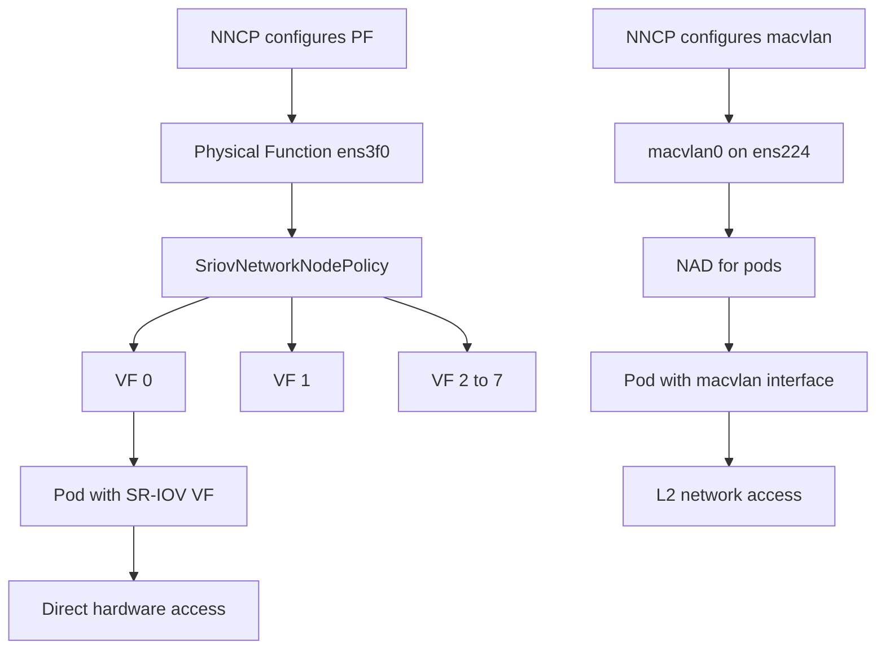

> 💡 **Quick Answer:** Use NNCP to configure the PF (Physical Function) settings like MTU and IP, then use the SR-IOV Network Operator's `SriovNetworkNodePolicy` to create VFs. For macvlan, define a `mac-vlan` type interface in NNCP with the desired mode.

## The Problem

Standard kernel networking adds overhead for latency-sensitive workloads:

- **AI/GPU training** needs near-wire-speed RDMA between nodes
- **Telco/NFV** requires dedicated, isolated network interfaces per VNF
- **HPC workloads** need predictable, low-latency networking
- **Storage traffic** benefits from dedicated, isolated paths

SR-IOV bypasses the kernel networking stack by giving pods direct hardware access to NIC virtual functions. Macvlan provides lightweight L2 isolation without a bridge.

## The Solution

### Step 1: Configure PF with NNCP

Use NNCP to set up the Physical Function before creating VFs:

```yaml
apiVersion: nmstate.io/v1
kind: NodeNetworkConfigurationPolicy
metadata:
  name: worker-sriov-pf-setup
spec:
  nodeSelector:
    node-role.kubernetes.io/worker: ""
    feature.node.kubernetes.io/sriov.capable: "true"
  desiredState:
    interfaces:
      # Configure the SR-IOV Physical Function
      - name: ens3f0
        type: ethernet
        state: up
        ethernet:
          sr-iov:
            total-vfs: 8
        mtu: 9000
        ipv4:
          enabled: false
        ipv6:
          enabled: false
```

### Step 2: SR-IOV Network Operator VF Configuration

After NNCP configures the PF, use `SriovNetworkNodePolicy` for VF management:

```yaml
apiVersion: sriovnetwork.openshift.io/v1
kind: SriovNetworkNodePolicy
metadata:
  name: gpu-rdma-vfs
  namespace: openshift-sriov-network-operator
spec:
  deviceType: netdevice
  nicSelector:
    pfNames:
      - ens3f0
  nodeSelector:
    feature.node.kubernetes.io/sriov.capable: "true"
  numVfs: 8
  resourceName: gpu_rdma_vf
  isRdma: true
  mtu: 9000
---
apiVersion: sriovnetwork.openshift.io/v1
kind: SriovNetwork
metadata:
  name: gpu-rdma-network
  namespace: openshift-sriov-network-operator
spec:
  resourceName: gpu_rdma_vf
  networkNamespace: ai-workloads
  ipam: |
    {
      "type": "static",
      "addresses": [
        {"address": "10.50.0.0/24"}
      ]
    }
```

### Step 3: Macvlan Interface with NNCP

Macvlan provides lightweight L2 sub-interfaces without a bridge:

```yaml
apiVersion: nmstate.io/v1
kind: NodeNetworkConfigurationPolicy
metadata:
  name: worker-macvlan
spec:
  nodeSelector:
    node-role.kubernetes.io/worker: ""
  desiredState:
    interfaces:
      - name: macvlan0
        type: mac-vlan
        state: up
        mac-vlan:
          base-iface: ens224
          mode: bridge
        ipv4:
          enabled: true
          dhcp: false
          address:
            - ip: 10.80.0.10
              prefix-length: 24
```

### Macvlan Modes

| Mode | Behavior | Use Case |
|------|----------|----------|
| `bridge` | Macvlan interfaces can communicate with each other and the external network | Most common, pod-to-pod on same host |
| `vepa` | All traffic goes through external switch, even between local macvlans | Switch-enforced policy |
| `private` | Macvlans isolated from each other, only external communication | Strict tenant isolation |
| `passthru` | Single macvlan gets direct NIC access | Near-SR-IOV performance |

### Step 4: Macvlan NetworkAttachmentDefinition

```yaml
apiVersion: k8s.cni.cncf.io/v1
kind: NetworkAttachmentDefinition
metadata:
  name: macvlan-storage
  namespace: my-namespace
spec:
  config: |
    {
      "cniVersion": "0.3.1",
      "type": "macvlan",
      "master": "ens224",
      "mode": "bridge",
      "ipam": {
        "type": "whereabouts",
        "range": "10.80.0.0/24",
        "exclude": ["10.80.0.1/32", "10.80.0.10/32"]
      }
    }
```

### Step 5: Pod Using SR-IOV VF

```yaml
apiVersion: v1
kind: Pod
metadata:
  name: gpu-training
  namespace: ai-workloads
  annotations:
    k8s.v1.cni.cncf.io/networks: gpu-rdma-network
spec:
  containers:
    - name: training
      image: nvcr.io/nvidia/pytorch:24.01-py3
      resources:
        requests:
          nvidia.com/gpu: 1
          openshift.io/gpu_rdma_vf: 1
        limits:
          nvidia.com/gpu: 1
          openshift.io/gpu_rdma_vf: 1
```

### Step 6: Verify

```bash
# Check VFs created
oc debug node/worker-0 -- chroot /host ip link show ens3f0
# Look for "vf 0", "vf 1", etc.

# Check SR-IOV device plugin resources
oc get node worker-0 -o jsonpath='{.status.allocatable}' | jq .

# Verify macvlan
oc debug node/worker-0 -- chroot /host ip link show macvlan0

# Check VF allocation in pod
oc exec gpu-training -- ip link show
```



## Common Issues

### SR-IOV VFs not created

```bash
# Check IOMMU is enabled
oc debug node/worker-0 -- chroot /host dmesg | grep -i iommu

# Check SR-IOV capability
oc debug node/worker-0 -- chroot /host lspci -v | grep -i "sr-iov"

# Check driver supports VFs
oc debug node/worker-0 -- chroot /host cat /sys/class/net/ens3f0/device/sriov_numvfs
```

### Macvlan no connectivity to parent host

```bash
# By design, macvlan interfaces cannot communicate with the parent
# interface on the same host. This is a kernel limitation.
# Use bridge mode for macvlan-to-macvlan communication
# Use a separate interface for host communication
```

### VF driver mismatch

```yaml
# Use netdevice for kernel-mode VFs
deviceType: netdevice

# Use vfio-pci for DPDK workloads
deviceType: vfio-pci

# Check current driver
# oc debug node/worker-0 -- chroot /host ls -la /sys/class/net/ens3f0/device/virtfn0/driver
```

## Best Practices

- **Use NNCP for PF configuration, SR-IOV operator for VFs** — clean separation of concerns
- **Set MTU on PF via NNCP before creating VFs** — VF MTU inherits from PF
- **Enable RDMA** (`isRdma: true`) for GPU/AI workloads using InfiniBand or RoCE
- **Use macvlan bridge mode** for most use cases — allows communication between macvlan interfaces
- **Use `whereabouts` IPAM** with macvlan — provides cluster-wide IP allocation without conflicts
- **Label SR-IOV capable nodes** — use `nodeSelector` to target only nodes with SR-IOV NICs

## Key Takeaways

- **NNCP configures the Physical Function** (MTU, VF count, state) while the **SR-IOV operator manages VFs**
- SR-IOV provides **direct hardware access** to pods — bypassing kernel networking for maximum performance
- **Macvlan** is a lightweight alternative when SR-IOV isn't available — no bridge overhead, direct L2 access
- Macvlan interfaces **cannot communicate with the parent interface** on the same host — this is by design
- Combine SR-IOV with RDMA for **GPU training and HPC workloads** requiring near-wire-speed inter-node communication
