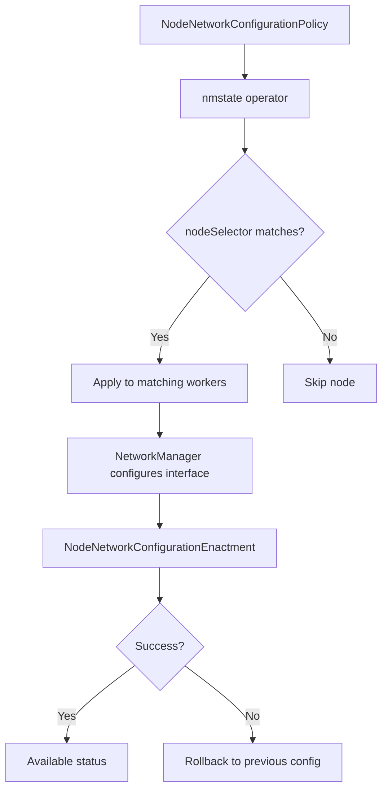

> 💡 **Quick Answer:** Create a `NodeNetworkConfigurationPolicy` with `nodeSelector` targeting worker nodes and define static IPv4/IPv6 addresses under `desiredState.interfaces`. The nmstate operator applies the configuration and reports status via `NodeNetworkConfigurationEnactment`.

## The Problem

Worker nodes in production Kubernetes clusters often need static IP addresses on secondary interfaces for:

- **Storage networks** — iSCSI, NFS, Ceph requiring predictable IPs
- **GPU/RDMA networks** — InfiniBand or RoCE interfaces for AI workloads
- **Management networks** — Out-of-band monitoring and administration
- **Tenant isolation** — Dedicated network segments per team or application

Manually configuring NetworkManager on each node doesn't scale, isn't declarative, and doesn't survive node replacements. NNCP solves this by managing node networking through the Kubernetes API.

## The Solution

### Step 1: Verify nmstate Operator is Running

```bash
# OpenShift
oc get pods -n openshift-nmstate

# Kubernetes
kubectl get pods -n nmstate
```

### Step 2: Check Available Interfaces

View the current network state of your worker nodes:

```bash
# List all node network states
oc get nodenetworkstate

# View a specific node's interfaces
oc get nns worker-0 -o yaml | grep -A5 'name: ens'
```

### Step 3: Create NNCP for Static IPv4

```yaml
apiVersion: nmstate.io/v1
kind: NodeNetworkConfigurationPolicy
metadata:
  name: worker-storage-ip
spec:
  nodeSelector:
    node-role.kubernetes.io/worker: ""
  desiredState:
    interfaces:
      - name: ens224
        type: ethernet
        state: up
        ipv4:
          enabled: true
          dhcp: false
          address:
            - ip: 192.168.100.{{ nodeIndex }}
              prefix-length: 24
        ipv6:
          enabled: false
```

> ⚠️ **Note:** NNCP applies the same config to all matching nodes. For per-node IPs, use separate NNCPs with specific `nodeSelector` labels.

### Step 4: Per-Node Static IPs

For unique IPs per worker, label nodes and create targeted policies:

```bash
# Label each worker with its storage IP
oc label node worker-0 network.storage-ip=192.168.100.10
oc label node worker-1 network.storage-ip=192.168.100.11
oc label node worker-2 network.storage-ip=192.168.100.12
```

```yaml
apiVersion: nmstate.io/v1
kind: NodeNetworkConfigurationPolicy
metadata:
  name: worker-0-storage-ip
spec:
  nodeSelector:
    kubernetes.io/hostname: worker-0
  desiredState:
    interfaces:
      - name: ens224
        type: ethernet
        state: up
        ipv4:
          enabled: true
          dhcp: false
          address:
            - ip: 192.168.100.10
              prefix-length: 24
        ipv6:
          enabled: false
---
apiVersion: nmstate.io/v1
kind: NodeNetworkConfigurationPolicy
metadata:
  name: worker-1-storage-ip
spec:
  nodeSelector:
    kubernetes.io/hostname: worker-1
  desiredState:
    interfaces:
      - name: ens224
        type: ethernet
        state: up
        ipv4:
          enabled: true
          dhcp: false
          address:
            - ip: 192.168.100.11
              prefix-length: 24
        ipv6:
          enabled: false
```

### Step 5: Dual-Stack IPv4 and IPv6

```yaml
apiVersion: nmstate.io/v1
kind: NodeNetworkConfigurationPolicy
metadata:
  name: worker-dualstack
spec:
  nodeSelector:
    node-role.kubernetes.io/worker: ""
  desiredState:
    interfaces:
      - name: ens224
        type: ethernet
        state: up
        ipv4:
          enabled: true
          dhcp: false
          address:
            - ip: 192.168.100.10
              prefix-length: 24
        ipv6:
          enabled: true
          dhcp: false
          autoconf: false
          address:
            - ip: fd00:storage::10
              prefix-length: 64
```

### Step 6: Verify the Configuration

```bash
# Check NNCP status
oc get nncp worker-storage-ip

# Check per-node enactment
oc get nnce

# Verify the interface on a specific node
oc debug node/worker-0 -- chroot /host ip addr show ens224
```



## Common Issues

### NNCP stuck in Progressing

```bash
# Check enactment status for each node
oc get nnce -o wide

# View detailed failure reason
oc get nnce worker-0.worker-storage-ip -o jsonpath='{.status.conditions}'

# Common cause: wrong interface name
oc get nns worker-0 -o yaml | grep -B2 -A10 'type: ethernet'
```

### Interface name varies across nodes

```bash
# Check each node's interface names
for node in worker-0 worker-1 worker-2; do
  echo "=== $node ==="
  oc get nns $node -o jsonpath='{.status.currentState.interfaces[*].name}'
  echo
done

# Use consistent naming with udev rules or match by MAC address
```

### Static IP conflicts with DHCP

```yaml
# Ensure DHCP is explicitly disabled
ipv4:
  enabled: true
  dhcp: false      # Must be false for static IPs
  auto-dns: false  # Prevent DHCP DNS override
  auto-routes: false
  auto-gateway: false
```

## Best Practices

- **Use `nodeSelector` with role labels** to target only worker nodes — never accidentally configure control plane networking
- **Create per-node NNCPs for unique IPs** — a single NNCP applies identical config to all matching nodes
- **Verify interface names** across all workers before applying — names like `ens224` vs `enp3s0` vary by hardware
- **Disable DHCP explicitly** when using static IPs — set `dhcp: false`, `auto-dns: false`, `auto-routes: false`
- **Test on one node first** — use `kubernetes.io/hostname` selector before rolling out to all workers
- **Monitor enactments** — always check `oc get nnce` after applying an NNCP

## Key Takeaways

- `NodeNetworkConfigurationPolicy` provides **declarative, API-driven** network configuration for node interfaces
- Use `nodeSelector` to target workers — `node-role.kubernetes.io/worker: ""` for all workers or `kubernetes.io/hostname` for specific nodes
- For **per-node unique IPs**, create separate NNCPs with hostname selectors
- The nmstate operator handles applying, validating, and **auto-rolling back** failed configurations
- Always verify with `oc get nnce` to confirm successful application on each node
