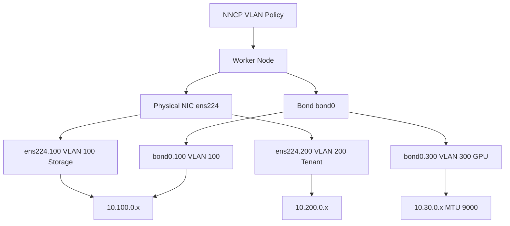

> 💡 **Quick Answer:** Define a VLAN interface in your NNCP with `type: vlan`, specifying `base-iface` (parent NIC or bond) and `id` (VLAN tag). The switch port must be configured as a trunk allowing that VLAN ID.

## The Problem

Production Kubernetes clusters need network segmentation:

- **Storage VLAN** — Ceph, NFS, iSCSI on a dedicated segment
- **Tenant VLANs** — isolate customer traffic on shared infrastructure
- **Management VLAN** — out-of-band access separated from workload traffic
- **GPU/RDMA VLAN** — dedicated high-performance network for AI training

Without VLANs, all traffic shares the same broadcast domain, creating security risks and performance contention.

## The Solution

### Step 1: VLAN on a Physical Interface

```yaml
apiVersion: nmstate.io/v1
kind: NodeNetworkConfigurationPolicy
metadata:
  name: worker-vlan-storage
spec:
  nodeSelector:
    node-role.kubernetes.io/worker: ""
  desiredState:
    interfaces:
      - name: ens224.100
        type: vlan
        state: up
        vlan:
          base-iface: ens224
          id: 100
        ipv4:
          enabled: true
          dhcp: false
          address:
            - ip: 10.100.0.10
              prefix-length: 24
        ipv6:
          enabled: false
```

### Step 2: VLAN on a Bond Interface

The most robust setup — VLAN over bonded NICs for both redundancy and segmentation:

```yaml
apiVersion: nmstate.io/v1
kind: NodeNetworkConfigurationPolicy
metadata:
  name: worker-bond-vlans
spec:
  nodeSelector:
    node-role.kubernetes.io/worker: ""
  desiredState:
    interfaces:
      # Bond first
      - name: bond0
        type: bond
        state: up
        ipv4:
          enabled: false
        ipv6:
          enabled: false
        link-aggregation:
          mode: 802.3ad
          options:
            miimon: "100"
          port:
            - ens224
            - ens256
      # Port interfaces
      - name: ens224
        type: ethernet
        state: up
        ipv4:
          enabled: false
        ipv6:
          enabled: false
      - name: ens256
        type: ethernet
        state: up
        ipv4:
          enabled: false
        ipv6:
          enabled: false
      # Storage VLAN
      - name: bond0.100
        type: vlan
        state: up
        vlan:
          base-iface: bond0
          id: 100
        ipv4:
          enabled: true
          dhcp: false
          address:
            - ip: 10.100.0.10
              prefix-length: 24
      # Tenant VLAN
      - name: bond0.200
        type: vlan
        state: up
        vlan:
          base-iface: bond0
          id: 200
        ipv4:
          enabled: true
          dhcp: false
          address:
            - ip: 10.200.0.10
              prefix-length: 24
```

### Step 3: Multiple VLANs for Traffic Separation

```yaml
apiVersion: nmstate.io/v1
kind: NodeNetworkConfigurationPolicy
metadata:
  name: worker-multi-vlan
spec:
  nodeSelector:
    node-role.kubernetes.io/worker: ""
  desiredState:
    interfaces:
      # Management VLAN 10
      - name: ens224.10
        type: vlan
        state: up
        vlan:
          base-iface: ens224
          id: 10
        ipv4:
          enabled: true
          dhcp: true
      # Storage VLAN 100
      - name: ens224.100
        type: vlan
        state: up
        vlan:
          base-iface: ens224
          id: 100
        ipv4:
          enabled: true
          dhcp: false
          address:
            - ip: 10.100.0.10
              prefix-length: 24
      # GPU RDMA VLAN 300
      - name: ens224.300
        type: vlan
        state: up
        vlan:
          base-iface: ens224
          id: 300
        ipv4:
          enabled: true
          dhcp: false
          address:
            - ip: 10.30.0.10
              prefix-length: 24
        mtu: 9000
```

### Step 4: Verify VLAN Configuration

```bash
# Check NNCP applied successfully
oc get nncp worker-vlan-storage
oc get nnce

# Verify VLAN interface on node
oc debug node/worker-0 -- chroot /host ip -d link show ens224.100

# Verify VLAN traffic
oc debug node/worker-0 -- chroot /host ping -c3 10.100.0.1
```



## Common Issues

### VLAN interface created but no connectivity

```bash
# Verify switch trunk configuration allows the VLAN ID
# The switch port must be a trunk, not access mode

# Check VLAN tag is correct
oc debug node/worker-0 -- chroot /host cat /proc/net/vlan/ens224.100

# Verify parent interface is up
oc debug node/worker-0 -- chroot /host ip link show ens224
```

### VLAN name format

```yaml
# Standard naming: <parent>.<vlan-id>
- name: ens224.100     # Recommended
  vlan:
    base-iface: ens224
    id: 100

# Custom naming also works
- name: storage-vlan
  type: vlan
  vlan:
    base-iface: ens224
    id: 100
```

### MTU issues with VLANs

```yaml
# VLAN MTU cannot exceed parent interface MTU
# Set parent MTU first, then VLAN MTU
interfaces:
  - name: ens224
    type: ethernet
    state: up
    mtu: 9000
  - name: ens224.100
    type: vlan
    state: up
    mtu: 9000  # Must be <= parent MTU
    vlan:
      base-iface: ens224
      id: 100
```

## Best Practices

- **Use bond + VLAN** for production — provides both redundancy and segmentation on the same physical NICs
- **Match VLAN IDs with your network team** — ensure switch trunks allow the VLAN IDs you configure
- **Set MTU on the parent first** — VLAN MTU cannot exceed the parent interface MTU
- **Use descriptive VLAN IDs** — document VLAN purpose (100=storage, 200=tenant, 300=GPU)
- **Don't assign IPs to the parent interface** when using VLANs — keep the parent as a trunk only
- **Test with ping** across the VLAN to verify end-to-end connectivity before deploying workloads

## Key Takeaways

- NNCP VLANs use `type: vlan` with `base-iface` and `id` to create tagged interfaces
- **Bond + VLAN** is the production pattern — redundancy from the bond, segmentation from VLANs
- Multiple VLANs on a single parent NIC enable **traffic separation without extra hardware**
- Switch ports must be configured as **trunks** with the required VLAN IDs allowed
- VLAN MTU is limited by the parent interface MTU — set the parent MTU first
