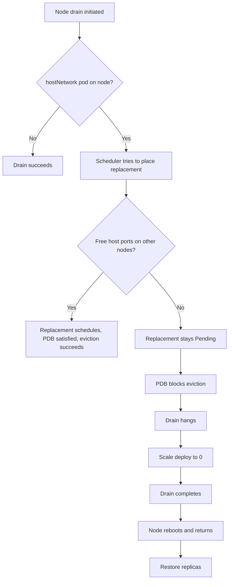

> 💡 **Quick Answer:** When draining a node with hostNetwork pods, the scheduler can't place replacement pods if all other nodes already use those host ports. Run `oc describe pod <pending-pod>` to confirm "didn't have free ports for the requested host ports". Fix: temporarily scale down the hostNetwork deployment, drain, then restore.

## The Problem

You have multiple Deployments using `hostNetwork: true` (e.g., custom ingress routers, monitoring agents, metrics collectors). When MCO tries to drain a node, it attempts to evict these pods. The PDB requires at least N replicas running, but replacement pods can't schedule on other nodes because the same host ports are already occupied. Result: drain hangs forever.

## The Solution

### Step 1: Confirm the Symptom

```bash
# Check for Pending pods in the affected namespace
oc get pods -n openshift-ingress | grep Pending
# router-custom-7f8b9c6d4-abc12   0/1   Pending   0   5m
```

### Step 2: Check Why the Pod Can't Schedule

```bash
oc describe pod router-custom-7f8b9c6d4-abc12 -n openshift-ingress
```

Look for:

```
Events:
  Warning  FailedScheduling  0/9 nodes are available:
    3 nodes had untainted tolerations,
    5 nodes didn't have free ports for the requested host ports,
    1 node is being drained.
```

**Translation:** All eligible worker nodes already have a pod using ports 80/443 (or whatever the hostNetwork pod binds). No room for the replacement.

### Step 3: Map Port Usage Across Nodes

```bash
# Find which ports the hostNetwork deployment uses
oc get deploy router-custom -n openshift-ingress -o json | \
  jq '.spec.template.spec.containers[].ports[] | {hostPort, containerPort, protocol}'

# Find all pods using those ports across nodes
oc get pods -A -o json | jq -r '
  .items[] |
  select(.spec.hostNetwork==true) |
  "\(.metadata.namespace)/\(.metadata.name) node=\(.spec.nodeName) ports=\([.spec.containers[].ports[]?.hostPort] | join(","))"
' | sort
```

### Step 4: Scale Down and Drain

Since the replacement can't schedule anywhere, you must scale down the blocking deployment to let the drain proceed:

```bash
# Record replicas
REPLICAS=$(oc get deploy router-custom -n openshift-ingress -o jsonpath='{.spec.replicas}')

# Scale down
oc scale deploy router-custom -n openshift-ingress --replicas=0

# Drain proceeds
oc adm drain worker-3 --ignore-daemonsets --delete-emptydir-data --force --timeout=30m

# After node returns Ready:
oc adm uncordon worker-3
oc scale deploy router-custom -n openshift-ingress --replicas="$REPLICAS"
```



### Long-Term Fix: Reduce hostNetwork Usage

```yaml
# Instead of hostNetwork, use hostPort on specific containers
spec:
  containers:
    - name: router
      ports:
        - containerPort: 8080
          hostPort: 80      # Only binds port 80, not ALL ports
          protocol: TCP
```

Or use NodePort/LoadBalancer Services instead of hostNetwork entirely.

## Common Issues

### Multiple hostNetwork Deployments Blocking the Same Node

```bash
# List all hostNetwork deployments on the target node
oc get pods -A -o wide --field-selector spec.nodeName=worker-3 | \
  xargs -I{} sh -c 'oc get pod {} -o jsonpath="{.spec.hostNetwork}" 2>/dev/null && echo " {}"' | grep true
```

### Replicas Set Higher Than Node Count

If you have 6 replicas of a hostNetwork deployment but only 6 worker nodes, there's zero headroom for rescheduling during maintenance. Set replicas to `nodeCount - 1` to allow one node to drain.

## Best Practices

- **Set hostNetwork deployment replicas to N-1** where N is worker count — leaves headroom for drains
- **Use `maxUnavailable: 1`** on PDBs for hostNetwork workloads
- **Prefer hostPort over hostNetwork** — hostPort only reserves specific ports, not the entire network namespace
- **Consider dedicated node pools** — separate hostNetwork workloads from regular pods

## Key Takeaways

- hostNetwork pods bind host ports on their node — replacements need a node with free ports
- If all nodes' ports are occupied, the replacement stays Pending and PDB blocks eviction
- Scale down the deployment temporarily to unblock the drain
- Long-term: reduce replicas to N-1, switch from hostNetwork to hostPort, or use Services
