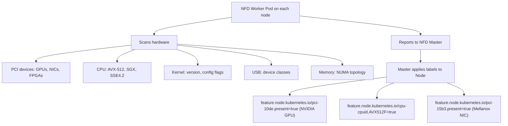
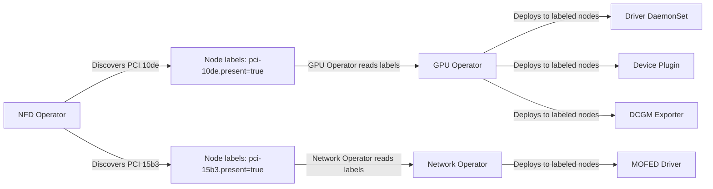

> 💡 **Quick Answer:** Node Feature Discovery (NFD) automatically detects hardware features on Kubernetes nodes and exposes them as labels. It's a **prerequisite for the NVIDIA GPU Operator** — NFD labels nodes with PCI device info (GPU vendor `10de`, NIC types, etc.) so operators can target the right nodes. Install via OperatorHub (OpenShift) or Helm (upstream).
>
> **Key insight:** Without NFD, the GPU Operator doesn't know which nodes have GPUs. NFD is the foundational discovery layer that enables all hardware-aware scheduling.
>
> **Gotcha:** NFD only discovers and labels — it doesn't install drivers or configure hardware. That's the job of operators like GPU Operator, SRIOV Network Operator, etc.

## The Problem

Kubernetes doesn't natively detect hardware features on nodes. You need to manually label nodes with GPU types, NIC capabilities, CPU instruction sets, and other hardware details. This is error-prone, doesn't scale, and breaks when you add new nodes.

Without automated discovery, operators like the NVIDIA GPU Operator can't determine which nodes have GPUs, the SR-IOV Network Operator can't find capable NICs, and workloads can't be scheduled to nodes with specific hardware features.

## The Solution

### How NFD Works

NFD runs as a DaemonSet on every node. Each NFD worker pod:

1. Detects hardware features (PCI devices, CPU flags, USB devices, kernel features, etc.)
2. Reports them to the NFD master
3. NFD master applies labels to the node



### Install on OpenShift (OperatorHub)

```bash
# Create the namespace
cat << 'EOF' | oc apply -f -
apiVersion: v1
kind: Namespace
metadata:
  name: openshift-nfd
  labels:
    openshift.io/cluster-monitoring: "true"
EOF

# Create the OperatorGroup
cat << 'EOF' | oc apply -f -
apiVersion: operators.coreos.com/v1
kind: OperatorGroup
metadata:
  name: openshift-nfd
  namespace: openshift-nfd
spec:
  targetNamespaces:
    - openshift-nfd
EOF

# Subscribe to the NFD Operator
cat << 'EOF' | oc apply -f -
apiVersion: operators.coreos.com/v1alpha1
kind: Subscription
metadata:
  name: nfd
  namespace: openshift-nfd
spec:
  channel: stable
  name: nfd
  source: redhat-operators
  sourceNamespace: openshift-marketplace
EOF

# Wait for the operator to install
oc wait --for=condition=Available deployment/nfd-controller-manager \
  -n openshift-nfd --timeout=120s
```

### Create the NodeFeatureDiscovery Instance

```yaml
apiVersion: nfd.openshift.io/v1
kind: NodeFeatureDiscovery
metadata:
  name: nfd-instance
  namespace: openshift-nfd
spec:
  operand:
    image: registry.redhat.io/openshift4/ose-node-feature-discovery:v4.14
    servicePort: 12000
  workerConfig:
    configData: |
      core:
        sleepInterval: 60s
        sources:
          - pci
          - usb
          - cpu
          - kernel
          - memory
          - system
          - local
      sources:
        pci:
          deviceClassWhitelist:
            - "0300"    # VGA controllers (GPUs)
            - "0302"    # 3D controllers (NVIDIA compute GPUs)
            - "0200"    # Network controllers
            - "0207"    # InfiniBand
            - "1200"    # Processing accelerators
          deviceLabelFields:
            - vendor
            - device
            - subsystem_vendor
        cpu:
          cpuid:
            attributeBlacklist: []
            attributeWhitelist:
              - AVX
              - AVX2
              - AVX512F
              - AVX512BW
              - AVX512CD
              - AVX512DQ
              - AVX512VL
              - SGX
              - AMX_BF16
              - AMX_INT8
              - AMX_TILE
```

```bash
# Apply the NFD instance
oc apply -f nfd-instance.yaml

# Verify NFD worker pods are running on all nodes
oc get pods -n openshift-nfd -l app=nfd-worker
# Should show one pod per node

# Verify NFD master is running
oc get pods -n openshift-nfd -l app=nfd-master
```

### Install on Upstream Kubernetes (Helm)

```bash
# Add the NFD Helm repo
helm repo add nfd https://kubernetes-sigs.github.io/node-feature-discovery/charts
helm repo update

# Install NFD
helm install nfd nfd/node-feature-discovery \
  --namespace node-feature-discovery \
  --create-namespace \
  --set master.replicaCount=1 \
  --set worker.config.core.sleepInterval=60s

# Verify
kubectl get pods -n node-feature-discovery
```

### Verify Node Labels

```bash
# Check labels on a GPU node
kubectl get node gpu-worker-1 -o json | jq '.metadata.labels' | grep feature.node

# Common NFD labels:
# feature.node.kubernetes.io/pci-10de.present=true          → NVIDIA GPU detected
# feature.node.kubernetes.io/pci-10de.sriov.capable=true    → GPU supports SR-IOV
# feature.node.kubernetes.io/pci-15b3.present=true          → Mellanox NIC detected
# feature.node.kubernetes.io/cpu-cpuid.AVX512F=true         → CPU supports AVX-512
# feature.node.kubernetes.io/system-os_release.ID=rhcos     → RHCOS operating system
# feature.node.kubernetes.io/kernel-version.major=5         → Kernel major version

# List ALL NFD labels on a node
kubectl get node gpu-worker-1 -o json | jq -r '.metadata.labels | to_entries[] | select(.key | startswith("feature.node.kubernetes.io")) | "\(.key)=\(.value)"'
```

### PCI Vendor IDs Reference

| Vendor ID | Manufacturer | Common Devices |
|-----------|-------------|----------------|
| `10de` | NVIDIA | GPUs (Tesla, A100, H100, H200) |
| `15b3` | Mellanox/NVIDIA | ConnectX NICs, InfiniBand HCAs |
| `8086` | Intel | CPUs, Ethernet, FPGAs |
| `1002` | AMD | GPUs (Instinct MI series) |
| `1d0f` | Amazon | ENA network adapters |
| `1af4` | Red Hat/Virtio | Virtual devices in KVM |

### Using NFD Labels for Scheduling

```yaml
# Schedule pods to nodes with NVIDIA GPUs
apiVersion: v1
kind: Pod
metadata:
  name: gpu-workload
spec:
  nodeSelector:
    feature.node.kubernetes.io/pci-10de.present: "true"
  containers:
    - name: app
      image: nvidia/cuda:12.3.0-runtime-ubuntu22.04
      resources:
        limits:
          nvidia.com/gpu: 1
---
# Schedule to nodes with AVX-512 support (for optimized inference)
apiVersion: v1
kind: Pod
metadata:
  name: inference-workload
spec:
  nodeSelector:
    feature.node.kubernetes.io/cpu-cpuid.AVX512F: "true"
  containers:
    - name: inference
      image: mymodel:latest
---
# Schedule to nodes with Mellanox NICs (for RDMA workloads)
apiVersion: v1
kind: Pod
metadata:
  name: rdma-workload
spec:
  nodeSelector:
    feature.node.kubernetes.io/pci-15b3.present: "true"
  containers:
    - name: app
      image: rdma-app:latest
```

### Custom Feature Rules (NodeFeatureRule)

Create custom labels based on combinations of discovered features:

```yaml
apiVersion: nfd.k8s-sigs.io/v1alpha1
kind: NodeFeatureRule
metadata:
  name: gpu-compute-node
spec:
  rules:
    - name: nvidia-gpu-with-rdma
      labels:
        node-role.kubernetes.io/gpu-rdma: "true"
      matchFeatures:
        - feature: pci.device
          matchExpressions:
            vendor:
              op: In
              value: ["10de"]       # NVIDIA GPU
        - feature: pci.device
          matchExpressions:
            vendor:
              op: In
              value: ["15b3"]       # Mellanox NIC

    - name: avx512-compute
      labels:
        compute-capability/avx512: "true"
      matchFeatures:
        - feature: cpu.cpuid
          matchExpressions:
            AVX512F:
              op: Exists
            AVX512BW:
              op: Exists
```

```bash
# Apply the rule
kubectl apply -f gpu-compute-rule.yaml

# Verify custom labels appeared
kubectl get nodes -l node-role.kubernetes.io/gpu-rdma=true
```

### Integration with GPU Operator

The NVIDIA GPU Operator **depends on NFD** to discover GPU nodes. The dependency chain:



**Install order:**
1. Install NFD Operator first
2. Create NFD instance — wait for labels to appear
3. Install GPU Operator — it finds nodes via NFD labels
4. Install Network Operator (if needed) — also uses NFD labels

```bash
# Verify GPU Operator can find GPU nodes via NFD
kubectl get nodes -l feature.node.kubernetes.io/pci-10de.present=true
# These are the nodes where GPU Operator will deploy drivers
```

## Common Issues

### NFD worker pods in CrashLoopBackOff
Usually caused by incompatible NFD version with the cluster. On OpenShift, ensure you're using the NFD version matching your OCP release.

### Labels not appearing on nodes
Check NFD worker logs:
```bash
kubectl logs -n openshift-nfd -l app=nfd-worker --tail=50
# Look for "failed to detect" or permission errors
```

NFD workers need privileged access to read PCI and CPU info. Verify the SCC/PSP allows it.

### GPU Operator reports "no GPU nodes found"
NFD isn't running or hasn't labeled nodes yet. Check:
```bash
kubectl get nodes -l feature.node.kubernetes.io/pci-10de.present=true
# If empty, NFD hasn't detected GPUs yet — check NFD pods
```

### Too many labels cluttering node descriptions
Use `workerConfig` to whitelist only needed PCI classes and CPU features. Don't discover everything if you only need GPU and NIC info.

### NFD labels disappear after node restart
This is normal — NFD re-applies labels on each discovery cycle (default: 60s). If NFD pods aren't running after reboot, labels won't be reapplied. Ensure NFD DaemonSet has proper tolerations.

### Conflict with manual labels
NFD labels use the `feature.node.kubernetes.io/` prefix. Don't manually set labels with this prefix — NFD will overwrite them on next discovery cycle.

## Best Practices

- **Install NFD before any hardware operators** — GPU Operator, Network Operator, and SR-IOV all depend on NFD labels
- **Whitelist only needed PCI classes** — reduces label count and API server load
- **Use NodeFeatureRule for composite labels** — combine multiple features into meaningful scheduling labels
- **Set `sleepInterval` appropriately** — 60s is fine for most clusters; increase to 300s for very large clusters to reduce API load
- **Pin NFD version to match your cluster** — mismatched versions cause compatibility issues
- **Monitor NFD with Prometheus** — `nfd_worker_build_info` and `nfd_master_build_info` metrics

## Key Takeaways

- NFD is the **foundational hardware discovery layer** for Kubernetes — install it first
- It detects GPUs (PCI `10de`), NICs (PCI `15b3`), CPU features (AVX-512), and more
- NVIDIA GPU Operator, Network Operator, and SR-IOV Operator all depend on NFD labels
- Use `NodeFeatureRule` CRD to create custom scheduling labels from discovered features
- Install order: NFD → GPU Operator → Network Operator → SR-IOV
- Labels are auto-managed — don't manually set `feature.node.kubernetes.io/*` labels
