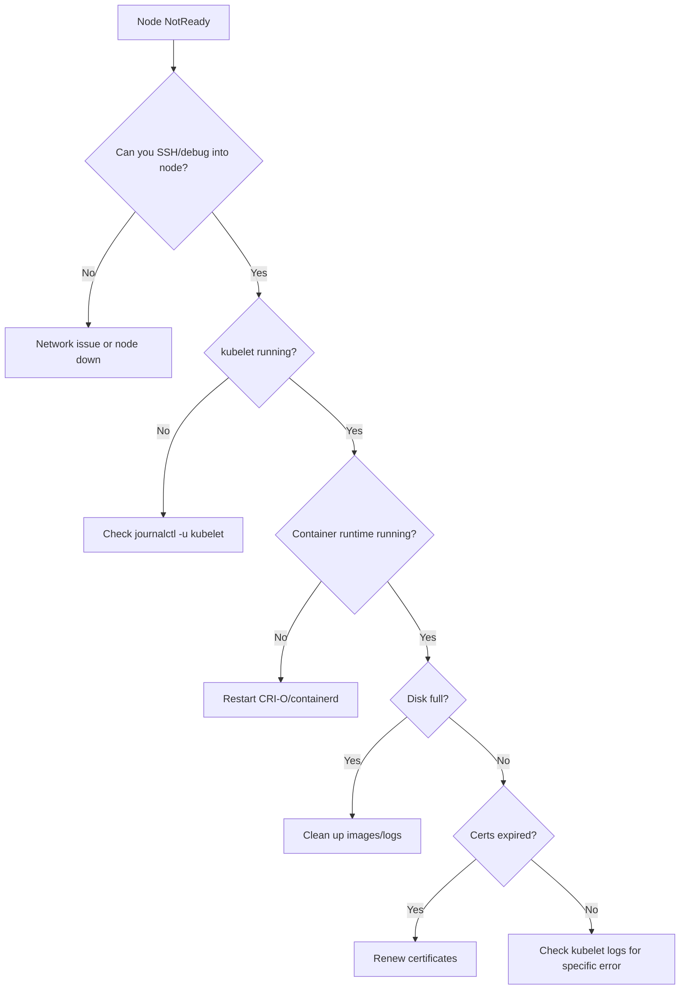

> 💡 **Quick Answer:** A NotReady node means the kubelet isn't reporting health to the API server. Check `systemctl status kubelet` on the node, then `journalctl -u kubelet -f` for errors. Common causes: kubelet crash, container runtime down, expired certificates, disk pressure, or network partition.

## The Problem

One or more nodes show `NotReady` status. Pods on those nodes are unreachable, new pods won't schedule there, and if the condition persists, pods are evicted. You need to identify why the kubelet stopped reporting.

## The Solution

### Step 1: Identify NotReady Nodes

```bash
kubectl get nodes
# NAME       STATUS     ROLES    AGE   VERSION
# master-1   Ready      master   30d   v1.28.6
# worker-1   Ready      worker   30d   v1.28.6
# worker-2   NotReady   worker   30d   v1.28.6  ← Problem node

# Check conditions
kubectl describe node worker-2 | grep -A20 "Conditions:"
```

### Step 2: Check kubelet on the Node

```bash
# SSH or debug into the node
# OpenShift:
oc debug node/worker-2

# Inside the debug pod:
chroot /host
systemctl status kubelet
# If kubelet is down, check why:
journalctl -u kubelet --since "10 minutes ago" --no-pager | tail -50
```

### Step 3: Common Causes and Fixes

**Cause 1: Container runtime down**
```bash
systemctl status crio    # OpenShift
systemctl status containerd  # Kubernetes
# Restart if needed
systemctl restart crio
```

**Cause 2: Disk pressure**
```bash
df -h /
# If root filesystem is >85% full:
# Clean up old containers and images
crictl rmi --prune
journalctl --vacuum-size=500M
```

**Cause 3: Certificate expired**
```bash
# Check kubelet certificate
openssl x509 -in /var/lib/kubelet/pki/kubelet-client-current.pem -noout -dates
# notAfter=Mar 19 00:00:00 2026 GMT  ← Expired!
```

**Cause 4: Network partition**
```bash
# Can the node reach the API server?
curl -k https://<api-server>:6443/healthz
# If unreachable: check network, firewall rules, DNS
```

**Cause 5: kubelet OOMKilled**
```bash
dmesg | grep -i "oom\|killed"
journalctl -k | grep -i oom
```



## Common Issues

### Node Flapping Between Ready and NotReady

Usually indicates intermittent network issues or the node is under heavy load and kubelet can't respond to heartbeats in time.

```bash
# Check node events for flapping
kubectl get events --field-selector involvedObject.name=worker-2 --sort-by='.lastTimestamp'
```

### All Nodes NotReady Simultaneously

Likely an API server or etcd issue, not individual node problems:
```bash
kubectl get pods -n kube-system | grep -E "api|etcd"
```

## Best Practices

- **Set up node health monitoring** — alert on NotReady within 2 minutes
- **Use node problem detector** for proactive issue detection
- **Ensure certificate auto-rotation is enabled** in kubelet config
- **Monitor disk usage** — set alerts at 80% to prevent pressure
- **Keep container runtime updated** — runtime bugs cause kubelet failures

## Key Takeaways

- NotReady = kubelet can't report to API server (heartbeat timeout is ~40s default)
- Always start with `systemctl status kubelet` and `journalctl -u kubelet` on the node
- Top causes: runtime down, disk full, certs expired, network partition
- On OpenShift, use `oc debug node/<name>` since you can't SSH to RHCOS
- Fix the root cause, don't just restart kubelet — the problem will return
