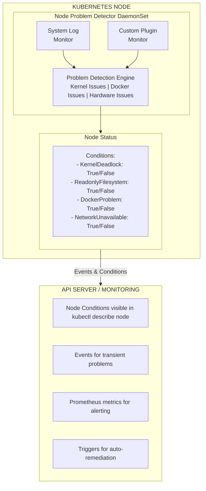

## The Problem

Node-level issues (kernel panics, hardware failures, container runtime problems) are often invisible to Kubernetes until they cause pod failures. You need early detection and reporting of node problems before they impact workloads.

## The Solution

Deploy Node Problem Detector (NPD) to monitor node health, detect problems, and report them as Node Conditions and Events that can trigger automated remediation.

## How Node Problem Detector Works



## Step 1: Install Node Problem Detector

### Using Helm

```bash
# Add Helm repository
helm repo add deliveryhero https://charts.deliveryhero.io/
helm repo update

# Install NPD
helm install node-problem-detector deliveryhero/node-problem-detector \
  --namespace kube-system \
  --set metrics.enabled=true

# Verify deployment
kubectl get pods -n kube-system -l app.kubernetes.io/name=node-problem-detector
```

### Using kubectl (Official Manifest)

```bash
kubectl apply -f https://raw.githubusercontent.com/kubernetes/node-problem-detector/master/deployment/node-problem-detector.yaml
```

### Custom DaemonSet

```yaml
apiVersion: apps/v1
kind: DaemonSet
metadata:
  name: node-problem-detector
  namespace: kube-system
  labels:
    app: node-problem-detector
spec:
  selector:
    matchLabels:
      app: node-problem-detector
  template:
    metadata:
      labels:
        app: node-problem-detector
    spec:
      serviceAccountName: node-problem-detector
      hostNetwork: true
      hostPID: true
      containers:
        - name: node-problem-detector
          image: registry.k8s.io/node-problem-detector/node-problem-detector:v0.8.15
          command:
            - /node-problem-detector
            - --logtostderr
            - --config.system-log-monitor=/config/kernel-monitor.json,/config/docker-monitor.json,/config/systemd-monitor.json
            - --config.custom-plugin-monitor=/config/health-checker.json
            - --config.system-stats-monitor=/config/system-stats-monitor.json
          securityContext:
            privileged: true
          resources:
            limits:
              memory: 200Mi
              cpu: 200m
            requests:
              memory: 100Mi
              cpu: 50m
          env:
            - name: NODE_NAME
              valueFrom:
                fieldRef:
                  fieldPath: spec.nodeName
          volumeMounts:
            - name: log
              mountPath: /var/log
              readOnly: true
            - name: kmsg
              mountPath: /dev/kmsg
              readOnly: true
            - name: localtime
              mountPath: /etc/localtime
              readOnly: true
            - name: config
              mountPath: /config
              readOnly: true
      volumes:
        - name: log
          hostPath:
            path: /var/log
        - name: kmsg
          hostPath:
            path: /dev/kmsg
        - name: localtime
          hostPath:
            path: /etc/localtime
        - name: config
          configMap:
            name: node-problem-detector-config
      tolerations:
        - operator: Exists
          effect: NoSchedule
        - operator: Exists
          effect: NoExecute
---
apiVersion: v1
kind: ServiceAccount
metadata:
  name: node-problem-detector
  namespace: kube-system
---
apiVersion: rbac.authorization.k8s.io/v1
kind: ClusterRoleBinding
metadata:
  name: node-problem-detector
roleRef:
  apiGroup: rbac.authorization.k8s.io
  kind: ClusterRole
  name: system:node-problem-detector
subjects:
  - kind: ServiceAccount
    name: node-problem-detector
    namespace: kube-system
```

## Step 2: Configure Problem Detection

### Kernel Monitor Configuration

```yaml
apiVersion: v1
kind: ConfigMap
metadata:
  name: node-problem-detector-config
  namespace: kube-system
data:
  kernel-monitor.json: |
    {
      "plugin": "kmsg",
      "logPath": "/dev/kmsg",
      "lookback": "5m",
      "bufferSize": 10,
      "source": "kernel-monitor",
      "conditions": [
        {
          "type": "KernelDeadlock",
          "reason": "KernelHasNoDeadlock",
          "message": "kernel has no deadlock"
        },
        {
          "type": "ReadonlyFilesystem",
          "reason": "FilesystemIsNotReadOnly",
          "message": "Filesystem is not read-only"
        }
      ],
      "rules": [
        {
          "type": "temporary",
          "reason": "OOMKilling",
          "pattern": "Kill process \\d+ (.+) score \\d+ or sacrifice child\\nKilled process \\d+ (.+) total-vm:\\d+kB, anon-rss:\\d+kB, file-rss:\\d+kB.*"
        },
        {
          "type": "temporary",
          "reason": "TaskHung",
          "pattern": "task \\S+:\\w+ blocked for more than \\w+ seconds\\."
        },
        {
          "type": "temporary",
          "reason": "UnregisterNetDevice",
          "pattern": "unregister_netdevice: waiting for \\w+ to become free. Usage count = \\d+"
        },
        {
          "type": "temporary",
          "reason": "KernelOops",
          "pattern": "BUG: unable to handle kernel NULL pointer dereference at .*"
        },
        {
          "type": "permanent",
          "condition": "KernelDeadlock",
          "reason": "AUFSUmountHung",
          "pattern": "task umount\\.aufs:\\w+ blocked for more than \\w+ seconds\\."
        },
        {
          "type": "permanent",
          "condition": "ReadonlyFilesystem",
          "reason": "FilesystemIsReadOnly",
          "pattern": "Remounting filesystem read-only"
        }
      ]
    }
```

### Docker/Containerd Monitor

```yaml
  docker-monitor.json: |
    {
      "plugin": "journald",
      "pluginConfig": {
        "source": "dockerd"
      },
      "logPath": "/var/log/journal",
      "lookback": "5m",
      "bufferSize": 10,
      "source": "docker-monitor",
      "conditions": [
        {
          "type": "ContainerRuntimeProblem",
          "reason": "ContainerRuntimeIsHealthy",
          "message": "Container runtime is healthy"
        }
      ],
      "rules": [
        {
          "type": "temporary",
          "reason": "ContainerRuntimeUnresponsive",
          "pattern": ".*container runtime is unresponsive.*"
        },
        {
          "type": "permanent",
          "condition": "ContainerRuntimeProblem",
          "reason": "ContainerRuntimeDown",
          "pattern": ".*Cannot connect to the Docker daemon.*"
        }
      ]
    }
```

### Containerd Monitor

```yaml
  containerd-monitor.json: |
    {
      "plugin": "journald",
      "pluginConfig": {
        "source": "containerd"
      },
      "logPath": "/var/log/journal",
      "lookback": "5m",
      "bufferSize": 10,
      "source": "containerd-monitor",
      "conditions": [
        {
          "type": "ContainerdProblem",
          "reason": "ContainerdIsHealthy",
          "message": "containerd is healthy"
        }
      ],
      "rules": [
        {
          "type": "temporary",
          "reason": "ContainerdTimeout",
          "pattern": ".*context deadline exceeded.*"
        },
        {
          "type": "permanent",
          "condition": "ContainerdProblem",
          "reason": "ContainerdDown",
          "pattern": ".*containerd.* died.*"
        }
      ]
    }
```

### System Stats Monitor

```yaml
  system-stats-monitor.json: |
    {
      "disk": {
        "metricsConfigs": {
          "disk/io_time": {
            "displayName": "disk/io_time"
          },
          "disk/bytes_used": {
            "displayName": "disk/bytes_used"
          },
          "disk/percent_used": {
            "displayName": "disk/percent_used"
          }
        },
        "includeRootBlk": true,
        "includeAllAttachedBlk": true,
        "lsblkTimeout": "5s"
      },
      "cpu": {
        "metricsConfigs": {
          "cpu/load_1m": {
            "displayName": "cpu/load_1m"
          },
          "cpu/load_5m": {
            "displayName": "cpu/load_5m"
          },
          "cpu/load_15m": {
            "displayName": "cpu/load_15m"
          }
        }
      },
      "memory": {
        "metricsConfigs": {
          "memory/bytes_used": {
            "displayName": "memory/bytes_used"
          },
          "memory/percent_used": {
            "displayName": "memory/percent_used"
          }
        }
      },
      "invokeInterval": "60s"
    }
```

### Custom Health Checker

```yaml
  health-checker.json: |
    {
      "plugin": "custom",
      "pluginConfig": {
        "invoke_interval": "30s",
        "timeout": "10s",
        "max_output_length": 80,
        "concurrency": 3
      },
      "source": "health-checker",
      "conditions": [
        {
          "type": "KubeletProblem",
          "reason": "KubeletIsHealthy",
          "message": "kubelet is functioning properly"
        },
        {
          "type": "DiskPressure",
          "reason": "NoDiskPressure",
          "message": "Node has sufficient disk space"
        }
      ],
      "rules": [
        {
          "type": "permanent",
          "condition": "KubeletProblem",
          "reason": "KubeletUnhealthy",
          "path": "/config/plugin/check_kubelet.sh",
          "timeout": "10s"
        },
        {
          "type": "permanent",
          "condition": "DiskPressure",
          "reason": "DiskIsFull",
          "path": "/config/plugin/check_disk.sh",
          "timeout": "10s"
        }
      ]
    }
```

## Step 3: Custom Health Check Scripts

```yaml
apiVersion: v1
kind: ConfigMap
metadata:
  name: node-problem-detector-plugins
  namespace: kube-system
data:
  check_kubelet.sh: |
    #!/bin/bash
    # Check kubelet health endpoint
    if curl -s --unix-socket /var/run/kubelet.sock http://localhost/healthz > /dev/null 2>&1; then
      exit 0
    else
      echo "Kubelet health check failed"
      exit 1
    fi

  check_disk.sh: |
    #!/bin/bash
    # Check disk space (fail if > 90% used)
    THRESHOLD=90
    USAGE=$(df -h / | awk 'NR==2 {print $5}' | tr -d '%')
    if [ "$USAGE" -gt "$THRESHOLD" ]; then
      echo "Disk usage is ${USAGE}%, threshold is ${THRESHOLD}%"
      exit 1
    fi
    exit 0

  check_ntp.sh: |
    #!/bin/bash
    # Check if NTP is synchronized
    if timedatectl status | grep -q "System clock synchronized: yes"; then
      exit 0
    else
      echo "NTP is not synchronized"
      exit 1
    fi

  check_dns.sh: |
    #!/bin/bash
    # Check DNS resolution
    if nslookup kubernetes.default.svc.cluster.local > /dev/null 2>&1; then
      exit 0
    else
      echo "DNS resolution failed"
      exit 1
    fi
```

## Step 4: View Node Conditions

```bash
# Check node conditions added by NPD
kubectl get nodes -o custom-columns=NAME:.metadata.name,\
KERNEL_DEADLOCK:.status.conditions[?(@.type==\"KernelDeadlock\")].status,\
READONLY_FS:.status.conditions[?(@.type==\"ReadonlyFilesystem\")].status,\
CONTAINER_RUNTIME:.status.conditions[?(@.type==\"ContainerRuntimeProblem\")].status

# Describe node for full condition details
kubectl describe node <node-name> | grep -A 20 Conditions

# View events from NPD
kubectl get events --field-selector source=node-problem-detector
```

## Step 5: Prometheus Integration

### Enable Metrics

```yaml
apiVersion: v1
kind: Service
metadata:
  name: node-problem-detector
  namespace: kube-system
  labels:
    app: node-problem-detector
spec:
  selector:
    app: node-problem-detector
  ports:
    - name: metrics
      port: 20257
      protocol: TCP
  clusterIP: None
---
apiVersion: monitoring.coreos.com/v1
kind: ServiceMonitor
metadata:
  name: node-problem-detector
  namespace: monitoring
spec:
  selector:
    matchLabels:
      app: node-problem-detector
  namespaceSelector:
    matchNames:
      - kube-system
  endpoints:
    - port: metrics
      interval: 30s
```

### Prometheus Alerts

```yaml
apiVersion: monitoring.coreos.com/v1
kind: PrometheusRule
metadata:
  name: node-problem-detector-alerts
  namespace: monitoring
spec:
  groups:
    - name: node-problems
      rules:
        - alert: NodeKernelDeadlock
          expr: |
            kube_node_status_condition{condition="KernelDeadlock",status="true"} == 1
          for: 5m
          labels:
            severity: critical
          annotations:
            summary: "Node {{ $labels.node }} has kernel deadlock"
            description: "Kernel deadlock detected on node {{ $labels.node }}"

        - alert: NodeReadonlyFilesystem
          expr: |
            kube_node_status_condition{condition="ReadonlyFilesystem",status="true"} == 1
          for: 1m
          labels:
            severity: critical
          annotations:
            summary: "Node {{ $labels.node }} has read-only filesystem"
            description: "Filesystem on node {{ $labels.node }} is read-only"

        - alert: NodeContainerRuntimeProblem
          expr: |
            kube_node_status_condition{condition="ContainerRuntimeProblem",status="true"} == 1
          for: 5m
          labels:
            severity: critical
          annotations:
            summary: "Container runtime problem on {{ $labels.node }}"
            description: "Container runtime issue detected on node {{ $labels.node }}"

        - alert: NodeOOMKilling
          expr: |
            increase(problem_counter{reason="OOMKilling"}[5m]) > 0
          for: 0m
          labels:
            severity: warning
          annotations:
            summary: "OOM kills occurring on {{ $labels.node }}"
            description: "Out of memory kills detected on node {{ $labels.node }}"

        - alert: NodeHighDiskUsage
          expr: |
            problem_gauge{type="DiskPressure"} == 1
          for: 5m
          labels:
            severity: warning
          annotations:
            summary: "High disk usage on {{ $labels.node }}"
            description: "Disk usage exceeded threshold on node {{ $labels.node }}"
```

## Step 6: Auto-Remediation with Draino/Kured

### Automatic Node Draining

```yaml
# Deploy Draino for automatic node draining
apiVersion: apps/v1
kind: Deployment
metadata:
  name: draino
  namespace: kube-system
spec:
  replicas: 1
  selector:
    matchLabels:
      app: draino
  template:
    metadata:
      labels:
        app: draino
    spec:
      serviceAccountName: draino
      containers:
        - name: draino
          image: planetlabs/draino:latest
          command:
            - /draino
            - --node-label-expr=node-role.kubernetes.io/worker
            # Drain nodes with these conditions
            - --evict-condition=KernelDeadlock
            - --evict-condition=ReadonlyFilesystem
            - --evict-condition=ContainerRuntimeProblem
            # Dry run first
            # - --dry-run
          resources:
            limits:
              cpu: 100m
              memory: 128Mi
```

### Automatic Node Reboot with Kured

```bash
# Install Kured for automatic reboots
helm repo add kured https://kubereboot.github.io/charts
helm install kured kured/kured \
  --namespace kube-system \
  --set configuration.rebootSentinelFile=/var/run/reboot-required
```

## Verification Commands

```bash
# Check NPD pods
kubectl get pods -n kube-system -l app=node-problem-detector

# View NPD logs
kubectl logs -n kube-system -l app=node-problem-detector

# Check specific node conditions
kubectl get node <node-name> -o jsonpath='{.status.conditions}' | jq .

# List all problem events
kubectl get events -A --field-selector reason=KernelOops
kubectl get events -A --field-selector reason=OOMKilling

# Check metrics endpoint
kubectl port-forward -n kube-system ds/node-problem-detector 20257:20257
curl http://localhost:20257/metrics
```

## Troubleshooting NPD

### Check Configuration

```bash
# Verify config is mounted
kubectl exec -n kube-system ds/node-problem-detector -- ls -la /config/

# Check journald access
kubectl exec -n kube-system ds/node-problem-detector -- journalctl -n 10
```

### Debug Mode

```yaml
# Enable debug logging
containers:
  - name: node-problem-detector
    args:
      - --logtostderr
      - --v=4  # Verbose logging
```

### Common Issues

| Issue | Solution |
|-------|----------|
| No conditions reported | Check log path permissions, verify journald access |
| Metrics not available | Ensure metrics port (20257) is exposed |
| Custom scripts fail | Verify script is executable and paths are correct |
| False positives | Tune pattern matching in config |

## Summary

Node Problem Detector provides visibility into node-level issues that would otherwise go unnoticed until they cause pod failures. Combined with auto-remediation tools like Draino and Kured, it enables proactive cluster maintenance and improved reliability.

---

## 📘 Go Further with Kubernetes Recipes

**Love this recipe? There's so much more!** This is just one of **100+ hands-on recipes** in our comprehensive **[Kubernetes Recipes book](https://amzn.to/3DzC8QA)**.

Inside the book, you'll master:
- ✅ Production-ready deployment strategies
- ✅ Advanced networking and security patterns  
- ✅ Observability, monitoring, and troubleshooting
- ✅ Real-world best practices from industry experts

> *"The practical, recipe-based approach made complex Kubernetes concepts finally click for me."*

**👉 [Get Your Copy Now](https://amzn.to/3DzC8QA)** — Start building production-grade Kubernetes skills today!
