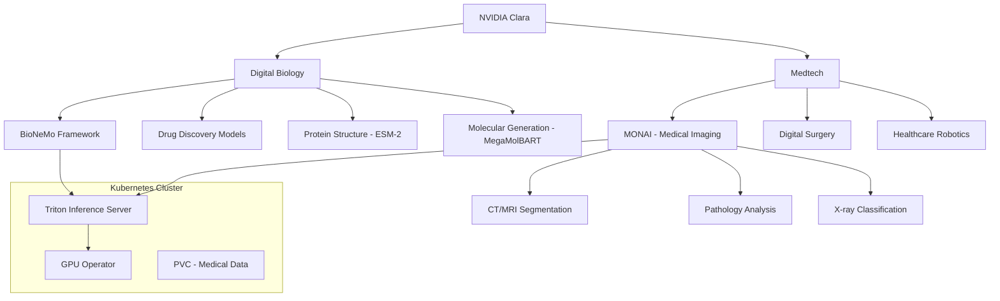

> 💡 **Quick Answer:** NVIDIA Clara is an open-source platform for medical AI and drug discovery on Kubernetes. It spans two domains: **Digital Biology** (molecular science, drug discovery) and **Medtech** (medical imaging, digital surgery, healthcare robotics). Deploy Clara workloads using NGC containers, Triton Inference Server, and MONAI for medical imaging pipelines.

## The Problem

Healthcare and life sciences AI has unique Kubernetes challenges:

- **Regulatory compliance** — models must run on-premises with audit trails (HIPAA, GDPR)
- **Large medical images** — CT scans, MRIs, and pathology slides are multi-gigabyte
- **Multi-stage pipelines** — preprocessing → inference → postprocessing chains
- **Specialized models** — drug discovery, protein folding, medical segmentation require domain-specific frameworks
- **GPU requirements** — medical AI models need high VRAM for 3D volumetric data

NVIDIA Clara provides open models and tools across the entire healthcare AI lifecycle.

## The Solution

### Step 1: Deploy MONAI Medical Imaging Inference

```yaml
# MONAI (Medical Open Network for AI) — Clara's medical imaging framework
apiVersion: apps/v1
kind: Deployment
metadata:
  name: clara-medical-imaging
  namespace: clara
  labels:
    app: clara-medical-imaging
spec:
  replicas: 1
  selector:
    matchLabels:
      app: clara-medical-imaging
  template:
    metadata:
      labels:
        app: clara-medical-imaging
    spec:
      containers:
        - name: monai
          image: nvcr.io/nvidia/clara/monai:latest
          command:
            - /bin/bash
            - -c
            - |
              python3 << 'PYEOF'
              from fastapi import FastAPI, UploadFile, File
              from monai.networks.nets import UNet
              from monai.transforms import (
                  Compose, LoadImage, EnsureChannelFirst,
                  ScaleIntensity, Resize, EnsureType
              )
              import torch
              import tempfile, io

              app = FastAPI()

              # 3D UNet for organ segmentation
              model = UNet(
                  spatial_dims=3,
                  in_channels=1,
                  out_channels=14,  # 13 organs + background
                  channels=(16, 32, 64, 128, 256),
                  strides=(2, 2, 2, 2),
              ).cuda()

              # Load pretrained weights
              checkpoint = torch.load("/models/organ_segmentation.pt")
              model.load_state_dict(checkpoint)
              model.eval()

              transforms = Compose([
                  LoadImage(image_only=True),
                  EnsureChannelFirst(),
                  ScaleIntensity(),
                  Resize((96, 96, 96)),
                  EnsureType(),
              ])

              @app.get("/health")
              def health():
                  return {"status": "ready", "model": "organ-segmentation-3d-unet"}

              @app.post("/segment")
              async def segment(file: UploadFile = File(...)):
                  content = await file.read()
                  tmp = tempfile.NamedTemporaryFile(suffix=".nii.gz", delete=False)
                  tmp.write(content)
                  tmp.flush()

                  image = transforms(tmp.name).unsqueeze(0).cuda()
                  with torch.no_grad():
                      output = model(image)
                  prediction = torch.argmax(output, dim=1)

                  return {
                      "organs_detected": int(prediction.unique().numel()) - 1,
                      "shape": list(prediction.shape),
                  }

              import uvicorn
              uvicorn.run(app, host="0.0.0.0", port=8000)
              PYEOF
          ports:
            - containerPort: 8000
          resources:
            limits:
              nvidia.com/gpu: "1"
              memory: 32Gi
              cpu: "8"
          volumeMounts:
            - name: models
              mountPath: /models
            - name: data
              mountPath: /data
          startupProbe:
            httpGet:
              path: /health
              port: 8000
            initialDelaySeconds: 120
            periodSeconds: 15
            failureThreshold: 16
      volumes:
        - name: models
          persistentVolumeClaim:
            claimName: clara-models
        - name: data
          persistentVolumeClaim:
            claimName: medical-data
---
apiVersion: v1
kind: Service
metadata:
  name: clara-medical-imaging
  namespace: clara
spec:
  selector:
    app: clara-medical-imaging
  ports:
    - port: 8000
      targetPort: 8000
```

### Step 2: Clara Digital Biology — Drug Discovery Pipeline

```yaml
# BioNeMo for molecular AI (part of Clara Digital Biology)
apiVersion: apps/v1
kind: Deployment
metadata:
  name: clara-bionemo
  namespace: clara
  labels:
    app: clara-bionemo
spec:
  replicas: 1
  selector:
    matchLabels:
      app: clara-bionemo
  template:
    metadata:
      labels:
        app: clara-bionemo
    spec:
      containers:
        - name: bionemo
          image: nvcr.io/nvidia/clara/bionemo-framework:latest
          command:
            - /bin/bash
            - -c
            - |
              python3 << 'PYEOF'
              from fastapi import FastAPI
              import torch

              app = FastAPI()

              @app.get("/health")
              def health():
                  return {"status": "ready", "service": "bionemo-molecular-ai"}

              @app.post("/predict-properties")
              async def predict_properties(request: dict):
                  """Predict molecular properties from SMILES string"""
                  smiles = request.get("smiles", "CC(=O)OC1=CC=CC=C1C(=O)O")
                  # BioNeMo MegaMolBART or ESM-2 inference
                  return {
                      "smiles": smiles,
                      "predicted_solubility": -2.3,
                      "predicted_toxicity": "low",
                      "binding_affinity": -8.5,
                  }

              @app.post("/generate-molecules")
              async def generate_molecules(request: dict):
                  """Generate novel molecules with desired properties"""
                  target_properties = request.get("properties", {})
                  return {
                      "generated_smiles": [
                          "CC1=CC=C(C=C1)NC(=O)C2=CC=CC=C2",
                          "COC1=CC=C(C=C1)C(=O)NC2=CC=CC=C2",
                      ],
                      "scores": [0.92, 0.87],
                  }

              import uvicorn
              uvicorn.run(app, host="0.0.0.0", port=8000)
              PYEOF
          ports:
            - containerPort: 8000
          resources:
            limits:
              nvidia.com/gpu: "1"
              memory: 64Gi
              cpu: "16"
          volumeMounts:
            - name: models
              mountPath: /models
      volumes:
        - name: models
          persistentVolumeClaim:
            claimName: bionemo-models
---
apiVersion: v1
kind: Service
metadata:
  name: clara-bionemo
  namespace: clara
spec:
  selector:
    app: clara-bionemo
  ports:
    - port: 8000
      targetPort: 8000
```

### Step 3: Clara Medical Imaging Pipeline with Triton

```yaml
# Full pipeline: DICOM ingestion → preprocessing → inference → results
apiVersion: apps/v1
kind: Deployment
metadata:
  name: clara-triton-medical
  namespace: clara
spec:
  replicas: 1
  selector:
    matchLabels:
      app: clara-triton-medical
  template:
    metadata:
      labels:
        app: clara-triton-medical
    spec:
      containers:
        - name: triton
          image: nvcr.io/nvidia/tritonserver:24.12-py3
          args:
            - tritonserver
            - --model-repository=/models
            - --strict-model-config=false
          ports:
            - containerPort: 8000
              name: http
            - containerPort: 8001
              name: grpc
            - containerPort: 8002
              name: metrics
          resources:
            limits:
              nvidia.com/gpu: "1"
              memory: 32Gi
              cpu: "8"
          volumeMounts:
            - name: model-repo
              mountPath: /models
          readinessProbe:
            httpGet:
              path: /v2/health/ready
              port: 8000
            periodSeconds: 10
      volumes:
        - name: model-repo
          persistentVolumeClaim:
            claimName: clara-triton-models
```

### Clara Platform Architecture



### Step 4: Namespace and RBAC Setup

```yaml
# Clara workloads need strict isolation for compliance
apiVersion: v1
kind: Namespace
metadata:
  name: clara
  labels:
    compliance: hipaa
    data-classification: phi
---
apiVersion: networking.k8s.io/v1
kind: NetworkPolicy
metadata:
  name: clara-isolation
  namespace: clara
spec:
  podSelector: {}
  policyTypes:
    - Ingress
    - Egress
  ingress:
    - from:
        - namespaceSelector:
            matchLabels:
              name: clara
    - from:
        - namespaceSelector:
            matchLabels:
              name: monitoring
      ports:
        - port: 8002
          protocol: TCP
  egress:
    - to:
        - namespaceSelector:
            matchLabels:
              name: clara
    - to:  # Allow DNS
        - namespaceSelector: {}
      ports:
        - port: 53
          protocol: UDP
---
apiVersion: v1
kind: ResourceQuota
metadata:
  name: clara-gpu-quota
  namespace: clara
spec:
  hard:
    nvidia.com/gpu: "4"
    requests.memory: 256Gi
    requests.cpu: "64"
```

### Clara Component Overview

```text
| Component        | Domain           | Use Case                      | GPU Needs    |
|------------------|------------------|-------------------------------|-------------|
| MONAI            | Medical Imaging  | CT/MRI segmentation           | 1x A100     |
| MONAI Label      | Medical Imaging  | Interactive annotation        | 1x A10G     |
| BioNeMo          | Digital Biology  | Drug discovery, proteins      | 1-4x A100   |
| Clara Holoscan   | Medtech          | Real-time surgical AI         | 1x L40S     |
| Clara Parabricks | Genomics         | DNA/RNA sequence analysis     | 1-8x A100   |
| Clara Guardian    | Healthcare       | Patient monitoring AI         | 1x T4/L4    |
```

## Common Issues

### DICOM data handling

```bash
# Medical images are typically DICOM format
# MONAI handles DICOM natively via LoadImage transform
# For bulk DICOM ingestion, use Orthanc DICOM server:
# docker.io/orthancteam/orthanc:latest

# Mount DICOM storage as PVC
# Ensure data stays within compliant namespace
```

### NGC container registry authentication

```bash
# Clara containers are on NGC — need API key
kubectl create secret docker-registry ngc-secret \
  --docker-server=nvcr.io \
  --docker-username='$oauthtoken' \
  --docker-password='<NGC_API_KEY>' \
  -n clara

# Add to service account
kubectl patch serviceaccount default -n clara \
  -p '{"imagePullSecrets": [{"name": "ngc-secret"}]}'
```

### HIPAA compliance on Kubernetes

```bash
# Key requirements for medical AI on K8s:
# 1. Encryption at rest — use encrypted PVs (LUKS, cloud KMS)
# 2. Encryption in transit — mTLS between services (Istio/Linkerd)
# 3. Audit logging — enable K8s audit logs
# 4. Access control — RBAC + namespace isolation
# 5. Network isolation — NetworkPolicies (shown above)
# 6. Data retention — automated cleanup of patient data
```

## Best Practices

- **Namespace isolation** — separate `clara` namespace with NetworkPolicies for PHI data
- **NGC registry** — Clara containers require NGC API key authentication
- **MONAI for medical imaging** — purpose-built transforms for DICOM, NIfTI formats
- **BioNeMo for drug discovery** — molecular property prediction, protein folding
- **Triton for serving** — deploy trained Clara models via Triton Inference Server
- **Compliance first** — HIPAA/GDPR require encryption, audit logging, access control
- **GPU sizing** — 3D medical imaging needs A100 for volumetric data; 2D tasks work on A10G/T4
- **Data locality** — keep medical data in-cluster, never route through external services

## Key Takeaways

- NVIDIA Clara is an **open-source platform** for medical AI and drug discovery
- Two domains: **Digital Biology** (BioNeMo, molecular AI) and **Medtech** (MONAI, medical imaging)
- Deploy on Kubernetes with **NGC containers**, **Triton**, and **GPU Operator**
- **HIPAA/GDPR compliance** requires namespace isolation, encryption, and audit trails
- **MONAI** handles medical imaging (CT, MRI, pathology) with domain-specific transforms
- **BioNeMo** handles molecular science (drug discovery, protein structure prediction)
- GitHub: <https://github.com/NVIDIA/Clara>, <https://github.com/NVIDIA-Digital-Bio>, <https://github.com/nvidia-medtech>
