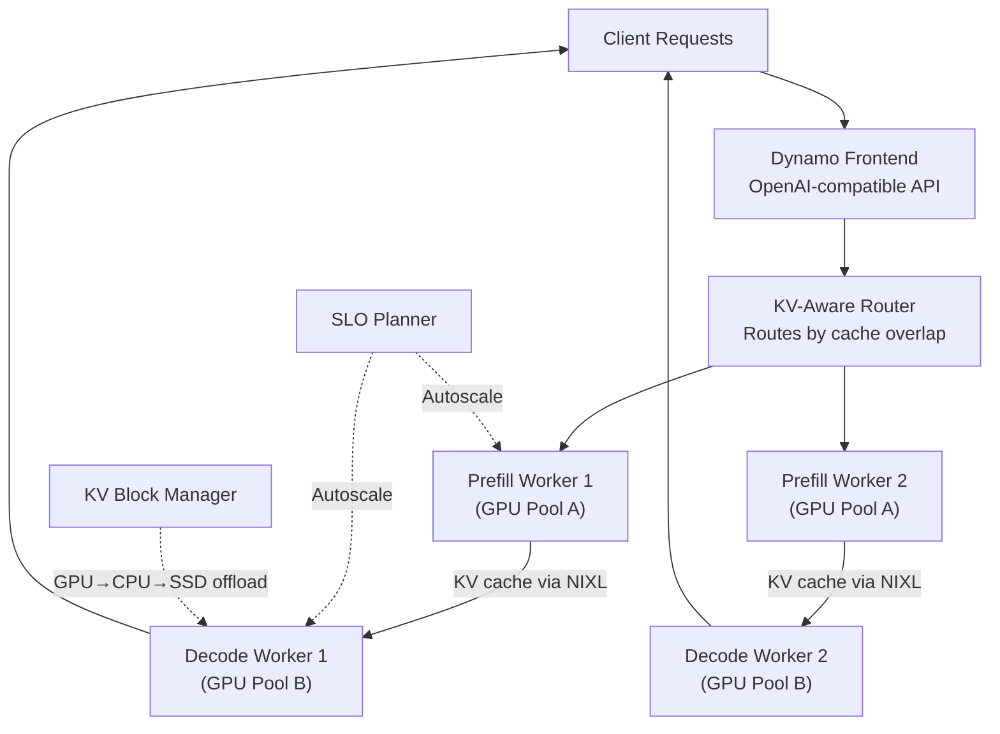

> 💡 **Quick Answer:** NVIDIA Dynamo is the open-source successor to Triton Inference Server. It orchestrates multi-node LLM inference with disaggregated prefill/decode, KV-aware routing, and SLA-driven autoscaling. Deploy on Kubernetes using the Grove operator and DynamoGraphDeploymentRequest CRD for zero-config model serving.

## The Problem

Serving large language models at datacenter scale requires more than a single inference engine on a single GPU. You need to coordinate prefill and decode phases across GPU pools, route requests intelligently to avoid redundant KV cache computation, autoscale to meet latency SLAs, and handle failures without dropping requests. Individual engines (vLLM, SGLang, TensorRT-LLM) optimize single-node execution but lack the orchestration layer for multi-node coordination.



## The Solution

### What NVIDIA Dynamo Does

Dynamo sits **above** inference engines — it doesn't replace vLLM, SGLang, or TensorRT-LLM, it coordinates them into a multi-node inference system.

| Component | Function |
|-----------|----------|
| **Frontend** | OpenAI-compatible API gateway |
| **KV-Aware Router** | Routes requests based on worker load + KV cache overlap → eliminates redundant prefill |
| **Disaggregated Serving** | Splits prefill and decode into independently scalable GPU pools |
| **NIXL** | Low-latency point-to-point KV cache transfer (GPU-to-GPU via NVLink, RDMA) |
| **KV Block Manager (KVBM)** | Offloads KV cache across GPU → CPU → SSD → remote storage |
| **ModelExpress** | Streams model weights GPU-to-GPU for 7× faster cold-start |
| **Planner** | SLA-driven autoscaler — profiles workloads, right-sizes GPU pools |
| **Grove** | K8s operator for topology-aware gang scheduling (NVL72, multi-rack) |
| **AIConfigurator** | Simulates 10K+ deployment configs in seconds to find optimal setup |

### Backend Support Matrix

| Feature | SGLang | TensorRT-LLM | vLLM |
|---------|:------:|:------------:|:----:|
| Disaggregated Serving | ✅ | ✅ | ✅ |
| KV-Aware Routing | ✅ | ✅ | ✅ |
| SLA-Based Planner | ✅ | ✅ | ✅ |
| KV Block Manager | 🚧 | ✅ | ✅ |
| Multimodal | ✅ | ✅ | ✅ |
| Tool Calling | ✅ | ✅ | ✅ |

### Quick Start: Docker (Single Node)

```bash
# Pull pre-built container (SGLang backend)
docker run --gpus all --network host --rm -it \
  nvcr.io/nvidia/ai-dynamo/sglang-runtime:1.0.1

# Inside the container — start frontend and worker
python3 -m dynamo.frontend --http-port 8000 --discovery-backend file &
python3 -m dynamo.sglang --model-path Qwen/Qwen3-0.6B --discovery-backend file &

# Test
curl -s localhost:8000/v1/chat/completions \
  -H "Content-Type: application/json" \
  -d '{
    "model": "Qwen/Qwen3-0.6B",
    "messages": [{"role": "user", "content": "Hello!"}],
    "max_tokens": 100
  }' | jq .
```

Available runtime containers:
- `nvcr.io/nvidia/ai-dynamo/sglang-runtime:1.0.1`
- `nvcr.io/nvidia/ai-dynamo/tensorrtllm-runtime:1.0.1`
- `nvcr.io/nvidia/ai-dynamo/vllm-runtime:1.0.1`

### Zero-Config Kubernetes Deployment

The simplest way to deploy on K8s — specify model, backend, and SLA targets:

```yaml
# dynamo-deploy.yaml
apiVersion: nvidia.com/v1beta1
kind: DynamoGraphDeploymentRequest
metadata:
  name: llama-70b-service
spec:
  model: meta-llama/Llama-3.1-70B-Instruct
  backend: vllm
  sla:
    ttft: 200.0    # Time to first token (ms)
    itl: 20.0      # Inter-token latency (ms)
  autoApply: true   # AIConfigurator auto-profiles and deploys
```

```bash
kubectl apply -f dynamo-deploy.yaml
```

Dynamo automatically:
1. Profiles the workload with AIConfigurator
2. Selects optimal topology (aggregated vs disaggregated, TP, PP)
3. Deploys frontend, router, prefill workers, and decode workers
4. Planner monitors SLAs and autoscales GPU pools

### Manual Kubernetes Deployment with Grove

For full control over the deployment topology:

```yaml
# Install Grove operator (prerequisite)
# Grove handles topology-aware gang scheduling
helm repo add grove https://ai-dynamo.github.io/grove
helm install grove grove/grove-operator -n dynamo-system --create-namespace
```

#### Disaggregated Prefill/Decode Deployment

```yaml
# dynamo-disaggregated.yaml
apiVersion: nvidia.com/v1beta1
kind: DynamoGraph
metadata:
  name: llama-70b-disagg
  namespace: inference
spec:
  model: meta-llama/Llama-3.1-70B-Instruct

  frontend:
    replicas: 2
    port: 8000
    resources:
      requests:
        cpu: "2"
        memory: 4Gi

  router:
    type: kv-aware      # Routes based on KV cache overlap
    replicas: 2
    resources:
      requests:
        cpu: "2"
        memory: 4Gi

  prefill:
    backend: sglang
    replicas: 4
    tensorParallelSize: 4
    resources:
      limits:
        nvidia.com/gpu: 4
    env:
      - name: HF_TOKEN
        valueFrom:
          secretKeyRef:
            name: hf-token
            key: HF_TOKEN

  decode:
    backend: sglang
    replicas: 8
    tensorParallelSize: 1
    resources:
      limits:
        nvidia.com/gpu: 1
    env:
      - name: HF_TOKEN
        valueFrom:
          secretKeyRef:
            name: hf-token
            key: HF_TOKEN

  planner:
    enabled: true
    sla:
      ttft: 200.0
      itl: 20.0
    minPrefillReplicas: 2
    maxPrefillReplicas: 8
    minDecodeReplicas: 4
    maxDecodeReplicas: 16

  kvCache:
    nixl:
      enabled: true        # Low-latency KV transfer between prefill → decode
    kvbm:
      enabled: true
      tiers:
        - type: gpu         # Hot tier
        - type: cpu          # Warm tier
          maxSizeGi: 64
        - type: ssd          # Cold tier
          maxSizeGi: 500
```

### Aggregated Deployment (Simpler)

When you don't need disaggregated serving:

```yaml
apiVersion: nvidia.com/v1beta1
kind: DynamoGraph
metadata:
  name: llama-8b-agg
  namespace: inference
spec:
  model: meta-llama/Llama-3.1-8B-Instruct

  frontend:
    replicas: 1
    port: 8000

  router:
    type: kv-aware
    replicas: 1

  workers:
    backend: vllm
    replicas: 4
    tensorParallelSize: 1
    resources:
      limits:
        nvidia.com/gpu: 1
    env:
      - name: HF_TOKEN
        valueFrom:
          secretKeyRef:
            name: hf-token
            key: HF_TOKEN

  planner:
    enabled: true
    sla:
      ttft: 100.0
      itl: 10.0
```

### Pre-Built Recipes

Dynamo ships tested recipes for common models:

| Model | Backend | Mode | GPUs |
|-------|---------|------|------|
| Llama 3 70B | vLLM | Aggregated | 4× H100 |
| DeepSeek-R1 | SGLang | Disaggregated | 8× H100 (multinode) |
| Qwen3-32B-FP8 | TensorRT-LLM | Aggregated | 1× H100 |

```bash
# Clone and deploy a recipe
git clone https://github.com/ai-dynamo/dynamo.git
cd dynamo/recipes/llama-3-70b/vllm
kubectl apply -f .
```

### KV-Aware Routing

The KV-aware router eliminates redundant prefill computation by routing requests to workers that already have relevant KV cache:

```
Request: "Summarize the following document: <long context>"
├─ Worker A: Has 80% of this context in KV cache → Route here (skip 80% prefill)
├─ Worker B: Has 20% of this context → Don't route here
└─ Worker C: Has 0% → Only if A is overloaded
```

This delivers **2× faster time to first token** in production workloads.

### SLA-Driven Autoscaling (Planner)

The Planner monitors real-time latency metrics and adjusts GPU allocation:

```
SLA: TTFT < 200ms, ITL < 20ms

Current state:
  Prefill workers: 4 (P99 TTFT = 180ms) ← OK
  Decode workers: 6 (P99 ITL = 25ms)   ← BREACH

Planner action:
  Scale decode workers: 6 → 8
  Result: P99 ITL drops to 15ms ← Within SLA
```

The Planner achieves **80% fewer SLA breaches at 5% lower TCO** compared to static provisioning.

### NIXL: Low-Latency KV Transfer

NIXL (NIM Inference eXchange Library) handles KV cache transfer between prefill and decode workers:

```
Prefill Worker → [NIXL via NVLink/RDMA] → Decode Worker

Transfer methods (fastest to slowest):
1. NVLink (intra-node): ~900 GB/s
2. InfiniBand RDMA (inter-node): ~400 GB/s
3. RoCE (inter-node): ~200 GB/s
4. TCP (fallback): ~25 GB/s
```

### ModelExpress: Fast Cold Start

ModelExpress streams model weights from running instances to new replicas via NIXL:

```
Traditional cold start:     Download from storage → Load to GPU (120s)
ModelExpress cold start:    Stream from neighbor GPU → Load (17s) = 7× faster
```

### Service Discovery on Kubernetes

Dynamo uses **K8s-native service discovery** — no etcd or NATS required:

| Deployment | etcd | NATS | Notes |
|------------|:----:|:----:|-------|
| Local dev | ❌ | ❌ | Use `--discovery-backend file` |
| Kubernetes | ❌ | ❌ | K8s CRDs + EndpointSlices |
| KV-Aware Routing | ❌ | ✅ | NATS needed for prefix caching coordination |
| Slurm | ✅ | ✅ | Both required |

### Cloud-Specific Guides

- **AWS EKS**: `dynamo/examples/deployments/EKS/`
- **Google GKE**: `dynamo/examples/deployments/GKE/`

### Benchmarking with AIPerf

```bash
# Install
pip install "ai-dynamo[sglang]"

# Benchmark your deployment
python3 -m dynamo.aiperf \
  --endpoint http://dynamo-frontend:8000 \
  --model meta-llama/Llama-3.1-70B-Instruct \
  --concurrency 32 \
  --duration 300 \
  --output results.json
```

## Common Issues

| Issue | Cause | Fix |
|-------|-------|-----|
| KV cache transfer slow | TCP fallback instead of RDMA | Configure NIXL with InfiniBand/RoCE; check `NCCL_IB_DISABLE` |
| Decode workers starved | Prefill consuming all GPUs | Enable disaggregated serving — separate GPU pools for prefill/decode |
| Cold start too slow | Downloading model from storage | Enable ModelExpress for GPU-to-GPU weight streaming |
| SLA breaches under load | Static GPU allocation | Enable Planner with TTFT/ITL targets for automatic scaling |
| Router not distributing evenly | KV-aware routing without NATS | Deploy NATS (`nats-server -js`) for prefix caching coordination |
| Grove scheduling suboptimal | Missing topology labels | Ensure nodes have NVLink/NUMA topology labels for Grove |

## Best Practices

- **Start aggregated, move to disaggregated** — disaggregation adds complexity; only split when prefill is the bottleneck
- **Use KV-aware routing always** — free performance gain even in aggregated mode
- **Set realistic SLA targets** — Planner optimizes for your targets; too aggressive = over-provisioned
- **Enable KVBM tiering** — GPU → CPU → SSD offloading extends effective context length
- **Use ModelExpress for autoscaling** — 7× faster cold-start means faster scale-out
- **Benchmark before production** — use AIPerf to validate topology choices
- **Pin to Dynamo 1.0.1+** — production-ready release with all core features

## Key Takeaways

- NVIDIA Dynamo is the open-source successor to Triton, built for datacenter-scale LLM inference
- Disaggregated serving splits prefill and decode into independently scalable GPU pools
- KV-aware routing eliminates redundant prefill computation for 2× faster TTFT
- The SLA Planner autoscales GPU pools to meet latency targets at minimum cost
- Grove operator enables topology-aware gang scheduling on Kubernetes (NVL72, multi-rack)
- Zero-config deployment via DynamoGraphDeploymentRequest CRD — specify model + SLA, Dynamo does the rest
- Works with all major backends: SGLang, TensorRT-LLM, and vLLM
