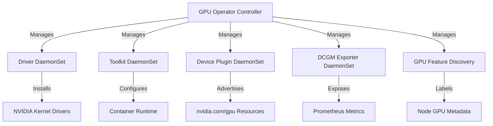

> 💡 **Quick Answer:** Install the GPU Operator with `helm install gpu-operator nvidia/gpu-operator -n gpu-operator --create-namespace`. It auto-deploys NVIDIA drivers, container toolkit, device plugin, and DCGM exporter as DaemonSets — no manual driver installation on nodes required.

## The Problem

Running GPU workloads on Kubernetes requires multiple NVIDIA components: kernel drivers, container toolkit, device plugin, and monitoring. Installing and maintaining these manually across nodes is error-prone, especially during cluster scaling or OS upgrades. You need an operator that manages the entire NVIDIA software stack as a unified deployment.

## The Solution

### Step 1: Prerequisites

```bash
# Verify NVIDIA GPUs are present on nodes
kubectl get nodes -o json | jq '.items[].status.capacity' | grep nvidia

# Label GPU nodes (optional but recommended)
kubectl label nodes <gpu-node> nvidia.com/gpu.present=true

# Verify no conflicting NVIDIA drivers are installed
# GPU Operator installs its own — existing drivers cause conflicts
ssh gpu-node "lsmod | grep nvidia"
```

### Step 2: Install GPU Operator via Helm

```bash
# Add NVIDIA Helm repo
helm repo add nvidia https://helm.ngc.nvidia.com/nvidia
helm repo update

# Install GPU Operator
helm install gpu-operator nvidia/gpu-operator \
  --namespace gpu-operator \
  --create-namespace \
  --set driver.enabled=true \
  --set toolkit.enabled=true \
  --set devicePlugin.enabled=true \
  --set dcgmExporter.enabled=true \
  --set migManager.enabled=false \
  --set gfd.enabled=true
```

### Step 3: Verify Installation

```bash
# Wait for all components to be ready
kubectl -n gpu-operator get pods -w

# Expected pods:
# nvidia-driver-daemonset-xxxxx          (driver container)
# nvidia-container-toolkit-xxxxx         (container runtime)
# nvidia-device-plugin-daemonset-xxxxx   (device plugin)
# nvidia-dcgm-exporter-xxxxx            (monitoring)
# gpu-feature-discovery-xxxxx           (node labels)
# gpu-operator-xxxxx                    (operator controller)

# Verify GPU resources are advertised
kubectl get nodes -o json | jq '.items[].status.allocatable' | grep nvidia
# "nvidia.com/gpu": "2"

# Check GPU node labels from GFD
kubectl get node <gpu-node> --show-labels | tr ',' '\n' | grep nvidia
# nvidia.com/cuda.driver.major=535
# nvidia.com/gpu.product=NVIDIA-A100-SXM4-80GB
# nvidia.com/gpu.memory=81920
```

### Step 4: Test GPU Access

```yaml
# gpu-test-pod.yaml
apiVersion: v1
kind: Pod
metadata:
  name: gpu-test
spec:
  restartPolicy: OnFailure
  containers:
    - name: cuda-test
      image: nvcr.io/nvidia/cuda:12.4.0-base-ubuntu22.04
      command: ["nvidia-smi"]
      resources:
        limits:
          nvidia.com/gpu: 1
```

```bash
kubectl apply -f gpu-test-pod.yaml
kubectl logs gpu-test
# +-----------------------------------------------------------------------------+
# | NVIDIA-SMI 535.129.03   Driver Version: 535.129.03   CUDA Version: 12.4     |
# |-------------------------------+----------------------+----------------------+
# | GPU  Name        Persistence-M| Bus-Id        Disp.A | Volatile Uncorr. ECC |
# | Fan  Temp  Perf  Pwr:Usage/Cap|         Memory-Usage | GPU-Util  Compute M. |
# |===============================+======================+======================|
# |   0  NVIDIA A100-SXM4-80GB On|   00000000:00:04.0 Off|                    0 |
# | N/A   32C    P0    52W / 400W |      0MiB / 81920MiB |      0%      Default |
# +-------------------------------+----------------------+----------------------+
```

### ClusterPolicy Configuration

The GPU Operator is configured via a `ClusterPolicy` CRD:

```yaml
apiVersion: nvidia.com/v1
kind: ClusterPolicy
metadata:
  name: cluster-policy
spec:
  operator:
    defaultRuntime: containerd
  driver:
    enabled: true
    version: "535.129.03"
    repository: nvcr.io/nvidia
    image: driver
    manager:
      env:
        - name: ENABLE_GPU_DIRECT_STORAGE
          value: "false"
  toolkit:
    enabled: true
    version: v1.14.6-ubuntu20.04
  devicePlugin:
    enabled: true
    version: v0.15.0
    config:
      name: device-plugin-config
      default: default
  dcgmExporter:
    enabled: true
    version: 3.3.5-3.4.1-ubuntu22.04
    config:
      name: dcgm-exporter-config
  gfd:
    enabled: true
    version: v0.8.2
  migManager:
    enabled: false
  nodeStatusExporter:
    enabled: true
```



### Pre-Installed Drivers (Skip Driver Container)

If your OS already has NVIDIA drivers (e.g., Ubuntu with `nvidia-driver-535`):

```bash
helm install gpu-operator nvidia/gpu-operator \
  --namespace gpu-operator \
  --create-namespace \
  --set driver.enabled=false \
  --set toolkit.enabled=true
```

### OpenShift Installation

```bash
# Install via OperatorHub (OLM)
# Navigate to: Operators → OperatorHub → NVIDIA GPU Operator → Install

# Or via CLI
cat <<EOF | kubectl apply -f -
apiVersion: operators.coreos.com/v1alpha1
kind: Subscription
metadata:
  name: gpu-operator-certified
  namespace: nvidia-gpu-operator
spec:
  channel: v24.6
  name: gpu-operator-certified
  source: certified-operators
  sourceNamespace: openshift-marketplace
EOF
```

## Common Issues

### Driver Pod CrashLoopBackOff

```bash
# Check driver pod logs
kubectl -n gpu-operator logs -l app=nvidia-driver-daemonset

# Common cause: Secure Boot enabled — disable in BIOS
# Common cause: Kernel headers missing
# Common cause: Conflicting host drivers — uninstall first:
sudo apt-get remove --purge nvidia-*
```

### "nvidia.com/gpu: 0" in Node Allocatable

```bash
# Verify device plugin is running
kubectl -n gpu-operator get pods -l app=nvidia-device-plugin-daemonset

# Check device plugin logs
kubectl -n gpu-operator logs -l app=nvidia-device-plugin-daemonset

# Restart device plugin
kubectl -n gpu-operator delete pods -l app=nvidia-device-plugin-daemonset
```

### DCGM Exporter Not Reporting Metrics

```bash
# Port-forward and check
kubectl -n gpu-operator port-forward svc/nvidia-dcgm-exporter 9400:9400
curl localhost:9400/metrics | grep DCGM

# Verify DCGM can access GPU
kubectl -n gpu-operator exec -it $(kubectl -n gpu-operator get pod -l app=nvidia-dcgm-exporter -o name | head -1) -- dcgmi discovery -l
```

## Best Practices

- **Use GPU Operator for driver management** — don't install drivers manually on nodes
- **Pin driver versions** — set `driver.version` in ClusterPolicy for reproducibility
- **Enable DCGM Exporter** — GPU monitoring is essential for capacity planning
- **Use GPU Feature Discovery** — auto-labels nodes with GPU model, memory, driver version
- **Separate GPU node pools** — use taints/tolerations to isolate GPU workloads
- **Plan for driver upgrades** — GPU Operator handles rolling driver updates via DaemonSet

## Key Takeaways

- GPU Operator manages the entire NVIDIA stack: drivers, toolkit, device plugin, monitoring
- Install with a single Helm command — no manual driver installation needed
- ClusterPolicy CRD controls all component versions and configurations
- GPU Feature Discovery auto-labels nodes with hardware details
- DCGM Exporter provides Prometheus metrics for GPU utilization, memory, temperature
- Disable `driver.enabled` if using pre-installed OS-level NVIDIA drivers
