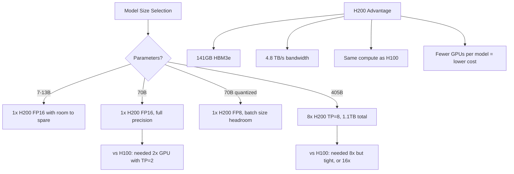

> 💡 **Quick Answer:** Use node selectors targeting `nvidia.com/gpu.product: NVIDIA-H200` and request `nvidia.com/gpu` resources. H200's 141GB HBM3e enables running 70B+ models on a single GPU and 405B models across 8 GPUs without CPU offloading.

## The Problem

Large language models (70B-405B parameters) require massive GPU memory. A100 (80GB) and H100 (80GB) can't fit 70B models in full precision on a single GPU, forcing tensor parallelism across multiple GPUs with expensive inter-GPU communication. H200 changes the equation with 141GB HBM3e.

## The Solution

NVIDIA H200 SXM GPUs provide 141GB HBM3e at 4.8 TB/s bandwidth — nearly 2x the memory of H100. This enables fitting larger models per GPU, reducing parallelism overhead and improving throughput.

### H200 vs H100 Comparison

```yaml
# GPU Specifications:
H100_SXM:
  memory: "80 GB HBM3"
  bandwidth: "3.35 TB/s"
  fp8_tflops: 3958
  interconnect: "NVLink 4.0 (900 GB/s)"
  tdp: "700W"

H200_SXM:
  memory: "141 GB HBM3e"
  bandwidth: "4.8 TB/s"
  fp8_tflops: 3958          # Same compute as H100
  interconnect: "NVLink 4.0 (900 GB/s)"
  tdp: "700W"
  advantage: "76% more memory, 43% more bandwidth"
```

### Node Selection for H200

```yaml
apiVersion: apps/v1
kind: Deployment
metadata:
  name: llm-inference-h200
  namespace: ai-inference
spec:
  replicas: 1
  selector:
    matchLabels:
      app: llm-inference
  template:
    metadata:
      labels:
        app: llm-inference
    spec:
      nodeSelector:
        nvidia.com/gpu.product: "NVIDIA-H200"
      tolerations:
        - key: nvidia.com/gpu
          operator: Exists
          effect: NoSchedule
      containers:
        - name: inference
          image: nvcr.io/nim/meta/llama-3.1-70b-instruct:latest
          env:
            - name: NGC_API_KEY
              valueFrom:
                secretKeyRef:
                  name: ngc-secret
                  key: api-key
            # Single GPU — H200 fits 70B in FP16
            - name: TENSOR_PARALLEL_SIZE
              value: "1"
          resources:
            limits:
              nvidia.com/gpu: 1    # 141GB fits 70B FP16
          ports:
            - containerPort: 8000
```

### 405B Model on 8x H200 (Single Node)

```yaml
apiVersion: apps/v1
kind: Deployment
metadata:
  name: llama-405b-h200
  namespace: ai-inference
spec:
  replicas: 1
  selector:
    matchLabels:
      app: llama-405b
  template:
    metadata:
      labels:
        app: llama-405b
    spec:
      nodeSelector:
        nvidia.com/gpu.product: "NVIDIA-H200"
        nvidia.com/gpu.count: "8"
      containers:
        - name: inference
          image: nvcr.io/nim/meta/llama-3.1-405b-instruct:latest
          env:
            - name: NGC_API_KEY
              valueFrom:
                secretKeyRef:
                  name: ngc-secret
                  key: api-key
            - name: TENSOR_PARALLEL_SIZE
              value: "8"
            - name: MAX_BATCH_SIZE
              value: "64"
            - name: MAX_INPUT_LEN
              value: "32768"
            - name: MAX_OUTPUT_LEN
              value: "4096"
          resources:
            limits:
              nvidia.com/gpu: 8    # 8x141GB = 1.1TB total
          volumeMounts:
            - name: dshm
              mountPath: /dev/shm
      volumes:
        - name: dshm
          emptyDir:
            medium: Memory
            sizeLimit: 64Gi
```

### H200 Training with DeepSpeed

```yaml
apiVersion: kubeflow.org/v1
kind: PyTorchJob
metadata:
  name: llm-pretrain-h200
  namespace: ai-training
spec:
  pytorchReplicaSpecs:
    Worker:
      replicas: 4
      template:
        spec:
          nodeSelector:
            nvidia.com/gpu.product: "NVIDIA-H200"
          containers:
            - name: trainer
              image: nvcr.io/nvidia/pytorch:24.03-py3
              command:
                - torchrun
                - --nnodes=4
                - --nproc_per_node=8
                - --rdzv_backend=c10d
                - --rdzv_endpoint=$(MASTER_ADDR):29500
                - /workspace/train.py
                - --model=meta-llama/Llama-3.1-70b
                - --bf16
                - --deepspeed=/workspace/ds_zero3.json
                - --per-device-train-batch-size=4
                - --gradient-accumulation-steps=4
                - --sequence-length=8192
              env:
                - name: NCCL_IB_DISABLE
                  value: "0"
                - name: NCCL_IB_HCA
                  value: "mlx5"
                - name: NCCL_NET_GDR_LEVEL
                  value: "5"
              resources:
                limits:
                  nvidia.com/gpu: 8
                  rdma/rdma_shared_device_a: 1
              volumeMounts:
                - name: dshm
                  mountPath: /dev/shm
          volumes:
            - name: dshm
              emptyDir:
                medium: Memory
                sizeLimit: 128Gi
```

### Monitor H200 GPUs

```bash
# Check H200 nodes
kubectl get nodes -l nvidia.com/gpu.product=NVIDIA-H200

# Verify HBM3e memory (141GB)
kubectl exec -it <pod> -- nvidia-smi --query-gpu=name,memory.total,memory.used,memory.free --format=csv

# Memory bandwidth utilization
kubectl exec -it <pod> -- nvidia-smi dmon -s mu -d 5

# Power and thermal
kubectl exec -it <pod> -- nvidia-smi --query-gpu=power.draw,temperature.gpu,clocks.gr,clocks.mem --format=csv

# NVLink topology
kubectl exec -it <pod> -- nvidia-smi topo -m

# DCGM metrics for Prometheus
kubectl exec -it <pod> -- dcgmi dmon -e 1001,1002,1003,1004,1005
```



## Common Issues

- **GPU not detected as H200** — update GPU Operator to latest version with H200 support; check `nvidia-smi` output
- **OOM even on H200** — 405B in FP16 needs ~810GB; use FP8 quantization or tensor parallelism across 8 GPUs
- **NVLink not active** — H200 SXM requires NVSwitch baseboard; PCIe variants have reduced interconnect
- **Thermal throttling** — H200 at 700W TDP requires proper datacenter cooling; monitor `temperature.gpu`
- **KV cache exhaustion** — long sequences consume memory beyond model weights; reduce `MAX_INPUT_LEN` or batch size

## Best Practices

- Use H200 to reduce tensor parallelism degree — 70B on 1 GPU instead of 2
- Enable FP8 for inference to maximize batch size headroom on 141GB
- Use NVLink for multi-GPU within a node, InfiniBand for multi-node
- Monitor HBM3e bandwidth utilization — H200 benefits most for memory-bound workloads
- Request all 8 GPUs per node for large model training to leverage NVSwitch
- Set `/dev/shm` to 128Gi for multi-GPU NCCL communication
- Use `nvidia.com/gpu.product` node selector, not generic `nvidia.com/gpu`

## Key Takeaways

- H200 provides 141GB HBM3e (76% more than H100) at 4.8 TB/s bandwidth
- Fits 70B models on a single GPU — eliminates tensor parallelism overhead
- 8x H200 (1.1TB) fits 405B models comfortably with KV cache headroom
- Same compute (FP8 TFLOPS) as H100 — the advantage is memory capacity and bandwidth
- Reduces GPU count per workload, lowering cost and communication overhead
- Ideal for large model inference where memory bandwidth is the bottleneck
