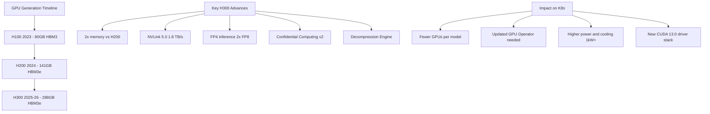

> 💡 **Quick Answer:** H300 (Blackwell architecture) brings 288GB HBM3e, NVLink 5.0 (1.8 TB/s), FP4 inference support, and a Transformer Engine v2. Plan Kubernetes infrastructure with updated GPU Operator, high-power cooling (1000W+ TDP), and NVLink Switch interconnect.

## The Problem

Even with H200's 141GB, the largest models (405B+, MoE architectures with 1T+ parameters) require multi-node tensor parallelism with expensive InfiniBand communication. Each GPU boundary adds latency. The industry needs more memory per GPU, faster interconnect, and lower-precision inference without accuracy loss.

## The Solution

NVIDIA H300 (Blackwell architecture) doubles the memory to 288GB HBM3e per GPU, introduces NVLink 5.0 at 1.8 TB/s per GPU, and adds FP4 precision for 2x inference throughput over FP8. A single 8-GPU H300 node provides 2.3TB of GPU memory.

### H300 vs H200 vs H100 Comparison

```yaml
# GPU Evolution:
H100_SXM:
  architecture: "Hopper"
  memory: "80 GB HBM3"
  bandwidth: "3.35 TB/s"
  fp8_tflops: 3958
  nvlink: "4.0 (900 GB/s)"
  tdp: "700W"

H200_SXM:
  architecture: "Hopper"
  memory: "141 GB HBM3e"
  bandwidth: "4.8 TB/s"
  fp8_tflops: 3958
  nvlink: "4.0 (900 GB/s)"
  tdp: "700W"

H300_SXM:  # Blackwell architecture
  architecture: "Blackwell"
  memory: "288 GB HBM3e"
  bandwidth: "8+ TB/s"
  fp4_tflops: "~10000"          # New FP4 precision
  fp8_tflops: "~5000"
  nvlink: "5.0 (1.8 TB/s)"
  tdp: "1000W+"
  new_features:
    - "FP4 Transformer Engine v2"
    - "Second-gen Confidential Computing"
    - "Decompression Engine for compressed KV cache"
    - "NVLink 5.0 with NVLink Switch"
```

### Infrastructure Requirements

```yaml
# Kubernetes node requirements for H300:
Node_Specs:
  power:
    per_gpu: "1000W+ TDP"
    per_node_8gpu: "10-12 kW total (with CPU, network, cooling)"
    cooling: "Direct liquid cooling recommended"
    pdu: "2x 30A 208V circuits per node minimum"

  network:
    intra_node: "NVLink 5.0 via NVLink Switch (1.8 TB/s per GPU)"
    inter_node: "InfiniBand NDR400 (400 Gb/s per port)"
    rdma: "ConnectX-8 or BlueField-4 DPUs"
    management: "25GbE minimum"

  storage:
    model_cache: "NVMe local (7+ GB/s read for model loading)"
    checkpoints: "NFSoRDMA or Lustre (parallel filesystem)"
    datasets: "Shared NFS or object storage"

  software:
    gpu_operator: "v25.x+ (Blackwell support)"
    cuda: "13.0+"
    driver: "570.x+"
    tensorrt_llm: "v1.0+ (FP4 support)"
```

### Planned Deployment Pattern

```yaml
# H300 inference deployment (projected)
apiVersion: apps/v1
kind: Deployment
metadata:
  name: llm-inference-h300
  namespace: ai-inference
spec:
  replicas: 1
  selector:
    matchLabels:
      app: llm-h300
  template:
    metadata:
      labels:
        app: llm-h300
    spec:
      nodeSelector:
        nvidia.com/gpu.product: "NVIDIA-H300"
      containers:
        - name: inference
          image: nvcr.io/nim/meta/llama-3.1-405b-instruct:latest
          env:
            - name: NGC_API_KEY
              valueFrom:
                secretKeyRef:
                  name: ngc-secret
                  key: api-key
            # 405B fits on 4x H300 in FP8 (4x288GB = 1.15TB)
            # Or 2x H300 in FP4 (2x288GB = 576GB for ~400GB model)
            - name: TENSOR_PARALLEL_SIZE
              value: "4"
            - name: QUANTIZATION
              value: "fp4"        # Blackwell FP4 support
            - name: MAX_BATCH_SIZE
              value: "128"
          resources:
            limits:
              nvidia.com/gpu: 4
          volumeMounts:
            - name: dshm
              mountPath: /dev/shm
      volumes:
        - name: dshm
          emptyDir:
            medium: Memory
            sizeLimit: 128Gi
```

### GPU Operator Readiness

```bash
# Check GPU Operator supports Blackwell
kubectl get clusterpolicy gpu-cluster-policy -o jsonpath='{.spec.driver.version}'

# Verify CUDA compatibility
kubectl exec -it <gpu-pod> -- nvcc --version
# Needs CUDA 13.0+ for Blackwell features

# Check NVLink 5.0 topology
kubectl exec -it <gpu-pod> -- nvidia-smi topo -m
# Should show NVLink 5.0 connections at 1.8 TB/s

# Verify FP4 support in TensorRT-LLM
kubectl exec -it <gpu-pod> -- python3 -c "
import tensorrt_llm
print(f'TRT-LLM version: {tensorrt_llm.__version__}')
print(f'FP4 supported: {tensorrt_llm.supports_fp4()}')
"
```

### Model Sizing Guide for H300

```yaml
# What fits where with H300 (288GB per GPU):
Single_GPU_1x288GB:
  - "Llama 3.1 70B FP16 (~140GB) — with 148GB KV cache headroom"
  - "Llama 3.1 70B FP8 (~70GB) — massive batch size capacity"
  - "Mixtral 8x22B FP8 (~90GB)"
  - "Any model up to 140B in FP8"

Two_GPUs_2x288GB_576GB:
  - "Llama 3.1 405B FP4 (~200GB model + KV cache)"
  - "Llama 3.1 405B FP8 (~400GB) — tight but fits"
  - "Falcon 180B FP16 (~360GB)"

Four_GPUs_4x288GB_1152GB:
  - "Llama 3.1 405B FP8 — comfortable with large batch sizes"
  - "Mixtral 8x22B ensemble serving"
  - "1T+ MoE models in FP4"

Eight_GPUs_8x288GB_2304GB:
  - "Any current model with maximum batch size"
  - "Multi-model serving (405B + safety + embedding)"
  - "Pre-training 70B+ models with large micro-batch"
```



## Common Issues

- **GPU Operator doesn't recognize H300** — requires GPU Operator v25.x+ with Blackwell support; update ClusterPolicy
- **FP4 not available** — needs TensorRT-LLM v1.0+ and CUDA 13.0+; check container image versions
- **Power throttling** — H300 at 1000W+ needs direct liquid cooling; air-cooled datacenters will throttle
- **NVLink 5.0 not detected** — requires NVLink Switch baseboard; PCIe variants don't have full NVLink mesh
- **Driver mismatch** — Blackwell needs 570.x+ drivers; older drivers won't initialize the GPU

## Best Practices

- Plan power infrastructure early — 8x H300 nodes draw 10-12 kW each
- Use direct liquid cooling for sustained workloads at full TDP
- Update GPU Operator and driver containers to Blackwell-compatible versions before deployment
- Leverage FP4 for inference — 2x throughput over FP8 with minimal accuracy loss
- Use NVLink 5.0 for intra-node communication, InfiniBand NDR400 for inter-node
- Test workloads on H200 first, then migrate to H300 — same software stack, just faster
- Plan node pools with `nvidia.com/gpu.product` labels for workload-specific scheduling

## Key Takeaways

- H300 provides 288GB HBM3e (2x H200) at 8+ TB/s memory bandwidth
- NVLink 5.0 doubles interconnect to 1.8 TB/s per GPU
- FP4 precision enables 2x inference throughput over FP8
- 405B models fit on 2-4 GPUs instead of 8 — reduces cost and latency
- Requires updated software stack: GPU Operator v25+, CUDA 13+, driver 570+
- Power and cooling infrastructure is the primary planning constraint (1000W+ per GPU)
- Kubernetes scheduling unchanged — use node selectors and GPU resource requests
