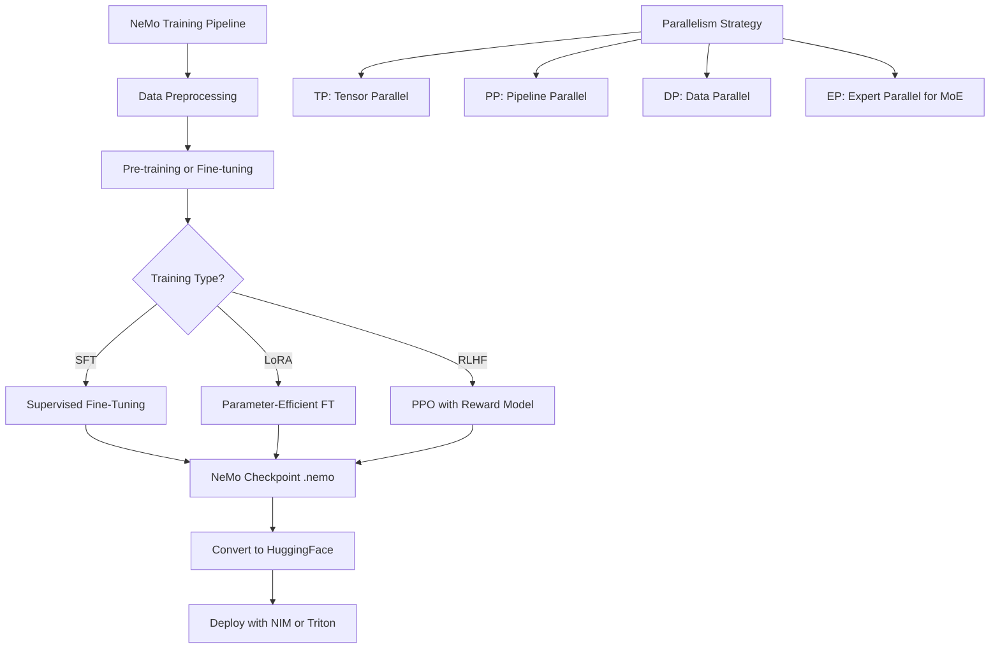

> 💡 **Quick Answer:** Deploy NeMo using the `nvcr.io/nvidia/nemo` container with PyTorchJob or LeaderWorkerSet. NeMo provides pre-built recipes for LLM pre-training, fine-tuning (SFT, LoRA, RLHF), with built-in parallelism strategies (TP, PP, DP, EP) and automatic mixed precision.

## The Problem

Training or fine-tuning LLMs at scale requires complex parallelism configurations (tensor, pipeline, data, expert), mixed precision training, efficient data loading, checkpoint management, and RLHF alignment. Implementing this from scratch with raw PyTorch is error-prone and wastes weeks of engineering.

## The Solution

NVIDIA NeMo is a GPU-optimized framework that provides pre-built recipes for LLM training workflows. It handles parallelism strategies, checkpoint management, data preprocessing, and RLHF — all configurable via YAML.

### NeMo Container Image

```bash
# Pull NeMo container from NGC
docker pull nvcr.io/nvidia/nemo:24.12

# Available images:
# nvcr.io/nvidia/nemo:24.12        — Full NeMo (training + inference)
# nvcr.io/nvidia/nemo:24.12-lm     — Language models only
# nvcr.io/nvidia/nemo:24.12-fw     — Framework only (lightweight)
```

### NeMo Fine-Tuning Job (SFT)

```yaml
apiVersion: kubeflow.org/v1
kind: PyTorchJob
metadata:
  name: nemo-sft-llama
  namespace: ai-training
spec:
  pytorchReplicaSpecs:
    Worker:
      replicas: 2
      restartPolicy: OnFailure
      template:
        metadata:
          annotations:
            k8s.v1.cni.cncf.io/networks: rdma-net
        spec:
          nodeSelector:
            nvidia.com/gpu.product: "NVIDIA-H200"
          containers:
            - name: nemo
              image: nvcr.io/nvidia/nemo:24.12
              command:
                - torchrun
                - --nnodes=2
                - --nproc_per_node=8
                - --rdzv_backend=c10d
                - --rdzv_endpoint=$(MASTER_ADDR):29500
                - /opt/NeMo/examples/nlp/language_modeling/tuning/megatron_gpt_finetuning.py
              args:
                - --config-path=/config
                - --config-name=sft_config
              env:
                - name: NCCL_IB_DISABLE
                  value: "0"
                - name: NCCL_IB_HCA
                  value: "mlx5"
                - name: NCCL_NET_GDR_LEVEL
                  value: "5"
                - name: CUDA_DEVICE_MAX_CONNECTIONS
                  value: "1"
                - name: NVTE_FWD_LAYERNORM_SM_MARGIN
                  value: "16"
                - name: NVTE_BWD_LAYERNORM_SM_MARGIN
                  value: "16"
                - name: HF_TOKEN
                  valueFrom:
                    secretKeyRef:
                      name: hf-token
                      key: token
              resources:
                limits:
                  nvidia.com/gpu: 8
                  rdma/rdma_shared_device_a: 1
              volumeMounts:
                - name: config
                  mountPath: /config
                - name: data
                  mountPath: /data
                - name: checkpoints
                  mountPath: /checkpoints
                - name: dshm
                  mountPath: /dev/shm
          volumes:
            - name: config
              configMap:
                name: nemo-sft-config
            - name: data
              persistentVolumeClaim:
                claimName: nfsordma-datasets
            - name: checkpoints
              persistentVolumeClaim:
                claimName: nfsordma-checkpoints
            - name: dshm
              emptyDir:
                medium: Memory
                sizeLimit: 128Gi
```

### NeMo SFT Configuration

```yaml
# ConfigMap: nemo-sft-config
apiVersion: v1
kind: ConfigMap
metadata:
  name: nemo-sft-config
  namespace: ai-training
data:
  sft_config.yaml: |
    trainer:
      devices: 8
      num_nodes: 2
      accelerator: gpu
      precision: bf16-mixed
      max_epochs: 3
      max_steps: -1
      val_check_interval: 500
      gradient_clip_val: 1.0
      accumulate_grad_batches: 1
      enable_checkpointing: true
      logger: true

    exp_manager:
      explicit_log_dir: /checkpoints/sft-llama
      exp_dir: /checkpoints/sft-llama
      name: nemo_sft
      create_wandb_logger: false
      create_tensorboard_logger: true
      resume_if_exists: true
      resume_ignore_no_checkpoint: true
      checkpoint_callback_params:
        monitor: val_loss
        save_top_k: 3
        mode: min
        save_last: true

    model:
      restore_from_path: /data/models/llama-3.1-8b-nemo
      tensor_model_parallel_size: 1
      pipeline_model_parallel_size: 1
      micro_batch_size: 2
      global_batch_size: 32
      sequence_parallel: true
      activations_checkpoint_method: uniform
      activations_checkpoint_num_layers: 1

      data:
        train_ds:
          file_names:
            - /data/sft/train.jsonl
          concat_sampling_probabilities:
            - 1.0
          max_seq_length: 4096
          micro_batch_size: ${model.micro_batch_size}
          global_batch_size: ${model.global_batch_size}
          shuffle: true
          num_workers: 4
          pin_memory: true
          drop_last: true

        validation_ds:
          file_names:
            - /data/sft/val.jsonl
          max_seq_length: 4096
          micro_batch_size: ${model.micro_batch_size}
          global_batch_size: ${model.global_batch_size}
          shuffle: false
          num_workers: 4

      optim:
        name: fused_adam
        lr: 2e-5
        weight_decay: 0.01
        betas:
          - 0.9
          - 0.98
        sched:
          name: CosineAnnealing
          warmup_steps: 50
          min_lr: 2e-6
```

### LoRA Fine-Tuning (Parameter-Efficient)

```yaml
# nemo-lora-config.yaml
apiVersion: v1
kind: ConfigMap
metadata:
  name: nemo-lora-config
  namespace: ai-training
data:
  lora_config.yaml: |
    trainer:
      devices: 8
      num_nodes: 1
      accelerator: gpu
      precision: bf16-mixed
      max_steps: 1000

    model:
      restore_from_path: /data/models/llama-3.1-70b-nemo
      tensor_model_parallel_size: 4
      pipeline_model_parallel_size: 1
      micro_batch_size: 1
      global_batch_size: 16

      # LoRA configuration
      peft:
        peft_scheme: lora
        lora_tuning:
          target_modules:
            - attention_qkv
            - attention_dense
          adapter_dim: 16
          alpha: 32
          dropout: 0.05

      data:
        train_ds:
          file_names:
            - /data/sft/train.jsonl
          max_seq_length: 4096

      optim:
        name: fused_adam
        lr: 1e-4
```

### RLHF with NeMo Aligner

```yaml
apiVersion: kubeflow.org/v1
kind: PyTorchJob
metadata:
  name: nemo-rlhf
  namespace: ai-training
spec:
  pytorchReplicaSpecs:
    Worker:
      replicas: 4
      template:
        spec:
          nodeSelector:
            nvidia.com/gpu.product: "NVIDIA-H200"
          containers:
            - name: nemo
              image: nvcr.io/nvidia/nemo:24.12
              command:
                - torchrun
                - --nnodes=4
                - --nproc_per_node=8
                - --rdzv_backend=c10d
                - --rdzv_endpoint=$(MASTER_ADDR):29500
                - /opt/NeMo-Aligner/examples/nlp/gpt/train_gpt_ppo_actor.py
              args:
                - --config-path=/config
                - --config-name=rlhf_config
              env:
                - name: NCCL_IB_DISABLE
                  value: "0"
              resources:
                limits:
                  nvidia.com/gpu: 8
                  rdma/rdma_shared_device_a: 1
              volumeMounts:
                - name: dshm
                  mountPath: /dev/shm
                - name: data
                  mountPath: /data
                - name: checkpoints
                  mountPath: /checkpoints
          volumes:
            - name: dshm
              emptyDir:
                medium: Memory
                sizeLimit: 128Gi
            - name: data
              persistentVolumeClaim:
                claimName: nfsordma-datasets
            - name: checkpoints
              persistentVolumeClaim:
                claimName: nfsordma-checkpoints
```

### Monitor NeMo Training

```bash
# Watch training logs
kubectl logs -f nemo-sft-llama-worker-0 -n ai-training

# Check GPU utilization
kubectl exec nemo-sft-llama-worker-0 -n ai-training -- \
  nvidia-smi --query-gpu=utilization.gpu,memory.used,power.draw --format=csv -l 5

# TensorBoard
kubectl port-forward svc/tensorboard 6006:6006 -n ai-training
# Open http://localhost:6006

# Check checkpoint saves
kubectl exec nemo-sft-llama-worker-0 -n ai-training -- \
  ls -la /checkpoints/sft-llama/

# Convert NeMo checkpoint to HuggingFace format
kubectl exec nemo-sft-llama-worker-0 -n ai-training -- \
  python /opt/NeMo/scripts/checkpoint_converters/convert_nemo_to_hf.py \
  --input_path=/checkpoints/sft-llama/nemo_sft-last.nemo \
  --output_path=/checkpoints/hf-llama-sft/
```



## Common Issues

- **OOM during training** — reduce `micro_batch_size`; enable `activations_checkpoint_method: uniform`; increase TP/PP
- **NCCL timeout** — increase `NCCL_SOCKET_TIMEOUT`; verify RDMA interface is up; check NVLink topology
- **Checkpoint save fails** — shared filesystem must be writable from all nodes; check PVC mount permissions
- **NeMo container very large** — use `-lm` variant for language models only; base image is 20GB+
- **Mixed precision NaN loss** — reduce learning rate; check data for anomalies; try `bf16-mixed` instead of `fp16`

## Best Practices

- Use `bf16-mixed` precision on H100/H200/H300 — avoids FP16 overflow issues
- Enable `sequence_parallel: true` for memory savings on long sequences
- Use activation checkpointing to trade compute for memory on large models
- Store checkpoints on NFSoRDMA shared storage for multi-node access
- Use NeMo's built-in data preprocessing for tokenization and packing
- Start with LoRA for quick experiments, move to full SFT once hyperparameters are tuned
- Export checkpoints to HuggingFace format for inference with NIM/Triton
- Set `CUDA_DEVICE_MAX_CONNECTIONS=1` for optimal NCCL+compute overlap

## Key Takeaways

- NeMo provides complete LLM training workflows: pre-training, SFT, LoRA, RLHF
- Built-in parallelism: TP, PP, DP, EP — configured via YAML, not code changes
- NeMo Aligner handles RLHF/PPO with reward model training
- Optimized for NVIDIA GPUs: Transformer Engine, fused kernels, mixed precision
- Checkpoints convert to HuggingFace format for deployment via NIM or Triton
- Use PyTorchJob or LeaderWorkerSet for Kubernetes orchestration
