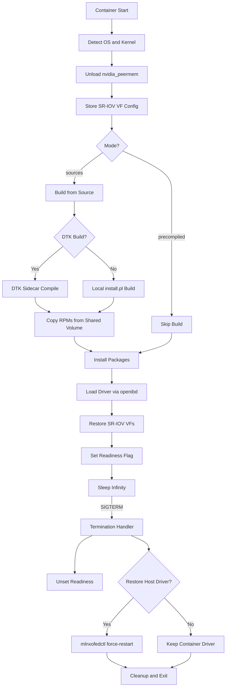

> 💡 **Quick Answer:** The NVIDIA NIC driver container entrypoint handles the full driver lifecycle: build from source (or use precompiled), install kernel modules, unload blocking modules (nvidia-peermem), restart openibd, restore SR-IOV VF config, create udev rules, and signal readiness via a flag file. Key env vars: `NVIDIA_NIC_DRIVER_VER`, `ENABLE_NFSRDMA`, `UNLOAD_STORAGE_MODULES`, `DTK_OCP_DRIVER_BUILD`.

## The Problem

The NVIDIA Network Operator deploys NIC drivers (MOFED/DOCA) as DaemonSet pods that must build or load kernel modules, handle SR-IOV VF preservation across driver reloads, manage udev naming rules, and support air-gapped DTK (DriverToolKit) builds on OpenShift. The entrypoint script orchestrates all of this — understanding it is critical for debugging driver issues, customizing builds, and handling upgrades.

## The Solution

### Container Execution Modes

The entrypoint supports two modes, determined by the Dockerfile CMD argument:

```yaml
# Mode 1: Build from source
# Container includes MLNX_OFED source tarball
# Entrypoint compiles kernel modules for the running kernel
container_cmd: "sources"
env:
  NVIDIA_NIC_DRIVER_VER: "24.07-0.6.1.0"
  NVIDIA_NIC_DRIVER_PATH: "/root/MLNX_OFED_SRC-24.07-0.6.1.0"

# Mode 2: Precompiled
# Container ships pre-built .ko modules for specific kernel
# Fastest startup — no compilation needed
container_cmd: "precompiled"
env:
  NVIDIA_NIC_DRIVER_VER: "24.07-0.6.1.0"
```

### Key Environment Variables

```yaml
# Required
NVIDIA_NIC_DRIVER_VER: "24.07-0.6.1.0"    # MOFED/DOCA version
NVIDIA_NIC_DRIVER_PATH: "/root/MLNX_OFED_SRC-..."  # Source path (sources mode)

# Optional — features
ENABLE_NFSRDMA: "false"                    # Load rpcrdma module for NFSoRDMA
UNLOAD_STORAGE_MODULES: "false"            # Unload ib_isert, nvme_rdma, etc. before reload
CREATE_IFNAMES_UDEV: "false"               # Create udev rules for short interface names
RESTORE_DRIVER_ON_POD_TERMINATION: "false"  # Restore host MOFED on container stop

# Optional — DTK (OpenShift DriverToolKit)
DTK_OCP_DRIVER_BUILD: "false"             # Use DTK sidecar for compilation
DTK_OCP_NIC_SHARED_DIR: "/mnt/shared-nvidia-nic-driver-toolkit"

# Optional — driver inventory (cache)
NVIDIA_NIC_DRIVERS_INVENTORY_PATH: ""      # PVC path to cache compiled packages

# Optional — debugging
ENTRYPOINT_DEBUG: "false"                  # Verbose logging
DEBUG_SLEEP_SEC_ON_EXIT: 300               # Sleep on exit for debugging

# Optional — module blacklisting
OFED_BLACKLIST_MODULES: "mlx5_core:mlx5_ib:ib_umad:ib_uverbs:ib_ipoib:rdma_cm:rdma_ucm:ib_core:ib_cm"
```

### Entrypoint Lifecycle Flow

```yaml
# 1. Pre-flight
- Detect OS (Ubuntu, RHEL/RHCOS, SLES)
- Detect kernel version (standard, RT, 64k)
- Unload blocking modules (nvidia_peermem)
- Check storage modules loaded vs UNLOAD_STORAGE_MODULES

# 2. Store current state
- Enumerate all Mellanox PFs (PCI addr, type, name, admin state, MTU, numVFs)
- Enumerate all VFs (MAC, GUID, admin state, MTU)
- Enumerate switchdev representors (phys_switch_id, port, name)
- This state is used to restore SR-IOV config after driver reload

# 3. Build driver (sources mode)
- Install kernel headers (dnf/apt/zypper based on OS)
- For RHCOS: enable rhocp and EUS repos, handle RT/64k kernels
- Run MLNX_OFED install.pl --kernel-only --build-only
- Or delegate to DTK sidecar (DTK_OCP_DRIVER_BUILD=true)
- Cache built packages in inventory path (checksum validated)

# 4. Install driver
- Create /lib/modules/${KVER} if missing
- Install .rpm or .deb packages
- Run depmod

# 5. Load driver
- Compare srcversion of loaded vs candidate modules
- If different: restart openibd (unloads old, loads new)
- If same: skip reload (optimization)
- Restore SR-IOV VF configuration (MACs, GUIDs, admin state, MTU)
- Load NFSoRDMA modules if enabled
- Mount rootfs for shared kernel headers
- Set readiness flag (/run/mellanox/drivers/.driver-ready)

# 6. Sleep infinity (wait for termination signal)
```

### SR-IOV Preservation Deep Dive

```bash
# The entrypoint preserves SR-IOV VF config across driver reloads:

# Before reload (store_devices_conf):
# 1. Enumerate PFs: PCI addr, netdev name, admin state, MTU, numVFs
# 2. Enumerate VFs: PCI addr, MAC, admin MAC, admin state, MTU, GUID (IB)
# 3. Enumerate switchdev representors: switch_id, port, VF id, name, state

# After reload (restore_sriov_config):
# 1. For each PF with VFs:
#    a. If switchdev mode: set to legacy first (kernel compat)
#    b. Set PF admin state (up/down)
#    c. Recreate VFs: echo $numvfs > sriov_numvfs
#    d. Wait BIND_DELAY_SEC for device init
# 2. For each VF:
#    a. Set MAC address (both VF netdev and PF vf admin MAC)
#    b. Set GUID for IB VFs
#    c. Unbind and rebind VF to driver
#    d. Set MTU and admin state
# 3. If switchdev: set back to switchdev mode, rebind VFs
# 4. Rename representors (two-phase to avoid name collisions)
```

### Configuring via NicClusterPolicy

```yaml
apiVersion: mellanox.com/v1alpha1
kind: NicClusterPolicy
metadata:
  name: nic-cluster-policy
spec:
  ofedDriver:
    image: doca-driver
    repository: nvcr.io/nvidia/mellanox
    version: "24.07-0.6.1.0"
    env:
      - name: ENABLE_NFSRDMA
        value: "true"
      - name: UNLOAD_STORAGE_MODULES
        value: "true"
      - name: CREATE_IFNAMES_UDEV
        value: "true"
      - name: RESTORE_DRIVER_ON_POD_TERMINATION
        value: "true"
    startupProbe:
      exec:
        command:
          - sh
          - -c
          - "test -f /run/mellanox/drivers/.driver-ready"
      initialDelaySeconds: 30
      periodSeconds: 10
      failureThreshold: 60
```

### DTK Build on OpenShift

```yaml
# When DTK_OCP_DRIVER_BUILD=true:
# 1. Entrypoint copies MOFED sources to shared volume
# 2. Sets compile flags in DTK build script
# 3. Touches start_compile flag
# 4. DTK sidecar (running with matching kernel-devel) compiles
# 5. DTK sets done_compile flag when finished
# 6. Entrypoint copies built RPMs from shared volume
# 7. Installs and loads driver

# Shared volume structure:
/mnt/shared-nvidia-nic-driver-toolkit/
  └── ${DTK_KVER}/                    # Sanitized kernel version
      ├── MLNX_OFED_SRC-24.07/       # Source tree (copied by entrypoint)
      ├── dtk_nic_driver_build.sh     # Build script (copied by entrypoint)
      ├── dtk_start_compile           # Flag: start build
      └── dtk_done_compile_24_07_...  # Flag: build complete
```

### Driver Inventory Cache

```yaml
# With NVIDIA_NIC_DRIVERS_INVENTORY_PATH set to a PVC:
# - Built packages are cached per kernel version + driver version
# - MD5 checksums validate cached packages
# - On restart: if cache hit with valid checksum, skip build entirely
# - On kernel upgrade: old kernel entries are cleaned up automatically

# PVC structure:
/var/nvidia-nic-driver-inventory/
  └── 5.14.0-427.40.1.el9_4.x86_64/
      ├── 24.07-0.6.1.0/
      │   ├── mlnx-ofa_kernel-*.rpm
      │   ├── kmod-mlnx-ofa_kernel-*.rpm
      │   └── ...
      └── 24.07-0.6.1.0.checksum
```

### Debugging the Entrypoint

```bash
# Enable debug mode in NicClusterPolicy:
env:
  - name: ENTRYPOINT_DEBUG
    value: "true"
  - name: DEBUG_SLEEP_SEC_ON_EXIT
    value: "600"

# Check entrypoint logs:
oc logs -n nvidia-network-operator \
  $(oc get pods -n nvidia-network-operator -l app=mofed -o name | head -1)

# Debug log file inside container:
oc exec -n nvidia-network-operator <pod> -- cat /tmp/entrypoint_debug_cmds.log

# Check readiness:
oc exec -n nvidia-network-operator <pod> -- \
  test -f /run/mellanox/drivers/.driver-ready && echo "READY" || echo "NOT READY"

# Check loaded driver version:
oc exec -n nvidia-network-operator <pod> -- \
  ethtool --driver $(ls /sys/class/net/ | grep -v lo | head -1) | grep version

# Verify module srcversions match:
oc exec -n nvidia-network-operator <pod> -- \
  bash -c 'for m in mlx5_core mlx5_ib ib_core; do
    echo "$m: modinfo=$(modinfo $m 2>/dev/null | grep srcversion | awk "{print \$NF}") sysfs=$(cat /sys/module/$m/srcversion 2>/dev/null)"
  done'
```

### Module Blacklisting

```bash
# The entrypoint blacklists inbox OFED modules on the host to prevent
# the host kernel from loading them instead of the container's modules

# Generated at /host/etc/modprobe.d/blacklist-ofed-modules.conf:
# blacklist mlx5_core
# blacklist mlx5_ib
# blacklist ib_umad
# blacklist ib_uverbs
# blacklist ib_ipoib
# blacklist rdma_cm
# blacklist rdma_ucm
# blacklist ib_core
# blacklist ib_cm

# Blacklist is removed on container termination (cleanup trap)
# If container is killed ungracefully, blacklist may persist on host
# causing inbox drivers to not load on reboot — manual cleanup needed
```



## Common Issues

- **Container stuck building** — kernel headers not available; for RHCOS check EUS repos are reachable; for RT kernels verify `redhat.repo` is mounted from host
- **openibd restart fails** — storage modules loaded and `UNLOAD_STORAGE_MODULES=false`; the entrypoint intentionally exits to prevent breaking storage — set `UNLOAD_STORAGE_MODULES=true` if safe
- **nvidia_peermem blocks reload** — entrypoint unloads nvidia_peermem if refcount=0; if refcount>0 (GPU workloads using GPUDirect), drain the node first
- **VF config lost after reload** — should auto-restore; if failing, check `BIND_DELAY_SEC` (default 4s) may be too short for slow NIC init
- **Interface names changed after reload** — `CREATE_IFNAMES_UDEV=true` injects udev rules to shorten names (strip `np[n]` suffix); without it, names may change
- **Switchdev representor names swapped** — entrypoint uses two-phase rename (temp name → final name) to avoid collisions; if still swapping, check `phys_switch_id` matching
- **Blacklist file persists after ungraceful kill** — manually remove `/etc/modprobe.d/blacklist-ofed-modules.conf` from host if inbox drivers won't load after container crash
- **DTK build timeout** — default wait is 10 retries × decaying sleep (starts 300s); total ~50min max; increase retries for slow builds or large source trees
- **Driver inventory checksum mismatch** — cached packages may be corrupted; delete the inventory path directory to force rebuild

## Best Practices

- Use precompiled containers for production — faster startup, no build dependencies
- Use driver inventory PVC for source builds — avoids recompilation on pod restart
- Set `ENTRYPOINT_DEBUG=true` during initial deployment and upgrades — invaluable for troubleshooting
- Always drain GPU workloads before NIC driver upgrades — nvidia_peermem refcount > 0 will block reload
- Set `RESTORE_DRIVER_ON_POD_TERMINATION=true` if you want host drivers restored when the container is removed
- Monitor the readiness flag `/run/mellanox/drivers/.driver-ready` via startup probe — don't assume the driver is loaded when the pod is Running
- For DTK builds on OpenShift: pre-build for N+1 OCP version before upgrading

## Key Takeaways

- The entrypoint handles the full NIC driver lifecycle: build → install → load → preserve SR-IOV → readiness
- Two modes: `sources` (compile from MLNX_OFED tarball) and `precompiled` (pre-built .ko modules)
- SR-IOV VF config (MACs, GUIDs, admin state, MTU) is preserved across driver reloads automatically
- DTK sidecar pattern enables compilation on OpenShift without shipping kernel-devel in the driver container
- Driver inventory caching (with MD5 checksums) avoids recompilation on pod restarts
- nvidia_peermem must be unloaded before MOFED reload — drain GPU workloads first
- Module blacklisting prevents host inbox drivers from loading instead of container-provided modules
