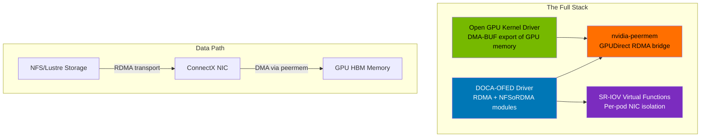
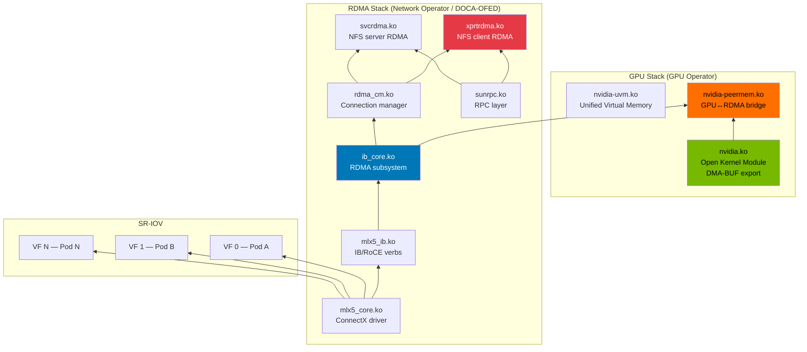

> 💡 **Quick Answer:** The full stack is: (1) GPU Operator with `useOpenKernelModules: true` for the open-source GPU kernel driver exposing DMA-BUF, (2) DOCA-OFED (Network Operator) with `nfsrdma` module for RDMA transport + NFSoRDMA, (3) `nvidia-peermem` module bridging GPU memory ↔ RDMA NIC for GPUDirect RDMA, and (4) SR-IOV VFs for per-pod dedicated NIC bandwidth. This enables zero-copy data paths from storage → NIC → GPU with no CPU involvement.

## The Problem

AI training at scale requires moving massive datasets (hundreds of GB) from distributed storage into GPU memory across a cluster. The default path — storage → NIC → CPU → system RAM → PCIe → GPU — creates three bottleneck hops. Each hop adds latency and consumes CPU cycles that should be running training code. At 8-GPU-per-node scale with 400Gbps networking, the CPU becomes the bottleneck, capping effective throughput at 40-60% of wire speed.

You need the full zero-copy data path: **storage → RDMA NIC → PCIe → GPU memory**, bypassing the CPU entirely.

## The Architecture



### How the Layers Connect

| Layer | Component | Role |
|-------|-----------|------|
| **GPU** | Open Kernel Driver + DMA-BUF | Exposes GPU memory pages to the Linux DMA-BUF subsystem so other devices (NICs) can address them |
| **Bridge** | `nvidia-peermem` | Registers GPU memory with the InfiniBand/RDMA core so NICs can DMA directly into GPU HBM |
| **Network** | DOCA-OFED + `nfsrdma` | Provides RDMA verbs stack + NFSoRDMA kernel module for RDMA-based NFS mounts |
| **Isolation** | SR-IOV VFs | Gives each pod its own hardware NIC slice with dedicated queues, bypassing the kernel network stack |

**Without this stack:** Storage → NIC → **CPU memcpy** → System RAM → **CPU memcpy** → GPU (3-5ms per transfer, CPU at 100%)

**With this stack:** Storage → NIC → GPU (0.5ms per transfer, CPU at ~5%)

## The Solution

### Prerequisites

- **NVIDIA GPUs**: A100, H100, H200, or later (PCIe or SXM)
- **NVIDIA ConnectX-6 Dx** or later NICs (ConnectX-7 recommended)
- **Firmware**: ConnectX NIC firmware with SRIOV and RDMA enabled
- **Kubernetes**: 1.28+ with GPU Operator and Network Operator
- **OpenShift**: 4.14+ (if using OpenShift)
- **Storage**: NFS server with RDMA support (e.g., NetApp ONTAP, DDN EXA5) or Lustre with LNet RDMA

### Step 1: Deploy GPU Operator with Open Kernel Modules

The **open-source GPU kernel driver** (`nvidia-open`) is required for DMA-BUF support. The proprietary driver does NOT export DMA-BUF interfaces.

```yaml
apiVersion: nvidia.com/v1
kind: ClusterPolicy
metadata:
  name: gpu-cluster-policy
spec:
  operator:
    defaultRuntime: crio    # containerd for non-OpenShift
  driver:
    enabled: true
    # === KEY: Use open kernel modules ===
    useOpenKernelModules: true
    version: "560.35.05"
    # Open driver image (note: -open suffix)
    image: nvcr.io/nvidia/driver
    repository: nvcr.io/nvidia
    licensingConfig:
      nlsEnabled: false
    rdma:
      enabled: true          # Load nvidia-peermem module
      useHostMofed: false     # MOFED managed by Network Operator
  # GPUDirect RDMA peer memory module
  gdrcopy:
    enabled: true
  # DCGM for monitoring
  dcgm:
    enabled: true
  dcgmExporter:
    enabled: true
    config:
      name: dcgm-exporter-config
  toolkit:
    enabled: true
  devicePlugin:
    enabled: true
    config:
      name: device-plugin-config
  # GDS for GPUDirect Storage (NVMe → GPU)
  gds:
    enabled: true
  # Node Feature Discovery
  nfd:
    enabled: true
  # MIG manager (for A100/H100 MIG partitioning)
  migManager:
    enabled: true
```

**Why open kernel modules?**

The open-source NVIDIA kernel driver (`nvidia-open`) implements the Linux DMA-BUF standard interface (`dma_buf_ops`). This allows:
- Other kernel subsystems to **import GPU memory** as DMA-BUF file descriptors
- The RDMA stack to register GPU pages for **peer-to-peer DMA** via `nvidia-peermem`
- Future kernel features (KFD, P2PDMA) to interoperate with GPU memory

```bash
# Verify open driver is loaded (not proprietary)
oc debug node/gpu-worker-1 -- chroot /host bash -c '
  modinfo nvidia | grep -E "^filename|^description|^license"
'
# filename:       /lib/modules/.../nvidia.ko
# description:    NVIDIA Unified Memory
# license:        Dual MIT/GPL    ← Open driver (proprietary shows "NVIDIA")

# Verify DMA-BUF support
oc debug node/gpu-worker-1 -- chroot /host bash -c '
  ls /sys/kernel/dmabuf/buffers/ 2>/dev/null && echo "DMA-BUF active" || echo "No DMA-BUF"
'
```

### Step 2: Deploy Network Operator with DOCA-OFED + NFSoRDMA

```yaml
apiVersion: mellanox.com/v1alpha1
kind: NicClusterPolicy
metadata:
  name: nic-cluster-policy
spec:
  ofedDriver:
    # === DOCA-OFED driver with NFSoRDMA ===
    image: doca-driver
    repository: nvcr.io/nvidia/mellanox
    version: "24.10-0.7.0.0-0"
    startupProbe:
      initialDelaySeconds: 10
      periodSeconds: 20
    livenessProbe:
      initialDelaySeconds: 30
      periodSeconds: 30
    rdmaSharedDevicePlugin:
      image: k8s-rdma-shared-dev-plugin
      repository: ghcr.io/mellanox
      version: "v1.5.1"
      config: |
        {
          "configList": [
            {
              "resourceName": "rdma_shared_device_a",
              "rdmaHcaMax": 63,
              "selectors": {
                "vendors": ["15b3"],
                "deviceIDs": ["101d", "101e", "a2dc"],
                "ifNames": ["ens8f0", "ens8f1"]
              }
            }
          ]
        }
    env:
      # === Enable NFSoRDMA kernel module ===
      - name: NFSRDMA_ENABLE
        value: "true"
      - name: RESTORE_DRIVER_ON_POD_TERMINATION
        value: "true"
      # Load nvidia-peermem for GPUDirect RDMA
      - name: CREATE_IFNAMES_UDEV
        value: "true"
    # Kernel modules to load
    # DOCA-OFED loads: mlx5_core, mlx5_ib, ib_core, rdma_cm, ib_uverbs
    # With NFSRDMA_ENABLE: also loads xprtrdma, svcrdma (NFSoRDMA transport)
    # nvidia-peermem: loaded by GPU Operator when rdma.enabled=true
  
  sriovDevicePlugin:
    image: sriov-network-device-plugin
    repository: ghcr.io/k8snetworkplumbingwg
    version: "v3.7.0"
    config: |
      {
        "resourceList": [
          {
            "resourcePrefix": "nvidia.com",
            "resourceName": "sriov_rdma_vf",
            "selectors": {
              "vendors": ["15b3"],
              "devices": ["101e"],
              "drivers": ["mlx5_core"],
              "isRdma": true
            }
          }
        ]
      }
```

**Verify DOCA-OFED and NFSoRDMA:**

```bash
# Check OFED driver pods are running
oc get pods -n nvidia-network-operator -l app=mofed

# Verify kernel modules on a GPU node
oc debug node/gpu-worker-1 -- chroot /host bash -c '
echo "=== RDMA Core ==="
lsmod | grep -E "^mlx5_core|^mlx5_ib|^ib_core|^rdma_cm"

echo ""
echo "=== NFSoRDMA ==="
lsmod | grep -E "^xprtrdma|^svcrdma|^rpcrdma"

echo ""
echo "=== GPUDirect RDMA (peermem) ==="
lsmod | grep nvidia_peermem

echo ""
echo "=== DMA-BUF ==="
lsmod | grep dmabuf
'

# Expected output:
# === RDMA Core ===
# mlx5_core           2097152  1 mlx5_ib
# mlx5_ib              409600  0
# ib_core              524288  7 mlx5_ib,ib_uverbs,rdma_cm,...
# rdma_cm              131072  1 ...
#
# === NFSoRDMA ===
# xprtrdma              90112  0     ← NFS client RDMA transport
# svcrdma               77824  0     ← NFS server RDMA transport (if serving)
# rpcrdma_core          45056  2 xprtrdma,svcrdma
#
# === GPUDirect RDMA (peermem) ===
# nvidia_peermem         16384  0     ← GPU↔NIC bridge
#
# === DMA-BUF ===
# dmabuf                 ...         ← DMA-BUF subsystem
```

### Step 3: Configure SR-IOV Virtual Functions

Create VFs on the ConnectX NICs so each pod gets its own hardware-isolated NIC slice with dedicated RDMA resources:

```yaml
apiVersion: sriovnetwork.openshift.io/v1
kind: SriovNetworkNodePolicy
metadata:
  name: gpu-rdma-vfs
  namespace: openshift-sriov-network-operator
spec:
  nodeSelector:
    node-role.kubernetes.io/gpu-worker: ""
    feature.node.kubernetes.io/network-sriov.capable: "true"
  resourceName: sriov_rdma_vf
  numVfs: 8                     # 8 VFs = 1 per GPU (for 8-GPU nodes)
  nicSelector:
    vendor: "15b3"              # Mellanox/NVIDIA
    deviceID: "101d"            # ConnectX-6 Dx (use 101e for CX-7)
    pfNames: ["ens8f0"]         # Physical function name
  deviceType: netdevice          # Use netdevice for RDMA (not vfio-pci)
  isRdma: true                  # Enable RDMA on VFs
  linkType: ETH                 # Ethernet (use IB for InfiniBand)
  mtu: 9000                     # Jumbo frames for RDMA performance
  # === Important: Access mode for RDMA NICs ===
  # Switch ports must be in ACCESS mode (untagged)
  # NFSoRDMA does NOT support VLAN tagging
```

**Why `deviceType: netdevice` and not `vfio-pci`?**

For GPUDirect RDMA, the VF must use the kernel `mlx5_core` driver (netdevice mode) so that:
- The `ib_core` RDMA subsystem can register the device
- `nvidia-peermem` can map GPU pages to the NIC's RDMA context
- NFSoRDMA can use the RDMA transport layer

`vfio-pci` bypasses the kernel entirely (for DPDK/userspace drivers) — no RDMA verbs, no peermem, no NFSoRDMA.

```bash
# Verify VFs are created
oc debug node/gpu-worker-1 -- chroot /host bash -c '
echo "=== SR-IOV VFs ==="
ip link show ens8f0
# Should show: vf 0, vf 1, ... vf 7

echo ""
echo "=== RDMA devices ==="
rdma link show
# Should show mlx5_0, mlx5_1, ... for each VF with RDMA capability

echo ""
echo "=== Allocatable resources ==="
'
oc get node gpu-worker-1 -o json | jq '.status.allocatable | with_entries(select(.key | contains("sriov")))'
# "nvidia.com/sriov_rdma_vf": "8"
```

### Step 4: Create SR-IOV Network Attachment

```yaml
apiVersion: sriovnetwork.openshift.io/v1
kind: SriovNetwork
metadata:
  name: gpu-rdma-net
  namespace: openshift-sriov-network-operator
spec:
  resourceName: sriov_rdma_vf
  networkNamespace: ai-training
  ipam: |
    {
      "type": "host-local",
      "subnet": "192.168.100.0/24",
      "rangeStart": "192.168.100.10",
      "rangeEnd": "192.168.100.200"
    }
  # Configure for RDMA
  capabilities: '{ "rdma": true }'
```

### Step 5: Mount NFSoRDMA Storage

On each GPU node, mount the NFS export with RDMA transport:

```yaml
# MachineConfig for NFSoRDMA mount (OpenShift)
apiVersion: machineconfiguration.openshift.io/v1
kind: MachineConfig
metadata:
  name: 99-gpu-worker-nfsordma-mount
  labels:
    machineconfiguration.openshift.io/role: gpu-worker
spec:
  config:
    ignition:
      version: 3.2.0
    systemd:
      units:
        - name: mnt-ai\\x2ddata.mount
          enabled: true
          contents: |
            [Unit]
            Description=NFSoRDMA AI Training Data
            After=network-online.target openibd.service
            Wants=network-online.target
            
            [Mount]
            What=nfs-server.internal.example.com:/exports/ai-data
            Where=/mnt/ai-data
            Type=nfs
            Options=rdma,port=20049,vers=4.1,rsize=1048576,wsize=1048576,hard,timeo=600,retrans=2,nconnect=16
            
            [Install]
            WantedBy=multi-user.target
```

**Mount options explained:**
- `rdma` — use RDMA transport instead of TCP
- `port=20049` — NFS server's RDMA listen port (standard NFSoRDMA port)
- `nconnect=16` — 16 parallel RDMA connections for aggregate bandwidth
- `rsize=1048576,wsize=1048576` — 1MB read/write blocks for large sequential I/O

```bash
# Verify NFSoRDMA mount is active
oc debug node/gpu-worker-1 -- chroot /host bash -c '
mount | grep rdma
# nfs-server:/exports/ai-data on /mnt/ai-data type nfs4 (rdma,...)

# Check RDMA transport is active (not falling back to TCP)
cat /proc/mounts | grep ai-data
nfsstat -m | grep ai-data
# Shows: proto=rdma
'
```

### Step 6: Deploy AI Training Pod with Full Stack

```yaml
apiVersion: v1
kind: Pod
metadata:
  name: gpu-rdma-training
  namespace: ai-training
  annotations:
    k8s.v1.cni.cncf.io/networks: gpu-rdma-net    # SR-IOV VF attachment
spec:
  containers:
    - name: training
      image: nvcr.io/nvidia/pytorch:24.12-py3
      command: ["bash", "-c"]
      args:
        - |
          echo "=== Verifying Full Stack ==="
          
          # 1. Check GPU (open driver)
          nvidia-smi --query-gpu=name,driver_version,memory.total --format=csv
          
          # 2. Check RDMA device (SR-IOV VF)
          ibv_devinfo 2>/dev/null || echo "Install rdma-core for ibv_devinfo"
          
          # 3. Check GPUDirect RDMA (peermem)
          cat /proc/driver/nvidia-peermem/version 2>/dev/null || \
            echo "nvidia-peermem not visible in container — check host"
          
          # 4. Check NFSoRDMA mount
          ls -la /data/
          dd if=/data/training-set/shard-000.tar of=/dev/null bs=1M count=1024 2>&1 | tail -1
          
          # 5. Run NCCL test with GPUDirect
          # NCCL will automatically use GPUDirect RDMA if available
          export NCCL_NET_GDR_LEVEL=5       # Enable GPUDirect RDMA in NCCL
          export NCCL_IB_DISABLE=0           # Use InfiniBand/RoCE
          export NCCL_SOCKET_IFNAME=net1     # SR-IOV VF interface
          
          echo "Stack verified. Starting training..."
          python train.py --data-dir /data/training-set/
      resources:
        limits:
          nvidia.com/gpu: 1
          nvidia.com/sriov_rdma_vf: 1       # One SR-IOV VF per GPU
        requests:
          nvidia.com/gpu: 1
          nvidia.com/sriov_rdma_vf: 1
      volumeMounts:
        - name: ai-data
          mountPath: /data
          readOnly: true
        - name: shm
          mountPath: /dev/shm
      securityContext:
        capabilities:
          add: ["IPC_LOCK"]     # Required for RDMA memory registration
  volumes:
    - name: ai-data
      hostPath:
        path: /mnt/ai-data     # NFSoRDMA mount point
        type: Directory
    - name: shm
      emptyDir:
        medium: Memory
        sizeLimit: "32Gi"       # Large SHM for PyTorch DataLoader workers
```

## Verifying the Full Data Path

### Test 1: GPUDirect RDMA (peermem) Active

```bash
# On the host node
oc debug node/gpu-worker-1 -- chroot /host bash -c '
# Check peermem is registered with InfiniBand core
cat /sys/module/nvidia_peermem/parameters/peermem_enabled 2>/dev/null
# 1 = active

# Check RDMA device capabilities
rdma link show | head -5
# link mlx5_0/1 state ACTIVE physical_state LINK_UP netdev ens8f0v0

# Verify peer memory is registered
dmesg | grep -i "nvidia peermem"
# nvidia-peermem registered successfully
'
```

### Test 2: NFSoRDMA Throughput

```bash
# From inside a GPU pod with the NFSoRDMA mount
dd if=/data/large-file.bin of=/dev/null bs=4M count=4096
# With RDMA: ~12-24 GB/s (100-200 Gbps) depending on NIC
# Without RDMA (TCP): ~3-6 GB/s

# Check NFS stats to confirm RDMA transport
nfsstat -m
# /data from nfs-server:/exports/ai-data
#  Flags: rdma,rw,vers=4.1
#  Proto: rdma     ← Confirmed RDMA, not TCP
```

### Test 3: End-to-End GPU Bandwidth

```python
# Python test: measure storage → GPU throughput via GPUDirect RDMA
import torch
import time
import numpy as np

# Read from NFSoRDMA mount directly into GPU
gpu = torch.device('cuda:0')
data = np.memmap('/data/training-set/shard-000.bin', dtype='float32', mode='r')

start = time.time()
tensor = torch.from_numpy(data[:256_000_000]).to(gpu)  # 1GB
elapsed = time.time() - start

print(f"Transferred 1GB to GPU in {elapsed:.3f}s = {1/elapsed:.1f} GB/s")
# With full stack: 8-15 GB/s
# Without GPUDirect: 2-4 GB/s
```

### Test 4: NCCL All-Reduce with GPUDirect RDMA

```bash
# Multi-node NCCL test
export NCCL_NET_GDR_LEVEL=5
export NCCL_IB_DISABLE=0
export NCCL_DEBUG=INFO

mpirun -np 16 -hostfile hosts \
  --mca btl_tcp_if_include net1 \
  /opt/nccl-tests/build/all_reduce_perf -b 1M -e 4G -f 2

# Look for "NET/IB" and "GDR" in NCCL debug output:
# NCCL INFO NET/IB : Using [0]mlx5_0:1/RoCE
# NCCL INFO NET/IB : GPU Direct RDMA Enabled for ...
```

## The Full Module Dependency Chain



## Common Issues

### nvidia-peermem Not Loading

```bash
# Check if GPU Operator has rdma enabled
oc get clusterpolicy -o jsonpath='{.items[0].spec.driver.rdma}'
# {"enabled": true}

# Check driver pod logs
oc logs -n gpu-operator -l app=nvidia-driver-daemonset -c nvidia-driver | grep peermem
# If "MOFED driver not found" → Network Operator must deploy DOCA-OFED first

# Correct startup order:
# 1. Network Operator deploys DOCA-OFED → mlx5_core, ib_core loaded
# 2. GPU Operator deploys open driver → nvidia.ko loaded
# 3. GPU Operator loads nvidia-peermem → bridges the two
```

### Open Driver Not Installed (Proprietary Loaded Instead)

```bash
# Check which driver is loaded
cat /proc/driver/nvidia/version
# If it shows "NVIDIA UNIX Open Kernel Module" → correct
# If it shows "NVIDIA UNIX x86_64 Kernel Module" → proprietary, no DMA-BUF

# Fix: ensure ClusterPolicy has useOpenKernelModules: true
oc patch clusterpolicy gpu-cluster-policy --type merge -p '
  {"spec":{"driver":{"useOpenKernelModules":true}}}'
# GPU Operator will redeploy driver DaemonSet with open modules
```

### NFSoRDMA Falling Back to TCP

```bash
# Check if xprtrdma module is loaded
lsmod | grep xprtrdma
# If missing, NFSRDMA_ENABLE wasn't set in NicClusterPolicy

# Check mount transport
cat /proc/mounts | grep nfs
# If "proto=tcp" instead of "proto=rdma":
# 1. NFS server may not support RDMA — check server config
# 2. Port 20049 may be blocked — check firewall
# 3. RDMA device may not be on the right subnet — check IP routing

# Test RDMA connectivity to NFS server
rdma_client -s nfs-server.internal.example.com -p 20049
```

### SR-IOV VFs Not RDMA-Capable

```bash
# Check VF RDMA capability
rdma link show
# If VFs don't show RDMA devices:
# 1. Verify isRdma: true in SriovNetworkNodePolicy
# 2. Verify deviceType: netdevice (not vfio-pci)
# 3. Check NIC firmware supports RDMA on VFs:
mlxconfig -d /dev/mst/mt4125_pciconf0 query | grep SRIOV_EN
# SRIOV_EN = True
mlxconfig -d /dev/mst/mt4125_pciconf0 query | grep RDMA
# RDMA_ENABLED = True
```

### Switch Port Configuration for RDMA

**Critical:** NFSoRDMA does not support 802.1Q VLAN tagging. Switch ports connected to RDMA NICs must be in **access mode** (untagged). Each VLAN requires a dedicated physical NIC.

```
# Switch configuration example (Arista/Cisco style)
interface Ethernet1/1
  description gpu-worker-1-rdma
  switchport mode access
  switchport access vlan 100
  mtu 9216
  no shutdown
  # DO NOT use: switchport mode trunk
```

## Performance Tuning

### Optimal Settings

```bash
# On each GPU node (via MachineConfig):

# 1. Enable adaptive RX coalescing for RDMA
ethtool -C ens8f0 adaptive-rx on

# 2. Set ring buffer to maximum
ethtool -G ens8f0 rx 8192 tx 8192

# 3. Enable PCI relaxed ordering (GPUDirect optimization)
setpci -s <NIC_PCI_BUS>:00.0 CAP_EXP+10.w=0020

# 4. Jumbo frames (must match switch MTU)
ip link set ens8f0 mtu 9000

# 5. NUMA-aware GPU↔NIC pairing
# GPU 0 on NUMA 0 should use NIC on NUMA 0
nvidia-smi topo -m
# Shows GPU-NIC affinity — schedule pods to match
```

### Expected Performance

| Configuration | NFS Read Throughput | GPU Load Time (10GB) | CPU Usage |
|--------------|-------------------|---------------------|-----------|
| TCP NFS + CPU copy | 3-6 GB/s | 1.7-3.3s | 80-100% |
| RDMA NFS + CPU copy | 10-20 GB/s | 0.5-1.0s | 20-40% |
| RDMA NFS + GPUDirect | 15-25 GB/s | 0.4-0.7s | 3-8% |
| RDMA NFS + GPUDirect + SR-IOV | 20-28 GB/s | 0.35-0.5s | 2-5% |

SR-IOV adds ~10-15% throughput by eliminating kernel networking overhead and providing dedicated hardware queues per pod.

## Best Practices

- **Match GPU and NIC NUMA nodes** — cross-NUMA transfers add 30-50% latency
- **Use open kernel modules** — required for DMA-BUF; also preferred by NVIDIA for datacenter GPUs going forward
- **Deploy Network Operator before GPU Operator** — nvidia-peermem needs ib_core to be loaded first
- **One SR-IOV VF per GPU** — matches the 1:1 GPU:NIC bandwidth ratio for maximum throughput
- **Dedicated NICs for RDMA** — don't share RDMA NICs with cluster management traffic
- **Access mode switch ports** — NFSoRDMA cannot do VLAN tagging; each VLAN = dedicated NIC
- **Test with `ib_write_bw` before deploying workloads** — verify raw RDMA bandwidth between nodes
- **Monitor with DCGM + `rdma` metrics** — track PCIe throughput and RDMA counters

## Key Takeaways

- The full stack is: **Open GPU driver** (DMA-BUF) → **nvidia-peermem** (bridge) → **DOCA-OFED** (RDMA) → **SR-IOV** (isolation)
- Open kernel modules (`useOpenKernelModules: true`) are required — proprietary driver lacks DMA-BUF
- `nvidia-peermem` is the glue: it registers GPU memory with the RDMA subsystem
- NFSoRDMA requires `NFSRDMA_ENABLE=true` in NicClusterPolicy and access-mode switch ports
- SR-IOV VFs with `isRdma: true` + `deviceType: netdevice` give per-pod RDMA hardware isolation
- Deploy order matters: Network Operator → GPU Operator → verify peermem → mount NFSoRDMA → deploy workloads
- This stack eliminates CPU from the storage → GPU data path, achieving 20-28 GB/s per NIC
