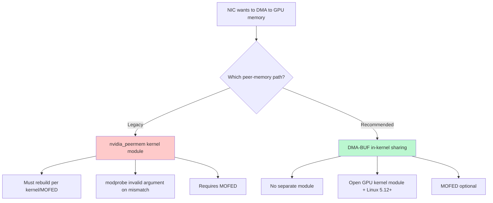

> 💡 **Quick Answer:** Configure nvidia_peermem and ib_register_peer_memory_client for GPUDirect RDMA on Kubernetes. Module loading and modprobe invalid argument fix.

## The Problem

GPUDirect RDMA lets a NIC read/write GPU memory directly over PCIe, bypassing a host-RAM bounce buffer — critical for fast multi-node GPU training. The legacy path uses the **`nvidia_peermem`** kernel module (formerly `nv_peer_mem`) to register GPU memory with the Mellanox/InfiniBand stack via `ib_register_peer_memory_client`. That module is a frequent source of pain: it must be rebuilt against every kernel and MOFED upgrade, and a mismatch produces:

```text
modprobe: ERROR: could not insert 'nvidia_peermem': Invalid argument
```

## The Solution

### Two Paths to GPUDirect RDMA



Since the open GPU kernel modules and Linux 5.12+, NVIDIA recommends **DMA-BUF** instead — it needs no separate peer-memory module at all and is far more robust across kernel/driver upgrades.

### Verify Current Module State

```bash
uname -r                                          # kernel must be 5.12+ for DMA-BUF
nvidia-smi --query-gpu=gpu_name,compute_cap --format=csv
lsmod | grep peermem                              # is the legacy module loaded?
```

### Migrate an Existing Installation to DMA-BUF

```bash
oc edit clusterpolicy gpu-cluster-policy
```

```yaml
spec:
  driver:
    kernelModuleType: open
    rdma:
      enabled: false    # disables legacy nvidia_peermem
```

```bash
oc delete pod -n gpu-operator -l app=nvidia-driver-daemonset
```

### Verify DMA-BUF Is Active

```bash
# nvidia-peermem-ctr container should be absent
kubectl get ds -n gpu-operator nvidia-driver-daemonset -o yaml | grep -i peermem

# Node should be annotated
oc get nodes -o json | jq '.items[].metadata.annotations["nvidia.com/gpudirect-dmabuf"]'
```

Confirm with NCCL logs:

```bash
NCCL_DEBUG=INFO NCCL_DEBUG_SUBSYS=NET,INIT NCCL_IB_HCA=mlx5_0 NCCL_NET_GDR_LEVEL=SYS \
  all_reduce_perf -b 8 -e 8G -f 2 -g 8
```

```text
# ✅ DMA-BUF active
[0] NCCL INFO NET/IB : GPU Direct RDMA (DMA-BUF) Enabled for HCA 0 'mlx5_0'

# ❌ Still on the legacy module
[0] NCCL INFO NET/IB : Using peer memory driver (nvidia-peermem)
```

## Common Issues

| Symptom | Cause | Fix |
|---------|-------|-----|
| `modprobe: ERROR: could not insert 'nvidia_peermem': Invalid argument` | Legacy module mismatched with the current kernel/MOFED version | Migrate to DMA-BUF; stop loading `nvidia_peermem` entirely |
| NCCL logs still show `peer memory driver` | `driver.rdma.enabled=true` still set | Set `rdma.enabled=false`, `kernelModuleType=open`, restart driver pods |
| `GPU Direct RDMA (DMA-BUF)` line absent | Proprietary driver in use | Switch to the open kernel module (`kernelModuleType=open`) |
| Driver pod crashloops after switching | Node kernel older than 5.12 | Upgrade the node kernel to 5.12+ |
| Works on some nodes only | Mixed GPU architectures (pre-Turing) | DMA-BUF needs Turing+; isolate older GPUs with node labels |

## Best Practices

- **Don't run both paths at once** — running `nvidia_peermem` alongside DMA-BUF causes ambiguous registration; the slower path can silently win
- **Migrate rather than chase rebuilds** — every `Invalid argument` modprobe failure is a signal to migrate to DMA-BUF, not to debug the module version mismatch again
- **MOFED becomes optional under DMA-BUF** — it was only mandatory for the legacy peermem path
- **No application changes needed** — NCCL, UCX, and CUDA-aware MPI use the same APIs regardless of which path registers GPU memory

## Key Takeaways

- `nvidia_peermem` is the legacy GPUDirect RDMA path — brittle across kernel/MOFED upgrades, and the source of the classic `Invalid argument` modprobe failure
- DMA-BUF (Linux 5.12+, open GPU kernel module, Turing+) is the modern replacement — no separate peer-memory module required
- Set `driver.kernelModuleType=open` and `driver.rdma.enabled=false` in the GPU Operator's ClusterPolicy to commit to DMA-BUF
- Verify with NCCL debug logs: `GPU Direct RDMA (DMA-BUF) Enabled` vs. `Using peer memory driver (nvidia-peermem)`
- Never run both paths simultaneously — pick one to avoid ambiguous memory registration
