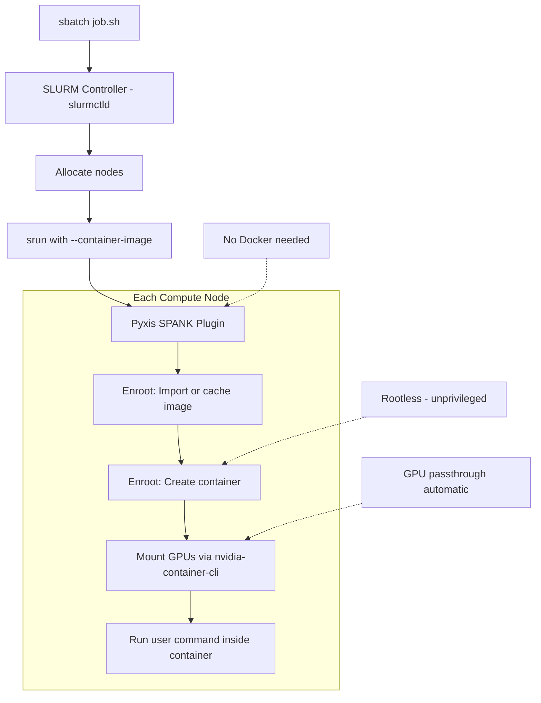

> 💡 **Quick Answer:** NVIDIA **Pyxis** is a SLURM plugin that lets you run containers inside SLURM jobs with `srun --container-image=nvcr.io/nvidia/pytorch:24.12-py3`. It uses **Enroot** as the container runtime — unprivileged, rootless, and optimized for HPC. No Docker or Podman needed on compute nodes.

## The Problem

HPC clusters managed by SLURM traditionally run bare-metal workloads. But AI teams need:

- **NGC containers** — NVIDIA's optimized PyTorch, TensorFlow, Triton images
- **Reproducible environments** — same container across dev, test, and production
- **No Docker on compute nodes** — HPC admins won't install Docker for security reasons
- **Multi-node GPU training** — containers that work with `srun` and MPI across nodes
- **Rootless** — users can't have root access on shared HPC systems

Pyxis + Enroot solves this: run containers in SLURM without Docker, with GPU passthrough, and MPI support.

## The Solution

### Step 1: Install Enroot on SLURM Nodes

```bash
# Install Enroot (container runtime for HPC)
# On each compute node:

# RHEL/Rocky/CentOS
arch=$(uname -m)
yum install -y \
  https://github.com/NVIDIA/enroot/releases/download/v3.5.0/enroot-3.5.0-1.el8.${arch}.rpm \
  https://github.com/NVIDIA/enroot/releases/download/v3.5.0/enroot+caps-3.5.0-1.el8.${arch}.rpm

# Ubuntu/Debian
apt install -y \
  https://github.com/NVIDIA/enroot/releases/download/v3.5.0/enroot_3.5.0-1_$(dpkg --print-architecture).deb \
  https://github.com/NVIDIA/enroot/releases/download/v3.5.0/enroot+caps_3.5.0-1_$(dpkg --print-architecture).deb

# Configure Enroot
cat > /etc/enroot/enroot.conf << 'EOF'
ENROOT_RUNTIME_PATH=/run/enroot/user-$(id -u)
ENROOT_DATA_PATH=/tmp/enroot-data/user-$(id -u)
ENROOT_CACHE_PATH=/tmp/enroot-cache
ENROOT_TEMP_PATH=/tmp/enroot-temp
ENROOT_SQUASH_OPTIONS="-b 256K -comp lz4 -noD"
ENROOT_MOUNT_HOME=yes
ENROOT_RESTRICT_DEV=yes
ENROOT_ROOTFS_WRITABLE=yes
EOF
```

### Step 2: Install Pyxis SLURM Plugin

```bash
# Install Pyxis (SLURM SPANK plugin for containers)
git clone https://github.com/NVIDIA/pyxis.git
cd pyxis
make
make install  # Installs to /usr/lib64/slurm/

# Configure SLURM to load Pyxis
cat >> /etc/slurm/plugstack.conf << 'EOF'
required /usr/lib64/slurm/spank_pyxis.so runtime_path=/run/pyxis
EOF

# Restart slurmd on compute nodes
systemctl restart slurmd
```

### Step 3: Run Containerized SLURM Jobs

```bash
# Basic: Run NGC PyTorch container
srun --container-image=nvcr.io/nvidia/pytorch:24.12-py3 \
     --gpus=8 \
     python3 -c "import torch; print(torch.cuda.device_count(), 'GPUs')"

# With bind mounts (like -v in Docker)
srun --container-image=nvcr.io/nvidia/pytorch:24.12-py3 \
     --container-mounts=/data:/data,/shared:/shared \
     --gpus=4 \
     python3 /shared/train.py --data /data/imagenet

# Multi-node distributed training
srun --nodes=4 \
     --ntasks-per-node=8 \
     --gpus-per-node=8 \
     --container-image=nvcr.io/nvidia/pytorch:24.12-py3 \
     --container-mounts=/shared:/shared \
     torchrun \
       --nnodes=$SLURM_NNODES \
       --nproc-per-node=8 \
       --rdzv-backend=c10d \
       --rdzv-endpoint=$(scontrol show hostname $SLURM_NODELIST | head -1):29500 \
       /shared/train_llm.py
```

### Step 4: Batch Script with Pyxis

```bash
#!/bin/bash
#SBATCH --job-name=llm-finetune
#SBATCH --nodes=4
#SBATCH --ntasks-per-node=8
#SBATCH --gres=gpu:8
#SBATCH --cpus-per-task=8
#SBATCH --mem=256G
#SBATCH --time=48:00:00
#SBATCH --partition=gpu
#SBATCH --output=/shared/logs/%j_%x.out
#SBATCH --error=/shared/logs/%j_%x.err

# Pyxis container flags
CONTAINER_IMAGE="nvcr.io/nvidia/pytorch:24.12-py3"
CONTAINER_MOUNTS="/shared:/shared,/data:/data"

# NCCL configuration
export NCCL_DEBUG=INFO
export NCCL_IB_DISABLE=0
export NCCL_NET_GDR_LEVEL=5
export NCCL_SOCKET_IFNAME=ib0

echo "Running on nodes: $SLURM_NODELIST"
echo "Total GPUs: $((SLURM_NNODES * 8))"

srun --container-image=$CONTAINER_IMAGE \
     --container-mounts=$CONTAINER_MOUNTS \
     --container-writable \
     torchrun \
       --nnodes=$SLURM_NNODES \
       --nproc-per-node=8 \
       --rdzv-backend=c10d \
       --rdzv-endpoint=$(scontrol show hostname $SLURM_NODELIST | head -1):29500 \
       /shared/scripts/finetune_llama.py \
       --model meta-llama/Llama-3.1-8B-Instruct \
       --dataset /data/custom_dataset \
       --output /shared/checkpoints/$SLURM_JOB_ID \
       --epochs 3 \
       --batch-size 4 \
       --gradient-accumulation 8
```

### Step 5: Pre-pull Container Images

```bash
# Enroot can import and cache container images
# Pre-pull on all nodes to avoid download during job:

# Import from NGC
enroot import docker://nvcr.io/nvidia/pytorch:24.12-py3
# Creates: nvidia+pytorch+24.12-py3.sqsh

# Import from Docker Hub
enroot import docker://vllm/vllm-openai:latest

# List cached images
enroot list

# Use cached image in srun (faster startup)
srun --container-image=nvidia+pytorch+24.12-py3.sqsh \
     python3 -c "print('using cached image')"

# Or use a shared filesystem for images
enroot import -o /shared/containers/pytorch-24.12.sqsh \
  docker://nvcr.io/nvidia/pytorch:24.12-py3
```

### Pyxis Architecture



### Pyxis vs Docker vs Kubernetes Comparison

```text
| Feature               | Pyxis+Enroot       | Docker           | Kubernetes       |
|-----------------------|--------------------|------------------|------------------|
| Root required         | No (rootless)      | Yes (or rootless)| No               |
| HPC scheduler        | SLURM native       | Not integrated   | K8s scheduler    |
| MPI support           | Native (srun)      | Manual           | MPI Operator     |
| GPU passthrough       | nvidia-container   | nvidia-docker    | GPU Operator     |
| Multi-node            | srun --nodes=N     | Swarm/Compose    | Pods/Jobs        |
| Image format          | Squashfs (fast)    | Overlay layers   | OCI              |
| Startup overhead      | Minimal            | Moderate         | Pod scheduling   |
| Network               | Host network       | Bridge/overlay   | CNI plugins      |
| Storage               | Bind mounts        | Volumes          | PVC/CSI          |
```

## Common Issues

### NGC authentication for private images

```bash
# Set NGC credentials for Enroot
mkdir -p ~/.config/enroot
cat > ~/.config/enroot/.credentials << 'EOF'
machine nvcr.io
login $oauthtoken
password <NGC_API_KEY>
EOF

# Or set environment variables
export ENROOT_LOGIN='$oauthtoken'
export ENROOT_PASSWORD='<NGC_API_KEY>'
```

### Container image not found on compute nodes

```bash
# Enroot needs to import images — they're not pulled like Docker
# Solution 1: Pre-import on all nodes
pdsh -w node[01-08] "enroot import docker://nvcr.io/nvidia/pytorch:24.12-py3"

# Solution 2: Use shared squashfs on NFS
enroot import -o /shared/images/pytorch.sqsh docker://nvcr.io/nvidia/pytorch:24.12-py3
# Then reference: --container-image=/shared/images/pytorch.sqsh
```

### Writable container filesystem

```bash
# By default, Enroot containers are read-only
# Use --container-writable for pip install etc.
srun --container-image=nvcr.io/nvidia/pytorch:24.12-py3 \
     --container-writable \
     bash -c "pip install transformers && python3 train.py"
```

## Best Practices

- **Pre-pull images** to shared squashfs files on NFS — avoids download during job
- **`--container-writable`** when you need to install packages inside the container
- **`--container-mounts`** for data and checkpoint directories
- **NCCL over InfiniBand** — set `NCCL_IB_DISABLE=0` for multi-node GPU jobs
- **Enroot cache** on fast local storage (`/tmp` or NVMe) — not on NFS
- **NGC credentials** in `~/.config/enroot/.credentials` for private images
- **Combine with SLURM accounting** — Pyxis jobs are tracked like any SLURM job

## Key Takeaways

- **Pyxis** = SLURM SPANK plugin that adds `--container-image` to `srun`/`sbatch`
- **Enroot** = rootless container runtime optimized for HPC (no Docker needed)
- **GPU passthrough** is automatic via `nvidia-container-cli`
- **Multi-node MPI** works natively — `srun --nodes=4 --container-image=...`
- Pre-pull images as **squashfs** on shared storage for fast job startup
- The bridge between **HPC (SLURM)** and **cloud-native (containers)** workflows
- GitHub: <https://github.com/NVIDIA/pyxis>, <https://github.com/NVIDIA/enroot>
