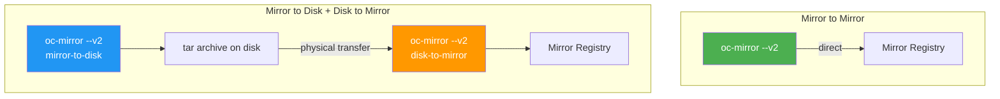

> 💡 **Quick Answer:** oc-mirror v2 (`--v2` flag) mirrors OpenShift releases, Operator catalogs, helm charts, and additional images to disconnected registries using an `ImageSetConfiguration` file. It supports mirror-to-mirror (partially disconnected), mirror-to-disk + disk-to-mirror (fully air-gapped), generates IDMS/ITMS/CatalogSource resources, and uses a cache for incremental mirroring.

## The Problem

Disconnected OpenShift clusters need hundreds of container images — release payloads, Operator bundles, and their dependencies. Manually identifying and mirroring each image is impractical:

- OpenShift 4.19 release payload alone contains 100+ images
- Operator catalogs contain thousands of images across hundreds of packages
- Update paths require all intermediate release images
- Dependencies between Operators aren't obvious without catalog introspection
- Without proper tooling, you miss images and discover it mid-install or mid-upgrade

## The Solution

### oc-mirror v2 Workflows



### Install oc-mirror

```bash
# Download from Red Hat console (Downloads page)
tar xzf oc-mirror.tar.gz
chmod +x oc-mirror
sudo mv oc-mirror /usr/local/bin/

# Verify v2
oc mirror --v2 --help
```

### ImageSetConfiguration

```yaml
# imageset-config.yaml
kind: ImageSetConfiguration
apiVersion: mirror.openshift.io/v2alpha1   # v2alpha1 for oc-mirror v2
mirror:
  platform:
    architectures:
    - amd64
    channels:
    - name: stable-4.18
      minVersion: 4.18.10
      maxVersion: 4.18.15
    - name: eus-4.16
      minVersion: 4.16.20
      maxVersion: 4.16.25
    graph: true    # Include OSUS graph-data image
  
  operators:
  - catalog: registry.redhat.io/redhat/redhat-operator-index:v4.18
    packages:
    - name: kubernetes-nmstate-operator
    - name: sriov-network-operator
    - name: nfd
    - name: gpu-operator-certified
    - name: cincinnati-operator
    - name: local-storage-operator
  
  additionalImages:
  - name: registry.redhat.io/ubi9/ubi:latest
  - name: registry.redhat.io/ubi9/ubi-minimal:latest
  
  helm:
    repositories:
    - name: nvidia
      url: https://helm.ngc.nvidia.com/nvidia
      charts:
      - name: gpu-operator
        version: 24.9.2
```

### Workflow 1: Mirror to Mirror (Partially Disconnected)

Use when the bastion host can reach both the internet and the mirror registry:

```bash
oc mirror --v2 \
  -c imageset-config.yaml \
  --workspace file:///opt/oc-mirror-workspace \
  docker://registry.example.com:8443

# Output:
# - Images mirrored to registry
# - working-dir/cluster-resources/ contains:
#   ├── idms-oc-mirror.yaml          (ImageDigestMirrorSet)
#   ├── itms-oc-mirror.yaml          (ImageTagMirrorSet)
#   ├── cs-redhat-operator-index.yaml (CatalogSource)
#   ├── updateservice.yaml            (UpdateService CR)
#   └── signature-configmap.json
```

### Workflow 2: Mirror to Disk (Fully Air-Gapped)

```bash
# Step 1: On connected host — mirror to disk
oc mirror --v2 \
  -c imageset-config.yaml \
  file:///mnt/transfer-disk/ocp-mirror

# Creates archive files under /mnt/transfer-disk/ocp-mirror/

# Step 2: Physically transfer disk to disconnected environment

# Step 3: On disconnected host — disk to mirror
oc mirror --v2 \
  -c imageset-config.yaml \
  --from file:///mnt/transfer-disk/ocp-mirror \
  docker://registry.example.com:8443
```

### Apply Generated Resources

```bash
# Apply IDMS, ITMS, CatalogSource
oc apply -f /opt/oc-mirror-workspace/working-dir/cluster-resources/

# Apply release image signatures (for release mirroring only)
oc apply -f /opt/oc-mirror-workspace/working-dir/cluster-resources/signature-configmap.json

# Verify
oc get imagedigestmirrorset
oc get imagetagmirrorset
oc get catalogsource -n openshift-marketplace
```

### Incremental Mirroring

oc-mirror v2 uses a local cache to avoid re-downloading unchanged images:

```bash
# First run: full download (may be hundreds of GB)
oc mirror --v2 -c imageset-config.yaml file:///opt/mirror-archive

# Update config to include new version
# Edit imageset-config.yaml: maxVersion: 4.18.16

# Second run: only downloads delta
oc mirror --v2 -c imageset-config.yaml file:///opt/mirror-archive

# Cache stored in --cache-dir (default: $HOME)
# Use --cache-dir for explicit control:
oc mirror --v2 -c imageset-config.yaml \
  --cache-dir /opt/oc-mirror-cache \
  --workspace file:///opt/oc-mirror-workspace \
  docker://registry.example.com:8443
```

### Dry Run

```bash
# Preview without mirroring
oc mirror --v2 \
  -c imageset-config.yaml \
  file:///tmp/dry-run \
  --dry-run

# Check generated files
cat /tmp/dry-run/working-dir/dry-run/mapping.txt    # All images
cat /tmp/dry-run/working-dir/dry-run/missing.txt    # Missing from cache
```

### Operator Filtering

```yaml
# Channel head only (default)
operators:
- catalog: registry.redhat.io/redhat/redhat-operator-index:v4.18
  packages:
  - name: rhacs-operator

# All versions of all Operators
operators:
- catalog: registry.redhat.io/redhat/redhat-operator-index:v4.18
  full: true

# Specific version range
operators:
- catalog: registry.redhat.io/redhat/redhat-operator-index:v4.18
  packages:
  - name: rhacs-operator
    channels:
    - name: stable
      minVersion: 4.5.0
      maxVersion: 4.6.0
```

### Deleting Mirrored Images

```yaml
# delete-imageset-config.yaml
apiVersion: mirror.openshift.io/v2alpha1
kind: DeleteImageSetConfiguration
delete:
  platform:
    channels:
    - name: stable-4.17
      minVersion: 4.17.0
      maxVersion: 4.17.5
  operators:
  - catalog: registry.redhat.io/redhat/redhat-operator-index:v4.17
    packages:
    - name: old-operator
      minVersion: 1.0.0
      maxVersion: 1.5.0
```

```bash
# Generate delete plan
oc mirror delete --v2 \
  --config delete-imageset-config.yaml \
  --generate \
  --workspace file:///opt/mirror-workspace \
  docker://registry.example.com:8443

# Review the plan
cat /opt/mirror-workspace/working-dir/delete/delete-images.yaml

# Execute deletion
oc mirror delete --v2 \
  --delete-yaml-file /opt/mirror-workspace/working-dir/delete/delete-images.yaml \
  docker://registry.example.com:8443
```

### EUS Upgrade Path Mirroring

```yaml
# Mirror EUS-to-EUS path: 4.14 → 4.15 (transient) → 4.16
kind: ImageSetConfiguration
apiVersion: mirror.openshift.io/v2alpha1
mirror:
  platform:
    graph: true
    architectures:
    - amd64
    channels:
    - name: stable-4.14
      minVersion: 4.14.38
      maxVersion: 4.14.42
      shortestPath: true
      type: ocp
    - name: eus-4.16
      minVersion: 4.14.38
      maxVersion: 4.16.15
      shortestPath: true
      type: ocp
```

## Common Issues

**"multiple channel heads" error**

Version filtering can truncate the Operator update graph, creating multiple end points. Fix: increase `maxVersion` to include the channel head, or decrease `minVersion`.

**Missing dependent Operator images**

oc-mirror v2 does NOT infer GVK or bundle dependencies. You must explicitly list all required Operators and their versions in the ImageSetConfiguration.

**Archive too large for transfer media**

Set `archiveSize: 4` (GiB) in ImageSetConfiguration to split archives into manageable chunks for USB drives.

**v1 to v2 migration**

Change `apiVersion` from `v1alpha2` to `v2alpha1`, remove `storageConfig` field, and use `--v2` flag. ICSP resources are replaced by IDMS/ITMS.

## Best Practices

- **Always use `--v2`** — v1 is deprecated, v2 generates IDMS/ITMS instead of ICSP
- **Set `graph: true`** for OSUS — required for upgrade graph in disconnected clusters
- **Use `--cache-dir` explicitly** — persistent cache enables incremental mirroring
- **Back up cache after successful mirrors** — cache loss forces full re-download
- **Dry run before real mirrors** — catch config errors before downloading hundreds of GB
- **Include all intermediate EUS versions** — oc-mirror may not auto-detect required hops
- **Use explicit registry hostnames** in `additionalImages` — relative names mirror to wrong paths

## Key Takeaways

- oc-mirror v2 is the single tool for mirroring all disconnected OpenShift content
- Two workflows: mirror-to-mirror (partial disconnect) and mirror-to-disk/disk-to-mirror (full air gap)
- ImageSetConfiguration defines exactly which releases, Operators, and images to mirror
- Generates IDMS, ITMS, CatalogSource, and UpdateService resources — apply to cluster
- Incremental mirroring via cache minimizes data transfer after initial mirror
- Explicitly list all Operator dependencies — v2 doesn't infer them automatically
