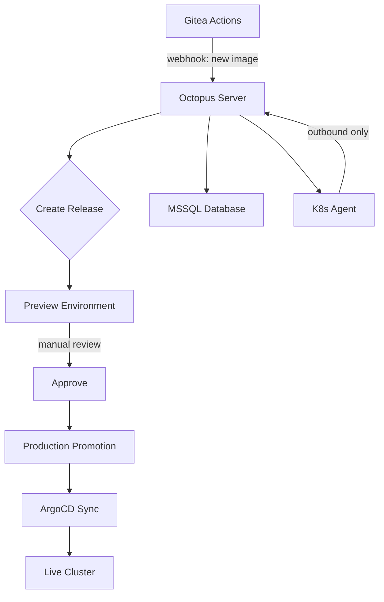

> 💡 **Quick Answer:** Octopus Deploy 2025.4 handles release orchestration — creating releases from CI artifacts, deploying to ephemeral preview environments for review, and promoting to production via ArgoCD sync. The K8s agent model eliminates inbound firewall rules.

## The Problem

CI tools (Gitea Actions, GitHub Actions) build artifacts but lack:
- Multi-environment promotion with approval gates
- Ephemeral preview environments per PR/release
- Deployment history and rollback tracking
- Separation of build (CI) and deploy (CD) concerns
- Tenant-aware deployments

## The Solution

Octopus Deploy provides release-centric deployment orchestration. The Kubernetes agent connects outbound to Octopus Server — no inbound ports needed.

### Architecture



### Step 1: Deploy MSSQL for Octopus

```yaml
# mssql.yaml
apiVersion: v1
kind: Secret
metadata:
  name: mssql-secret
  namespace: octopus
stringData:
  SA_PASSWORD: "YourStr0ng!Passw0rd"
---
apiVersion: apps/v1
kind: StatefulSet
metadata:
  name: mssql
  namespace: octopus
spec:
  serviceName: mssql
  replicas: 1
  selector:
    matchLabels:
      app: mssql
  template:
    metadata:
      labels:
        app: mssql
    spec:
      securityContext:
        fsGroup: 10001
      containers:
        - name: mssql
          image: mcr.microsoft.com/mssql/server:2022-latest
          ports:
            - containerPort: 1433
          env:
            - name: ACCEPT_EULA
              value: "Y"
            - name: MSSQL_SA_PASSWORD
              valueFrom:
                secretKeyRef:
                  name: mssql-secret
                  key: SA_PASSWORD
            - name: MSSQL_PID
              value: Express
          volumeMounts:
            - name: data
              mountPath: /var/opt/mssql
          resources:
            requests:
              memory: 1Gi
              cpu: 500m
            limits:
              memory: 2Gi
  volumeClaimTemplates:
    - metadata:
        name: data
      spec:
        accessModes: ["ReadWriteOnce"]
        resources:
          requests:
            storage: 20Gi
---
apiVersion: v1
kind: Service
metadata:
  name: mssql
  namespace: octopus
spec:
  selector:
    app: mssql
  ports:
    - port: 1433
```

### Step 2: Deploy Octopus Server

```yaml
# octopus-server.yaml
apiVersion: apps/v1
kind: Deployment
metadata:
  name: octopus-server
  namespace: octopus
spec:
  replicas: 1
  selector:
    matchLabels:
      app: octopus-server
  template:
    metadata:
      labels:
        app: octopus-server
    spec:
      containers:
        - name: octopus
          image: octopusdeploy/octopusdeploy:2025.4
          ports:
            - containerPort: 8080
              name: http
            - containerPort: 10943
              name: tentacle
          env:
            - name: ACCEPT_EULA
              value: "Y"
            - name: DB_CONNECTION_STRING
              value: "Server=mssql,1433;Database=OctopusDeploy;User Id=sa;Password=YourStr0ng!Passw0rd;TrustServerCertificate=true"
            - name: ADMIN_USERNAME
              value: admin
            - name: ADMIN_PASSWORD
              valueFrom:
                secretKeyRef:
                  name: octopus-admin
                  key: password
            - name: MASTER_KEY
              valueFrom:
                secretKeyRef:
                  name: octopus-master
                  key: key
            - name: OCTOPUS_SERVER_BASE64_LICENSE
              valueFrom:
                secretKeyRef:
                  name: octopus-license
                  key: license
          volumeMounts:
            - name: artifacts
              mountPath: /artifacts
            - name: taskLogs
              mountPath: /taskLogs
          resources:
            requests:
              memory: 1Gi
              cpu: 500m
            limits:
              memory: 4Gi
      volumes:
        - name: artifacts
          persistentVolumeClaim:
            claimName: octopus-artifacts
        - name: taskLogs
          persistentVolumeClaim:
            claimName: octopus-tasklogs
---
apiVersion: v1
kind: Service
metadata:
  name: octopus-server
  namespace: octopus
spec:
  selector:
    app: octopus-server
  ports:
    - name: http
      port: 8080
    - name: tentacle
      port: 10943
```

### Step 3: Install Kubernetes Agent

```bash
# The K8s agent connects outbound to Octopus Server
# No inbound firewall rules needed

helm repo add octopus https://octopusdeploy.github.io/helm-charts
helm repo update

helm install octopus-agent octopus/kubernetes-agent \
  --namespace octopus-agent \
  --create-namespace \
  --set agent.serverUrl=https://deploy.example.com \
  --set agent.serverCommsAddress=https://deploy.example.com:10943 \
  --set agent.space=Default \
  --set agent.targetName=k3s-prod \
  --set agent.bearerToken=YOUR_MACHINE_POLICY_TOKEN \
  --set agent.targetEnvironments="{Production}" \
  --set agent.targetRoles="{k3s,web}"
```

### Step 4: Configure Release Pipeline

```yaml
# Octopus deployment process (in UI or Config-as-Code)
# This creates ephemeral preview → review → promote flow

# Step 1: Deploy Preview
# - Create temporary namespace
# - Deploy release candidate
# - Expose via HTTPRoute with unique hostname
# - Notify PR with preview URL

# Step 2: Manual Intervention (approval gate)
# - Reviewer checks preview environment
# - Approves or rejects

# Step 3: Promote to Production
# - Update ArgoCD Application target revision
# - Trigger ArgoCD sync
# - Wait for healthy rollout
# - Clean up preview namespace
```

### Step 5: Octopus + ArgoCD Integration Script

```bash
#!/bin/bash
# promote-via-argocd.sh — Octopus step template
# Updates ArgoCD app to new image tag, triggers sync

IMAGE_TAG="${OctopusParameters['Octopus.Release.Number']}"
APP_NAME="myapp-production"
ARGOCD_SERVER="argocd.example.com"
ARGOCD_TOKEN="${OctopusParameters['ArgoCD.Token']}"

# Update image tag in ArgoCD
argocd app set ${APP_NAME} \
  --server ${ARGOCD_SERVER} \
  --auth-token ${ARGOCD_TOKEN} \
  --parameter image.tag=${IMAGE_TAG}

# Sync and wait
argocd app sync ${APP_NAME} \
  --server ${ARGOCD_SERVER} \
  --auth-token ${ARGOCD_TOKEN} \
  --prune

argocd app wait ${APP_NAME} \
  --server ${ARGOCD_SERVER} \
  --auth-token ${ARGOCD_TOKEN} \
  --timeout 300
```

## Common Issues

| Issue | Cause | Fix |
|-------|-------|-----|
| MSSQL won't start | Insufficient memory | MSSQL Express needs minimum 1Gi |
| Agent can't connect | Wrong server URL or firewall | Verify outbound 10943 is open |
| Master key lost | Pod recreated without secret | Back up master key in sealed secret |
| License expired | Trial ended | Apply community license (free for <10 targets) |
| Slow deployments | MSSQL on slow storage | Use SSD-backed PVC |

## Best Practices

1. **Store master key in external secret manager** — losing it means losing all encrypted data
2. **Use Express edition for small teams** — free, supports enough for single-node
3. **K8s agent over polling tentacle** — outbound-only is more secure
4. **Config-as-Code (OCL files)** — version deployment processes alongside app code
5. **Ephemeral previews with TTL** — auto-delete preview namespaces after 24h

## Key Takeaways

- Octopus Deploy separates CI (build) from CD (release) — each tool does what it's best at
- K8s agent model requires zero inbound firewall rules — agent connects outbound
- Ephemeral preview environments enable pre-production review without shared staging
- Integration with ArgoCD means Octopus handles orchestration while ArgoCD handles desired state
- MSSQL Express is free and sufficient for teams under 10 deployment targets
