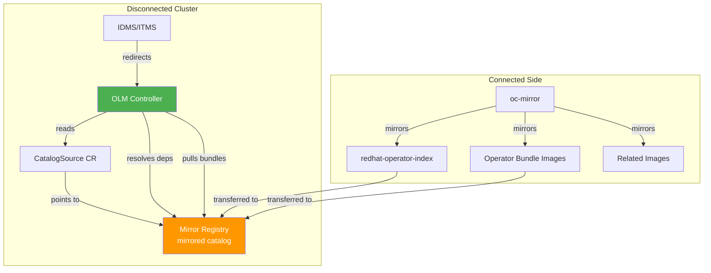

> 💡 **Quick Answer:** OLM in disconnected environments requires mirroring Operator catalog index images and their referenced content images to your mirror registry, then creating a `CatalogSource` CR pointing to the mirrored catalog. OLM resolves dependencies and pulls images from the mirror — no internet required. Use `oc-mirror` to automate catalog mirroring and CatalogSource generation.

## The Problem

OLM normally pulls Operator catalogs from `registry.redhat.io`. In disconnected clusters:

- Default `CatalogSource` resources point to unreachable registries
- OLM can't resolve Operator dependencies without catalog access
- Operator installs and upgrades fail silently
- The OperatorHub in the console shows no available Operators
- Custom Operators need their own mirrored catalogs

## The Solution

### How OLM Works in Disconnected Mode



### Step 1: Disable Default Catalog Sources

```bash
# Disable the default OperatorHub sources (they can't reach the internet)
oc patch OperatorHub cluster --type json \
  -p '[{"op": "add", "path": "/spec/disableAllDefaultSources", "value": true}]'

# Verify — default catalogs should be gone
oc get catalogsource -n openshift-marketplace
# No resources found
```

### Step 2: Mirror Operator Catalogs

Using oc-mirror (preferred):

```yaml
# imageset-config.yaml
kind: ImageSetConfiguration
apiVersion: mirror.openshift.io/v2alpha1
mirror:
  operators:
  - catalog: registry.redhat.io/redhat/redhat-operator-index:v4.18
    packages:
    - name: kubernetes-nmstate-operator
    - name: sriov-network-operator
    - name: gpu-operator-certified
    - name: local-storage-operator
    - name: cincinnati-operator
  - catalog: registry.redhat.io/redhat/certified-operator-index:v4.18
    packages:
    - name: nutanixcsioperator
```

```bash
# Mirror catalogs + operator images
oc mirror --v2 -c imageset-config.yaml \
  docker://registry.example.com:8443

# Generated: cs-redhat-operator-index.yaml
```

Using oc adm (alternative):

```bash
# Mirror the entire Red Hat operator catalog
oc adm catalog mirror \
  registry.redhat.io/redhat/redhat-operator-index:v4.18 \
  registry.example.com:8443/olm \
  -a /run/user/1000/containers/auth.json \
  --index-filter-by-os='.*'

# Mirror certified operator catalog
oc adm catalog mirror \
  registry.redhat.io/redhat/certified-operator-index:v4.18 \
  registry.example.com:8443/olm \
  -a /run/user/1000/containers/auth.json
```

### Step 3: Create CatalogSource

If using oc-mirror, apply the generated YAML:

```bash
oc apply -f working-dir/cluster-resources/cs-redhat-operator-index.yaml
```

Or create manually:

```yaml
apiVersion: operators.coreos.com/v1alpha1
kind: CatalogSource
metadata:
  name: redhat-operator-index
  namespace: openshift-marketplace
spec:
  sourceType: grpc
  image: registry.example.com:8443/redhat/redhat-operator-index:v4.18
  displayName: Red Hat Operators (Mirrored)
  publisher: Red Hat
  updateStrategy:
    registryPoll:
      interval: 30m
```

```bash
oc apply -f catalog-source.yaml

# Verify catalog is healthy
oc get catalogsource -n openshift-marketplace
# NAME                     DISPLAY                          TYPE   PUBLISHER   AGE
# redhat-operator-index    Red Hat Operators (Mirrored)     grpc   Red Hat     30s

# Check the catalog pod is running
oc get pods -n openshift-marketplace -l olm.catalogSource=redhat-operator-index
```

### Step 4: Install Operators from Mirrored Catalog

```yaml
# Subscription for an Operator from the mirrored catalog
apiVersion: operators.coreos.com/v1alpha1
kind: Subscription
metadata:
  name: gpu-operator-certified
  namespace: nvidia-gpu-operator
spec:
  channel: stable
  installPlanApproval: Manual
  name: gpu-operator-certified
  source: redhat-operator-index    # Points to mirrored CatalogSource
  sourceNamespace: openshift-marketplace
```

```bash
oc apply -f subscription.yaml

# Approve the install plan
oc get installplan -n nvidia-gpu-operator
oc patch installplan <plan-name> -n nvidia-gpu-operator \
  --type merge -p '{"spec":{"approved":true}}'
```

### Step 5: Verify IDMS/ITMS Redirect

OLM pulls images by digest from the original registry. IDMS redirects these pulls to your mirror:

```bash
# Check IDMS is configured
oc get imagedigestmirrorset

# Verify redirect is working — check a node's registries.conf
oc debug node/<node-name> -- chroot /host cat /etc/containers/registries.conf

# Should show:
# [[registry]]
#   prefix = ""
#   location = "registry.redhat.io/redhat"
#   mirror-by-digest-only = true
#   [[registry.mirror]]
#     location = "registry.example.com:8443/redhat"
```

### Updating Operator Catalogs

When new Operator versions are released:

```bash
# 1. Re-run oc-mirror with same config (incremental)
oc mirror --v2 -c imageset-config.yaml \
  docker://registry.example.com:8443

# 2. Apply updated CatalogSource (if image tag changed)
oc apply -f working-dir/cluster-resources/cs-redhat-operator-index.yaml

# 3. OLM detects new versions via registryPoll
# Check for pending upgrades
oc get csv -A | grep -v Succeeded
oc get installplan -A | grep -v Complete
```

### Custom Operator Catalogs

```bash
# Build a custom catalog with file-based catalog format
opm init my-operator --default-channel=stable --output yaml > catalog/index.yaml

# Add bundle
opm render registry.example.com:8443/my-operator-bundle:v1.0.0 \
  --output yaml >> catalog/index.yaml

# Build and push catalog image
opm validate catalog/
podman build -f catalog.Dockerfile -t registry.example.com:8443/my-catalog:latest
podman push registry.example.com:8443/my-catalog:latest

# Create CatalogSource for custom catalog
cat <<EOF | oc apply -f -
apiVersion: operators.coreos.com/v1alpha1
kind: CatalogSource
metadata:
  name: my-custom-catalog
  namespace: openshift-marketplace
spec:
  sourceType: grpc
  image: registry.example.com:8443/my-catalog:latest
  displayName: Custom Operators
  publisher: Internal
EOF
```

## Common Issues

**OperatorHub shows no Operators**

Default catalog sources are still enabled but can't reach the internet. Disable them with `oc patch OperatorHub cluster --type json -p '[{"op": "add", "path": "/spec/disableAllDefaultSources", "value": true}]'`.

**Catalog pod ImagePullBackOff**

IDMS/ITMS isn't configured, or the catalog image isn't in your mirror registry. Verify with `skopeo inspect docker://registry.example.com:8443/redhat/redhat-operator-index:v4.18`.

**Operator install fails — related image not found**

oc-mirror may not have mirrored all related images. Check the error log, identify the missing image, add it to `additionalImages` in ImageSetConfiguration, and re-mirror.

**Dependency resolution fails**

oc-mirror v2 doesn't infer dependencies. If Operator A requires Operator B, you must list both in the ImageSetConfiguration packages.

## Best Practices

- **Disable default catalogs first** — prevents OLM from trying to reach the internet
- **Use Manual install plan approval** — control when Operators upgrade in production
- **Mirror the same catalog version as your OCP version** — v4.18 catalog for OCP 4.18
- **Include all dependencies** explicitly — oc-mirror v2 doesn't resolve them automatically
- **Set `registryPoll.interval: 30m`** — CatalogSource checks for new content periodically
- **Test in non-production first** — mirror catalog, install Operators, verify before production

## Key Takeaways

- OLM in disconnected mode requires mirrored catalogs + CatalogSource + IDMS/ITMS
- Disable default OperatorHub sources — they can't reach the internet
- oc-mirror generates CatalogSource YAML automatically alongside mirrored content
- IDMS redirects image pulls from original registries to your mirror
- Operator dependencies must be explicitly included in the mirror configuration
- Update catalogs regularly to receive new Operator versions in your disconnected cluster
