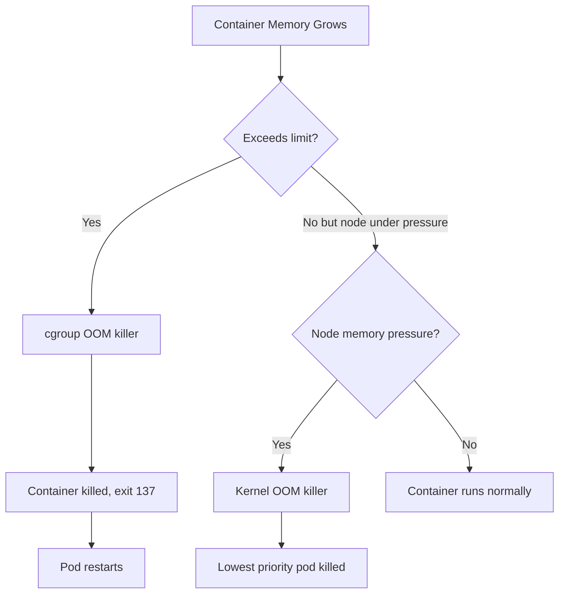

> 💡 **Quick Answer:** OOMKilled (exit code 137) means your container exceeded its memory limit and the kernel killed it. Fix: increase `resources.limits.memory`, fix memory leaks, or use VPA to auto-right-size. Check actual usage with `kubectl top pod` before adjusting limits.
>
> **Key insight:** There are TWO types of OOM: container limit OOM (cgroup) and node-level OOM (kernel). Container limit OOM kills only that container. Node-level OOM can kill any pod on the node.
>
> **Gotcha:** JVM `-Xmx` must be LESS than the container memory limit. If `-Xmx=512m` and limit is `512Mi`, the JVM will be OOMKilled because the JVM uses additional memory beyond heap (metaspace, threads, native).

## The Problem

Your container keeps getting killed with `OOMKilled`:

```bash
$ kubectl describe pod myapp-abc123 | grep -A5 "Last State"
    Last State:  Terminated
      Reason:    OOMKilled
      Exit Code: 137
      Started:   Thu, 02 Apr 2026 10:00:00 UTC
      Finished:  Thu, 02 Apr 2026 10:05:32 UTC
```

## The Solution

### Step 1: Check Current Memory Usage

```bash
# Real-time memory usage (requires metrics-server)
kubectl top pod myapp-abc123
# NAME           CPU(cores)   MEMORY(bytes)
# myapp-abc123   50m          480Mi

# Check the memory limit
kubectl get pod myapp-abc123 -o jsonpath='{.spec.containers[0].resources.limits.memory}'
# 512Mi
```

If usage is close to the limit, the container will eventually be OOMKilled.

### Step 2: Determine OOM Type

```bash
# Container cgroup OOM (most common)
kubectl describe pod myapp-abc123 | grep -i oom
# Reason: OOMKilled

# Node-level OOM (check node events)
kubectl describe node worker-1 | grep -A3 "OOM"
# "System OOM encountered, victim process: myapp"
```



### Step 3: Fix — Increase Memory Limits

```yaml
resources:
  requests:
    memory: "256Mi"   # Scheduler uses this for placement
  limits:
    memory: "1Gi"     # Hard ceiling — OOMKilled if exceeded
```

**Right-sizing guidelines:**
- Set `requests` to the **average** memory usage
- Set `limits` to the **peak** usage + 20% buffer
- Use `kubectl top pod` over time to find the right values

### Step 4: Fix Memory Leaks

If memory grows continuously, the app has a leak. Debug:

```bash
# Watch memory over time
watch -n5 "kubectl top pod myapp-abc123"

# Profile inside the container
kubectl exec -it myapp-abc123 -- /bin/sh
# For Go: curl localhost:6060/debug/pprof/heap > heap.prof
# For Java: jmap -dump:format=b,file=/tmp/heap.hprof 1
# For Python: pip install memory-profiler
# For Node: --inspect flag + Chrome DevTools
```

### JVM-Specific Fix

```yaml
containers:
  - name: myapp
    image: myapp:latest
    resources:
      limits:
        memory: "1Gi"
    env:
      # Set heap to 75% of container limit
      - name: JAVA_OPTS
        value: "-Xms256m -Xmx768m -XX:+UseContainerSupport"
      # Or let JVM auto-detect (Java 10+)
      - name: JAVA_OPTS
        value: "-XX:MaxRAMPercentage=75.0 -XX:+UseContainerSupport"
```

**JVM memory breakdown:**
- Heap (`-Xmx`): ~75% of limit
- Metaspace: ~100-200MB
- Thread stacks: ~1MB per thread
- Native memory, code cache, buffers: ~100-200MB
- **Total > Heap** — always leave headroom

### Use VPA for Auto-Right-Sizing

```yaml
apiVersion: autoscaling.k8s.io/v1
kind: VerticalPodAutoscaler
metadata:
  name: myapp-vpa
spec:
  targetRef:
    apiVersion: apps/v1
    kind: Deployment
    name: myapp
  updatePolicy:
    updateMode: "Auto"  # Or "Off" for recommendation-only
  resourcePolicy:
    containerPolicies:
      - containerName: myapp
        minAllowed:
          memory: "128Mi"
        maxAllowed:
          memory: "4Gi"
```

## Common Issues

### OOMKilled but kubectl top shows low memory
The peak happened between polling intervals. Use Prometheus with `container_memory_working_set_bytes` for accurate historical data.

### OOMKilled immediately on startup
The memory limit is too low for the application to even start. Java apps commonly need 512Mi+ just for JVM initialization.

### Node evicts pods but no OOMKilled
This is **eviction**, not OOM. The kubelet evicts pods when node memory drops below the eviction threshold (`--eviction-hard=memory.available<100Mi`). Check with `kubectl describe node | grep -A5 Conditions`.

### VPA and HPA conflict
Run VPA for **memory only** and HPA for **CPU scaling** to avoid conflicts:
```yaml
resourcePolicy:
  containerPolicies:
    - containerName: myapp
      controlledResources: ["memory"]  # VPA manages memory only
```

## Best Practices

- **Always set memory limits** — without limits, one container can consume all node memory
- **JVM heap = 75% of container limit** — leave room for non-heap memory
- **Use `-XX:+UseContainerSupport`** (Java 10+) for container-aware JVM
- **Monitor with Prometheus** — `container_memory_working_set_bytes` is what the OOM killer uses
- **Set requests ≈ average, limits ≈ peak + 20%** for right-sizing
- **Use VPA in recommendation mode first** to understand actual usage patterns

## Key Takeaways

- OOMKilled = container exceeded its cgroup memory limit → exit code 137
- Two types: container OOM (cgroup limit) and node OOM (kernel pressure)
- JVM apps need `-Xmx` set to ~75% of container limit, not 100%
- Use `kubectl top pod` and Prometheus for right-sizing decisions
- VPA can auto-adjust memory limits — use with HPA by splitting resource control
