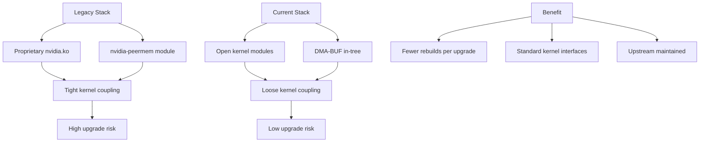

> 💡 **Quick Answer:** Enable open kernel modules in GPU Operator ClusterPolicy with `useOpenKernelModules: true` and switch GPUDirect RDMA from `nvidia-peermem` to DMA-BUF (kernel ≥ 6.x). This decouples GPU drivers from the kernel, reducing upgrade fragility.

## The Problem

Legacy NVIDIA GPU stack uses proprietary `.ko` kernel modules tightly coupled to specific kernel versions, plus `nvidia-peermem` for GPUDirect RDMA. Every kernel update risks breaking the GPU driver. Upgrade failures cascade: proprietary module mismatch → GPU unavailable → training jobs killed → teams blocked.

## The Solution

Open kernel modules (in-tree compatible, open-source) decouple from kernel internals. DMA-BUF (upstream kernel ≥ 6.x) replaces nvidia-peermem with a standard kernel subsystem for GPU memory sharing, making upgrades predictable and safe.

### Before vs After

```yaml
# ❌ BEFORE (Legacy Stack)
legacy:
  kernel_modules: "Proprietary .ko (nvidia.ko, nvidia-modeset.ko)"
  gpudirect_rdma: "nvidia-peermem (out-of-tree module)"
  coupling: "Tight — kernel update breaks GPU driver"
  upgrade_risk: "High — driver rebuild per kernel version"

# ✅ AFTER (Current Stack)
current:
  kernel_modules: "Open kernel modules (in-tree compatible)"
  gpudirect_rdma: "DMA-BUF (upstream kernel subsystem, ≥ 6.x)"
  coupling: "Loose — kernel and driver independent"
  upgrade_risk: "Low — standard kernel interfaces"
```

### Enable Open Kernel Modules

```yaml
apiVersion: nvidia.com/v1
kind: ClusterPolicy
metadata:
  name: gpu-cluster-policy
spec:
  operator:
    defaultRuntime: crio
  driver:
    enabled: true
    # Enable open kernel modules
    useOpenKernelModules: true
    version: "560.35.03"
    repository: nvcr.io/nvidia
    image: driver
    licensingConfig:
      nlsEnabled: false
    # Kernel module parameters
    kernelModuleConfig:
      name: nvidia-module-params
  dcgm:
    enabled: true
  dcgmExporter:
    enabled: true
  gdrcopy:
    enabled: true
```

### Verify Open Modules

```bash
# Check if open modules are loaded
kubectl exec -it nvidia-driver-daemonset-xxxx -n gpu-operator -- \
  cat /proc/driver/nvidia/version
# Should show: "Open Kernel Module"

# Verify DMA-BUF support
kubectl exec -it gpu-pod -- \
  cat /proc/modules | grep -E "nvidia|dma_buf"
# nvidia               ... (Open)
# nvidia_modeset       ... (Open)
# nvidia_uvm           ... (Open)
# dma_buf              ... (kernel built-in)

# Check GPUDirect RDMA via DMA-BUF (not nvidia-peermem)
kubectl exec -it gpu-pod -- \
  lsmod | grep nvidia_peermem
# Should return empty — DMA-BUF replaces it

# Verify kernel version ≥ 6.x
kubectl exec -it gpu-pod -- uname -r
# 6.x.y required for DMA-BUF
```

### MachineConfig for DMA-BUF Prerequisites

```yaml
apiVersion: machineconfiguration.openshift.io/v1
kind: MachineConfig
metadata:
  name: 99-gpu-dma-buf
  labels:
    machineconfiguration.openshift.io/role: gpu-worker
spec:
  config:
    ignition:
      version: 3.4.0
    storage:
      files:
        - path: /etc/modprobe.d/nvidia-open.conf
          mode: 0644
          contents:
            inline: |
              # Use open kernel modules
              options nvidia NVreg_OpenRmEnableUnsupportedGpus=1
        - path: /etc/modules-load.d/dma-buf.conf
          mode: 0644
          contents:
            inline: |
              # Ensure DMA-BUF is available
              # Usually built-in on kernel 6.x+
              # nvidia-peermem NOT loaded
```

### Upgrade Flow Comparison

```yaml
# Legacy upgrade (proprietary modules):
# 1. New kernel released
# 2. Rebuild proprietary nvidia.ko for new kernel
# 3. Rebuild nvidia-peermem for new kernel
# 4. Test on canary node
# 5. Roll out (high risk of mismatch)
# Risk: 2 out-of-tree modules to rebuild per kernel update

# Open modules + DMA-BUF upgrade:
# 1. New kernel released
# 2. Open modules use stable kernel interfaces (usually compatible)
# 3. DMA-BUF is in-tree (kernel handles it)
# 4. Test on canary node
# 5. Roll out (low risk)
# Risk: Only GPU userspace compatibility to verify
```



## Common Issues

- **Open modules not supported on older GPUs** — open kernel modules require Turing (T4) or newer architectures; older GPUs (V100) need proprietary modules
- **DMA-BUF not available** — requires kernel 6.x+; RHEL 8 / older kernels don't support it
- **GPUDirect performance regression** — rare; verify DMA-BUF is being used for RDMA with `ibv_devinfo` and NCCL debug logs
- **Module parameter not applied** — MachineConfig needs MCO rollout; check `oc get mcp gpu-worker`

## Best Practices

- Enable open kernel modules for all new GPU deployments on Turing+ hardware
- Verify kernel ≥ 6.x before disabling nvidia-peermem
- Test open modules on canary nodes before cluster-wide rollout
- Store module configuration in Git (MachineConfig) — not manual modprobe
- Monitor `nvidia-smi` after kernel upgrades to verify GPU initialization
- Combine with canary upgrade strategy for safe GPU driver transitions

## Key Takeaways

- Open kernel modules replace proprietary .ko files with in-tree compatible modules
- DMA-BUF replaces nvidia-peermem for GPUDirect RDMA (kernel ≥ 6.x)
- Decoupling GPU drivers from kernel reduces upgrade fragility
- Both changes are configured via ClusterPolicy and MachineConfig
- Requires Turing+ GPU architecture and kernel 6.x+
- Upgrade failure rate drops significantly — standard kernel interfaces don't break on updates
