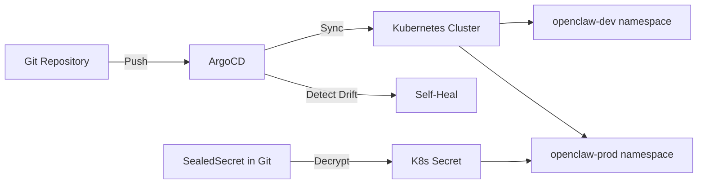

> 💡 **Quick Answer:** Create an ArgoCD Application pointing to your OpenClaw Kustomize overlay directory in Git. ArgoCD syncs manifests automatically, detects config drift, and handles rollback — while secrets stay out of Git via External Secrets or SealedSecrets.

## The Problem

Manual `kubectl apply` for OpenClaw updates doesn't scale. You need version-controlled deployments with automatic drift detection, rollback history, and multi-environment management — without storing secrets in Git.

## The Solution

### Step 1: Store Manifests in Git

```
openclaw-gitops/
├── base/
│   ├── kustomization.yaml
│   ├── deployment.yaml
│   ├── service.yaml
│   ├── pvc.yaml
│   └── configmap.yaml
├── overlays/
│   ├── dev/
│   │   ├── kustomization.yaml
│   │   └── patches/
│   └── production/
│       ├── kustomization.yaml
│       ├── patches/
│       └── external-secret.yaml
└── argocd/
    ├── app-dev.yaml
    └── app-production.yaml
```

### Step 2: ArgoCD Application for Production

```yaml
# argocd/app-production.yaml
apiVersion: argoproj.io/v1alpha1
kind: Application
metadata:
  name: openclaw-production
  namespace: argocd
  finalizers:
    - resources-finalizer.argocd.argoproj.io
spec:
  project: default
  source:
    repoURL: https://github.com/your-org/openclaw-gitops.git
    targetRevision: main
    path: overlays/production
  destination:
    server: https://kubernetes.default.svc
    namespace: openclaw-prod
  syncPolicy:
    automated:
      prune: true
      selfHeal: true
    syncOptions:
      - CreateNamespace=true
      - ServerSideApply=true
    retry:
      limit: 3
      backoff:
        duration: 5s
        maxDuration: 3m
        factor: 2
```

### Step 3: Secrets via SealedSecrets

```bash
# Encrypt secrets client-side
kubeseal --format yaml < secret.yaml > sealed-secret.yaml

# sealed-secret.yaml is safe to commit to Git
git add sealed-secret.yaml && git commit -m "Update OpenClaw API keys"
```

```yaml
# sealed-secret.yaml
apiVersion: bitnami.com/v1alpha1
kind: SealedSecret
metadata:
  name: openclaw-secrets
  namespace: openclaw-prod
spec:
  encryptedData:
    OPENCLAW_GATEWAY_TOKEN: AgBy8h...
    ANTHROPIC_API_KEY: AgCx9k...
```



### Step 4: Config Updates via Git

To update AGENTS.md or openclaw.json:

```bash
# Edit the ConfigMap in Git
vim overlays/production/configmap-patch.yaml

# Commit and push — ArgoCD handles the rest
git add -A && git commit -m "Update agent instructions" && git push
```

ArgoCD detects the change, syncs the ConfigMap, and the pod picks it up on next restart.

### Sync Waves for Ordered Deployment

```yaml
# Ensure secrets sync before deployment
apiVersion: external-secrets.io/v1beta1
kind: ExternalSecret
metadata:
  name: openclaw-secrets
  annotations:
    argocd.argoproj.io/sync-wave: "-1"

---
apiVersion: apps/v1
kind: Deployment
metadata:
  name: openclaw
  annotations:
    argocd.argoproj.io/sync-wave: "0"
```

## Common Issues

### ArgoCD Shows "OutOfSync" for PVC

PVCs are immutable after creation. Ignore with:

```yaml
spec:
  ignoreDifferences:
    - group: ""
      kind: PersistentVolumeClaim
      jsonPointers:
        - /spec/resources/requests/storage
```

### Secret Drift Detection

ArgoCD detects when someone manually patches a secret. `selfHeal: true` reverts it from Git source (SealedSecret).

### Pod Not Restarting After ConfigMap Change

Add a hash annotation to force rollout:

```yaml
# In kustomization.yaml
configMapGenerator:
  - name: openclaw-config
    behavior: replace
    files:
      - openclaw.json
      - AGENTS.md
```

Kustomize appends a hash suffix — ConfigMap name changes trigger pod restart.

## Best Practices

- **Automated sync with self-heal** — detect and fix drift automatically
- **SealedSecrets or External Secrets** — never plain secrets in Git
- **Sync waves** — secrets before deployments
- **Ignore PVC diffs** — they're immutable after creation
- **Separate repos for config vs app** — OpenClaw manifests in infra repo, agent content can be in separate repo
- **PR-based changes** — require review before production config changes

## Key Takeaways

- ArgoCD watches Git and syncs OpenClaw manifests automatically
- Use SealedSecrets or External Secrets Operator for secret management
- Self-heal and prune keep the cluster matching Git state
- Sync waves ensure secrets exist before the deployment starts
- Config changes via Git PR → merge → ArgoCD auto-deploys
