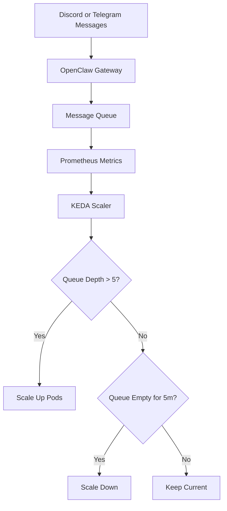

> 💡 **Quick Answer:** Use KEDA ScaledObjects with Prometheus metrics from OpenClaw to auto-scale agent pods based on pending message queue depth or session count.

## The Problem

Fixed-replica OpenClaw deployments waste resources during quiet periods and drop messages during traffic spikes. Manual scaling doesn't respond fast enough to sudden bursts from Discord or Telegram channels.

## The Solution

Deploy KEDA with custom Prometheus metrics from OpenClaw to scale agents based on actual workload demand.

### Expose OpenClaw Metrics

Configure OpenClaw to expose Prometheus-compatible metrics:

```yaml
apiVersion: v1
kind: ConfigMap
metadata:
  name: openclaw-config
  namespace: openclaw
data:
  openclaw.json: |
    {
      "metrics": {
        "enabled": true,
        "port": 9090,
        "path": "/metrics"
      }
    }
```

### ServiceMonitor for Prometheus

```yaml
apiVersion: monitoring.coreos.com/v1
kind: ServiceMonitor
metadata:
  name: openclaw-metrics
  namespace: openclaw
spec:
  selector:
    matchLabels:
      app: openclaw
  endpoints:
    - port: metrics
      interval: 15s
      path: /metrics
```

### KEDA ScaledObject

```yaml
apiVersion: keda.sh/v1alpha1
kind: ScaledObject
metadata:
  name: openclaw-scaler
  namespace: openclaw
spec:
  scaleTargetRef:
    name: openclaw-agent
  pollingInterval: 15
  cooldownPeriod: 300
  minReplicaCount: 1
  maxReplicaCount: 10
  triggers:
    - type: prometheus
      metadata:
        serverAddress: http://prometheus.monitoring:9090
        metricName: openclaw_pending_messages
        query: |
          sum(openclaw_pending_messages{namespace="openclaw"})
        threshold: "5"
        activationThreshold: "2"
    - type: prometheus
      metadata:
        serverAddress: http://prometheus.monitoring:9090
        metricName: openclaw_active_sessions
        query: |
          sum(openclaw_active_sessions{namespace="openclaw"})
        threshold: "10"
```

### Advanced: Scale by Channel

```yaml
apiVersion: keda.sh/v1alpha1
kind: ScaledObject
metadata:
  name: openclaw-discord-scaler
  namespace: openclaw
spec:
  scaleTargetRef:
    name: openclaw-discord
  pollingInterval: 10
  cooldownPeriod: 120
  minReplicaCount: 0
  maxReplicaCount: 5
  triggers:
    - type: prometheus
      metadata:
        serverAddress: http://prometheus.monitoring:9090
        metricName: openclaw_channel_queue
        query: |
          sum(openclaw_pending_messages{channel="discord"})
        threshold: "3"
  advanced:
    restoreToOriginalReplicaCount: true
    horizontalPodAutoscalerConfig:
      behavior:
        scaleUp:
          stabilizationWindowSeconds: 30
          policies:
            - type: Pods
              value: 2
              periodSeconds: 60
        scaleDown:
          stabilizationWindowSeconds: 300
          policies:
            - type: Pods
              value: 1
              periodSeconds: 120
```

### Cost-Optimized: Scale to Zero

```yaml
apiVersion: keda.sh/v1alpha1
kind: ScaledObject
metadata:
  name: openclaw-batch-scaler
  namespace: openclaw
spec:
  scaleTargetRef:
    name: openclaw-batch-worker
  pollingInterval: 30
  cooldownPeriod: 600
  minReplicaCount: 0  # Scale to zero when idle
  maxReplicaCount: 3
  triggers:
    - type: prometheus
      metadata:
        serverAddress: http://prometheus.monitoring:9090
        metricName: openclaw_queued_tasks
        query: |
          sum(openclaw_queued_tasks{type="batch"})
        threshold: "1"
        activationThreshold: "1"
```



## Common Issues

- **Flapping** — set `cooldownPeriod` ≥ 300s and use `stabilizationWindowSeconds` to prevent rapid scale up/down
- **Cold start latency** — keep `minReplicaCount: 1` for latency-sensitive channels; use 0 only for batch workers
- **Metric scrape delay** — reduce `pollingInterval` to 10s for responsive scaling; align with Prometheus scrape interval
- **API rate limits** — Discord/Telegram rate limits apply per bot token regardless of replica count

## Best Practices

- Separate ScaledObjects per channel type (Discord, Telegram, Slack)
- Use `activationThreshold` to prevent scaling on noise
- Set aggressive scaleUp (30s window) but conservative scaleDown (300s)
- Monitor with `keda_scaler_metrics_value` to verify KEDA sees your metrics
- Combine with PodDisruptionBudget for graceful scaling

## Key Takeaways

- KEDA enables event-driven scaling based on actual message workload
- Scale-to-zero saves costs for batch and low-traffic agents
- Per-channel scalers allow independent scaling policies
- Prometheus integration provides flexible, query-based triggers
- Stabilization windows prevent flapping during bursty traffic
