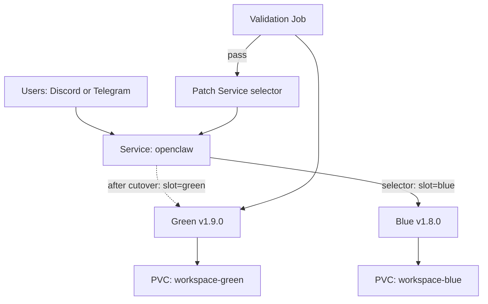

> 💡 **Quick Answer:** Deploy a new OpenClaw version alongside the current one, verify it works, then switch the Service selector to cut over — with instant rollback by reverting the selector.

## The Problem

Upgrading OpenClaw in-place with a rolling update risks message loss during transition. If the new version has issues with skills, memory, or channel integrations, rolling back takes time while users experience failures.

## The Solution

Run both versions simultaneously and switch traffic atomically via Service selector updates.

### Blue Deployment (Current)

```yaml
apiVersion: apps/v1
kind: Deployment
metadata:
  name: openclaw-blue
  namespace: openclaw
  labels:
    app: openclaw
    version: blue
spec:
  replicas: 1
  selector:
    matchLabels:
      app: openclaw
      slot: blue
  template:
    metadata:
      labels:
        app: openclaw
        slot: blue
        version: v1.8.0
    spec:
      containers:
        - name: openclaw
          image: ghcr.io/openclaw/openclaw:1.8.0
          envFrom:
            - secretRef:
                name: openclaw-credentials
          volumeMounts:
            - name: workspace
              mountPath: /home/node/.openclaw
      volumes:
        - name: workspace
          persistentVolumeClaim:
            claimName: openclaw-workspace-blue
```

### Green Deployment (New Version)

```yaml
apiVersion: apps/v1
kind: Deployment
metadata:
  name: openclaw-green
  namespace: openclaw
  labels:
    app: openclaw
    version: green
spec:
  replicas: 1
  selector:
    matchLabels:
      app: openclaw
      slot: green
  template:
    metadata:
      labels:
        app: openclaw
        slot: green
        version: v1.9.0
    spec:
      containers:
        - name: openclaw
          image: ghcr.io/openclaw/openclaw:1.9.0
          envFrom:
            - secretRef:
                name: openclaw-credentials
          volumeMounts:
            - name: workspace
              mountPath: /home/node/.openclaw
      volumes:
        - name: workspace
          persistentVolumeClaim:
            claimName: openclaw-workspace-green
```

### Service with Switchable Selector

```yaml
apiVersion: v1
kind: Service
metadata:
  name: openclaw
  namespace: openclaw
spec:
  selector:
    app: openclaw
    slot: blue  # Switch to "green" for cutover
  ports:
    - port: 18789
      targetPort: 18789
      name: gateway
```

### Cutover Script

```bash
#!/bin/bash
set -euo pipefail

NAMESPACE="openclaw"
NEW_SLOT="green"
OLD_SLOT="blue"

echo "=== Pre-flight checks ==="
# Verify green is healthy
kubectl wait --for=condition=available \
  deployment/openclaw-${NEW_SLOT} -n ${NAMESPACE} --timeout=60s

# Check green pod is ready
kubectl get pods -n ${NAMESPACE} -l slot=${NEW_SLOT} \
  -o jsonpath='{.items[0].status.containerStatuses[0].ready}'

echo "=== Switching traffic to ${NEW_SLOT} ==="
kubectl patch service openclaw -n ${NAMESPACE} \
  -p "{\"spec\":{\"selector\":{\"slot\":\"${NEW_SLOT}\"}}}"

echo "=== Verifying cutover ==="
sleep 5
ENDPOINT_POD=$(kubectl get endpoints openclaw -n ${NAMESPACE} \
  -o jsonpath='{.subsets[0].addresses[0].targetRef.name}')
echo "Traffic now goes to: ${ENDPOINT_POD}"

echo "=== Cutover complete ==="
echo "To rollback: kubectl patch service openclaw -n ${NAMESPACE} \\"
echo "  -p '{\"spec\":{\"selector\":{\"slot\":\"${OLD_SLOT}\"}}}'"
```

### Pre-Cutover Validation Job

```yaml
apiVersion: batch/v1
kind: Job
metadata:
  name: openclaw-green-validation
  namespace: openclaw
spec:
  template:
    spec:
      containers:
        - name: validate
          image: curlimages/curl:latest
          command:
            - /bin/sh
            - -c
            - |
              # Test gateway health on green pod directly
              GREEN_IP=$(nslookup openclaw-green.openclaw.svc.cluster.local | tail -1 | awk '{print $NF}')
              curl -sf http://${GREEN_IP}:18789/health || exit 1
              echo "Green deployment healthy"
              
              # Verify OpenClaw status
              curl -sf http://${GREEN_IP}:18789/api/status | grep -q '"ok":true' || exit 1
              echo "OpenClaw API responding"
      restartPolicy: Never
  backoffLimit: 3
```



## Common Issues

- **Both versions connecting to same channel** — use separate bot tokens or disable channel config on green until cutover
- **Workspace data mismatch** — copy workspace from blue PVC to green before deploying: `kubectl cp`
- **DNS propagation delay** — Service selector changes are instant for new connections but existing TCP connections persist
- **Forgot to scale down old version** — after cutover validation, scale blue to 0 replicas

## Best Practices

- Copy workspace data from blue to green PVC before deploying green
- Run validation Job before switching traffic
- Keep blue running for 24h after cutover as instant rollback
- Use separate bot tokens to prevent dual-connection issues
- Automate the cutover script in CI/CD pipeline
- Document rollback command in deployment runbook

## Key Takeaways

- Blue-green gives instant rollback via Service selector patch
- Both versions run simultaneously — no downtime during switch
- Validate green thoroughly before cutover
- Workspace PVC must be copied or synced between slots
- Keep old slot running briefly as safety net
