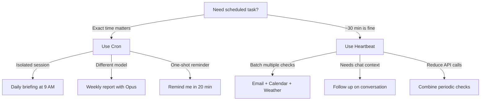

> 💡 **Quick Answer:** OpenClaw has two scheduling mechanisms: **Heartbeats** (periodic polls where the agent checks HEARTBEAT.md for tasks) and **Cron jobs** (precise scheduled tasks with isolated sessions). Configure heartbeats by editing `HEARTBEAT.md` in the workspace. Set up cron jobs via `openclaw cron add`.
>
> ```bash
> # Add a cron job
> kubectl exec -n openclaw deploy/openclaw -- \
>   openclaw cron add --schedule "0 9 * * 1-5" --task "Check my email inbox and summarize unread"
> ```
>
> **Key concept:** Heartbeats batch multiple checks (email + calendar + weather) in one turn. Cron jobs are isolated, precise-time tasks. Use heartbeats for "check a few things periodically" and cron for "do X at exactly 9 AM."
>
> **Gotcha:** Heartbeats use the main session's token budget. Too many heartbeat tasks = high API costs.

## The Problem

- AI assistants are reactive — they only respond when messaged
- Proactive notifications (email alerts, calendar reminders) require scheduling
- Some tasks need exact timing; others can be batched
- Background tasks shouldn't interfere with the main conversation session

## The Solution

Use OpenClaw's built-in heartbeat polling and cron system for proactive agent behavior.

## Heartbeats: Batch Periodic Checks

```bash
# Edit HEARTBEAT.md to define periodic tasks
kubectl exec -n openclaw deploy/openclaw -- sh -c 'cat > /home/node/.openclaw/workspace/HEARTBEAT.md << EOF
# Heartbeat Tasks

## Check email
- Look for urgent unread emails
- Summarize anything important

## Calendar
- Check for events in the next 2 hours
- Send a reminder if something is coming up

## Weather
- Check weather if it is morning (8-10 AM)
EOF'
```

The agent reads HEARTBEAT.md on each heartbeat poll (default: every ~30 min) and executes any tasks listed.

## Cron Jobs: Precise Scheduling

```bash
# Daily morning briefing at 9 AM
kubectl exec -n openclaw deploy/openclaw -- \
  openclaw cron add \
  --schedule "0 9 * * 1-5" \
  --task "Good morning! Check email, calendar, and weather. Send me a summary on WhatsApp."

# Weekly report every Friday at 5 PM
kubectl exec -n openclaw deploy/openclaw -- \
  openclaw cron add \
  --schedule "0 17 * * 5" \
  --task "Generate a weekly summary of all conversations and tasks completed this week."

# List cron jobs
kubectl exec -n openclaw deploy/openclaw -- openclaw cron list

# Remove a cron job
kubectl exec -n openclaw deploy/openclaw -- openclaw cron remove <job-id>
```

## When to Use Which



## Common Issues

### Issue 1: Heartbeat tasks not running

```bash
# Check HEARTBEAT.md exists and has content
kubectl exec -n openclaw deploy/openclaw -- \
  cat /home/node/.openclaw/workspace/HEARTBEAT.md

# If file is empty or comments-only, heartbeats return HEARTBEAT_OK (no action)
```

### Issue 2: Cron timezone issues

```bash
# OpenClaw uses UTC by default
# Set timezone in the pod environment
env:
  - name: TZ
    value: "America/New_York"
```

## Best Practices

1. **Batch periodic checks into HEARTBEAT.md** — Fewer API calls than separate cron jobs
2. **Use cron for exact timing** — Meetings, morning briefings, deadlines
3. **Keep HEARTBEAT.md small** — Limits token burn on each poll
4. **Track check state** — Use `memory/heartbeat-state.json` to avoid redundant checks
5. **Respect quiet hours** — Don't schedule notifications late at night

## Key Takeaways

- **Heartbeats** are periodic polls that batch multiple checks in one turn
- **Cron jobs** provide exact scheduling with isolated sessions
- **HEARTBEAT.md** is the control file — edit it to add/remove periodic tasks
- **Both persist across restarts** when state is stored on a PVC
- **Combine both** for optimal coverage: heartbeats for batched checks, cron for precise timing
