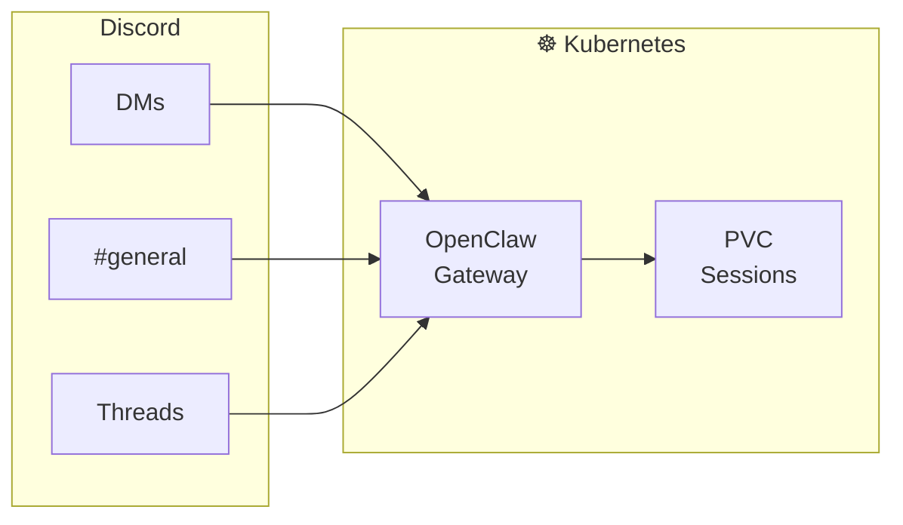

> 💡 **Quick Answer:** Create a Discord application at `discord.com/developers`, get the bot token, deploy OpenClaw with the token as a Secret, and configure `channels.discord` in `openclaw.json`. The bot responds to mentions in group channels and all DMs.
>
> ```yaml
> env:
>   - name: DISCORD_TOKEN
>     valueFrom:
>       secretKeyRef:
>         name: openclaw-secrets
>         key: DISCORD_TOKEN
> ```
>
> **Key concept:** OpenClaw's Discord channel handles mention detection, thread management, and message routing automatically. Configure `requireMention: true` for group channels.
>
> **Gotcha:** Discord bots need the `MESSAGE_CONTENT` privileged intent enabled in the Developer Portal, otherwise they can't read message text.

## The Problem

Building a Discord bot with AI capabilities requires:

- **SDK boilerplate** for handling events, commands, and message routing
- **Session management** to maintain conversation context per user/channel
- **Mention handling** to only respond when addressed in busy channels
- **Memory persistence** across bot restarts

## The Solution

OpenClaw handles all Discord integration out of the box — just provide the bot token and configure routing rules.

## Architecture Overview



## Step 1: Create the Discord Application

1. Go to [Discord Developer Portal](https://discord.com/developers/applications)
2. Click **New Application** → name it
3. Go to **Bot** → click **Reset Token** → copy the token
4. Enable **MESSAGE CONTENT INTENT** under Privileged Gateway Intents
5. Go to **OAuth2** → URL Generator → select `bot` scope → select permissions:
   - Send Messages, Read Message History, Use Slash Commands, Add Reactions
6. Open the generated URL to invite the bot to your server

## Step 2: Deploy on Kubernetes

```yaml
# openclaw-discord.yaml
apiVersion: v1
kind: Secret
metadata:
  name: openclaw-secrets
  namespace: openclaw
type: Opaque
stringData:
  ANTHROPIC_API_KEY: "sk-ant-your-key"
  DISCORD_TOKEN: "your-discord-bot-token"
---
apiVersion: v1
kind: ConfigMap
metadata:
  name: openclaw-config
  namespace: openclaw
data:
  openclaw.json: |
    {
      "gateway": { "port": 18789 },
      "channels": {
        "discord": {
          "enabled": true
        }
      },
      "messages": {
        "groupChat": {
          "requireMention": true,
          "mentionPatterns": ["@openclaw"]
        }
      }
    }
---
apiVersion: apps/v1
kind: Deployment
metadata:
  name: openclaw-discord
  namespace: openclaw
spec:
  replicas: 1
  strategy:
    type: Recreate
  selector:
    matchLabels:
      app: openclaw-discord
  template:
    metadata:
      labels:
        app: openclaw-discord
    spec:
      containers:
        - name: openclaw
          image: node:22-slim
          command: ["sh", "-c", "npm i -g openclaw@latest && openclaw gateway"]
          envFrom:
            - secretRef:
                name: openclaw-secrets
          volumeMounts:
            - name: state
              mountPath: /home/node/.openclaw
            - name: config
              mountPath: /home/node/.openclaw/openclaw.json
              subPath: openclaw.json
          resources:
            requests:
              cpu: 250m
              memory: 512Mi
            limits:
              cpu: "1"
              memory: 1Gi
      volumes:
        - name: state
          persistentVolumeClaim:
            claimName: openclaw-state
        - name: config
          configMap:
            name: openclaw-config
```

```bash
kubectl apply -f openclaw-discord.yaml
```

## Step 3: Configure Group Chat Behavior

```json
{
  "channels": {
    "discord": {
      "enabled": true,
      "groups": {
        "*": {
          "requireMention": true
        },
        "123456789012345678": {
          "requireMention": false,
          "allowFrom": ["987654321098765432"]
        }
      }
    }
  }
}
```

## Step 4: Customize the Bot Persona

```bash
# Edit the workspace SOUL.md to define the bot's personality
kubectl exec -n openclaw deploy/openclaw-discord -- sh -c 'cat > /home/node/.openclaw/workspace/SOUL.md << EOF
# Discord Community Bot

You are a helpful Kubernetes expert in the kubernetes.recipes Discord server.
Be concise, use code blocks for YAML/commands, and react with emoji when appropriate.
Stay on topic — Kubernetes, containers, cloud native.
EOF'
```

## Common Issues

### Issue 1: Bot not responding to mentions

```bash
# Verify MESSAGE_CONTENT intent is enabled in Discord Developer Portal
# Check logs for connection status
kubectl logs -n openclaw deploy/openclaw-discord | grep -i discord

# Verify the bot is connected
kubectl exec -n openclaw deploy/openclaw-discord -- openclaw status
```

### Issue 2: Bot responds to every message in group channels

```json
// Set requireMention to true
{
  "messages": {
    "groupChat": {
      "requireMention": true
    }
  }
}
```

## Best Practices

1. **Enable MESSAGE_CONTENT intent** — Required for reading message text
2. **Use requireMention in groups** — Prevents the bot from responding to every message
3. **Set a custom SOUL.md** — Define the bot's personality and expertise area
4. **Use Recreate strategy** — Only one instance should connect to Discord at a time
5. **Monitor token rotation** — Discord tokens don't expire but should be rotated periodically

## Key Takeaways

- **OpenClaw handles Discord integration** — No custom bot code needed
- **Mention-based routing** keeps the bot quiet in busy channels
- **SOUL.md defines persona** — Customize the bot's personality via workspace files
- **Persistent storage** maintains conversation history and context across restarts
- **Single replica** is required — Discord only allows one active connection per bot token
