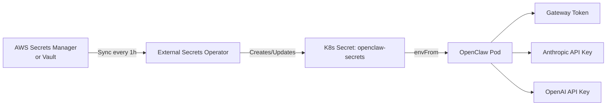

> 💡 **Quick Answer:** Install External Secrets Operator, create a `SecretStore` pointing to your vault (AWS Secrets Manager, HashiCorp Vault, or GCP), and define an `ExternalSecret` that syncs API keys into the `openclaw-secrets` Kubernetes Secret automatically. No secrets in Git, automatic rotation.

## The Problem

The OpenClaw deploy script creates secrets from environment variables — fine for development, but in production you don't want API keys in shell history, CI/CD variables, or anywhere near Git. You need secrets fetched from a central vault, automatically rotated, and synced to the Kubernetes Secret that OpenClaw reads.

## The Solution

### Step 1: Install External Secrets Operator

```bash
helm repo add external-secrets https://charts.external-secrets.io
helm install external-secrets external-secrets/external-secrets \
  --namespace external-secrets --create-namespace
```

### Step 2: Create SecretStore (AWS Example)

```yaml
# secret-store.yaml
apiVersion: external-secrets.io/v1beta1
kind: SecretStore
metadata:
  name: aws-secrets
  namespace: openclaw
spec:
  provider:
    aws:
      service: SecretsManager
      region: us-east-1
      auth:
        jwt:
          serviceAccountRef:
            name: openclaw-sa
```

### Step 3: Define ExternalSecret

```yaml
# external-secret.yaml
apiVersion: external-secrets.io/v1beta1
kind: ExternalSecret
metadata:
  name: openclaw-secrets
  namespace: openclaw
spec:
  refreshInterval: 1h
  secretStoreRef:
    name: aws-secrets
    kind: SecretStore
  target:
    name: openclaw-secrets
    creationPolicy: Owner
  data:
    - secretKey: OPENCLAW_GATEWAY_TOKEN
      remoteRef:
        key: openclaw/production
        property: gateway_token
    - secretKey: ANTHROPIC_API_KEY
      remoteRef:
        key: openclaw/production
        property: anthropic_api_key
    - secretKey: OPENAI_API_KEY
      remoteRef:
        key: openclaw/production
        property: openai_api_key
```

### HashiCorp Vault Alternative

```yaml
apiVersion: external-secrets.io/v1beta1
kind: SecretStore
metadata:
  name: vault
  namespace: openclaw
spec:
  provider:
    vault:
      server: https://vault.example.com
      path: secret
      version: v2
      auth:
        kubernetes:
          mountPath: kubernetes
          role: openclaw
          serviceAccountRef:
            name: openclaw-sa
```



### Step 4: Verify Sync

```bash
kubectl apply -f secret-store.yaml
kubectl apply -f external-secret.yaml

# Check sync status
kubectl get externalsecret -n openclaw
# NAME              STORE         REFRESH   STATUS
# openclaw-secrets  aws-secrets   1h        SecretSynced

# Verify the K8s secret was created
kubectl get secret openclaw-secrets -n openclaw
```

### Automatic Rotation

When you rotate an API key in your vault:
1. Update the secret in AWS/Vault/GCP
2. ESO syncs within `refreshInterval` (default 1h)
3. Restart OpenClaw to pick up new values:

```bash
# Auto-restart on secret change with Reloader
helm install reloader stakater/reloader --namespace openclaw
```

```yaml
# Add annotation to deployment
metadata:
  annotations:
    reloader.stakater.com/auto: "true"
```

## Common Issues

### ExternalSecret Status: SecretSyncedError

```bash
kubectl describe externalsecret openclaw-secrets -n openclaw
# Check Events for auth or path errors
```

### IAM/RBAC Permission Denied

Ensure the service account has access to the secret path:

```bash
# AWS: IAM policy needs secretsmanager:GetSecretValue
# Vault: role needs read on secret/data/openclaw/*
```

### Secret Not Updating After Vault Change

Check refresh interval and force sync:

```bash
kubectl annotate externalsecret openclaw-secrets -n openclaw \
  force-sync=$(date +%s) --overwrite
```

## Best Practices

- **Never store API keys in Git** — not even in encrypted form if you can avoid it
- **Set rotation alerts** — alert when API keys are > 90 days old
- **Use `refreshInterval: 1h`** — balance between freshness and API rate limits
- **Pair with Reloader** — auto-restart pods when secrets change
- **Audit secret access** — enable CloudTrail/Vault audit logs for key access
- **Separate secrets per environment** — different vault paths for dev/staging/prod

## Key Takeaways

- External Secrets Operator syncs vault secrets into Kubernetes Secrets
- Supports AWS Secrets Manager, HashiCorp Vault, GCP Secret Manager, Azure Key Vault
- Automatic rotation with configurable refresh intervals
- Pair with Reloader for zero-downtime secret rotation
- No secrets in Git, shell history, or CI/CD variables
