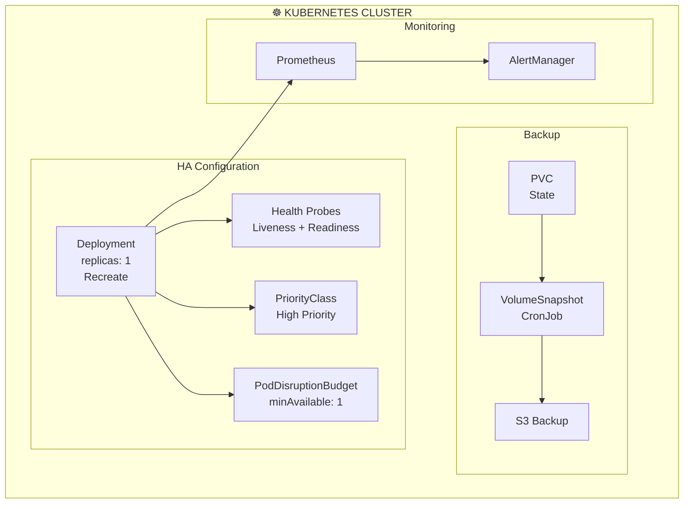

> 💡 **Quick Answer:** OpenClaw runs as a single-instance gateway (WhatsApp/Signal require exclusive connections), but you can achieve high availability through Kubernetes restart policies, health probes, PodDisruptionBudgets, PVC backups, and monitoring alerts. The key is fast recovery, not horizontal scaling.
>
> **Key concept:** HA for OpenClaw = fast automatic recovery + state persistence + monitoring, not multiple replicas (messaging protocols don't allow it).
>
> **Gotcha:** Don't set `replicas: 2` — messaging channels like WhatsApp and Discord only allow one active connection per token/session.

## The Problem

- If the OpenClaw pod dies, your AI assistant goes offline
- Pod rescheduling can take minutes if nodes are full
- PVC data loss means re-pairing all messaging channels
- No alerting means you won't know the bot is down

## The Solution

Use Kubernetes health probes, priority classes, PDB, and monitoring for fast automatic recovery.

## Architecture Overview



## Step 1: HA Deployment Configuration

```yaml
# openclaw-ha.yaml
apiVersion: scheduling.k8s.io/v1
kind: PriorityClass
metadata:
  name: openclaw-critical
value: 1000000
globalDefault: false
description: "OpenClaw gateway — keep running at all costs"
---
apiVersion: policy/v1
kind: PodDisruptionBudget
metadata:
  name: openclaw-pdb
  namespace: openclaw
spec:
  minAvailable: 1
  selector:
    matchLabels:
      app: openclaw
---
apiVersion: apps/v1
kind: Deployment
metadata:
  name: openclaw-gateway
  namespace: openclaw
spec:
  replicas: 1
  strategy:
    type: Recreate
  selector:
    matchLabels:
      app: openclaw
  template:
    metadata:
      labels:
        app: openclaw
    spec:
      priorityClassName: openclaw-critical
      terminationGracePeriodSeconds: 30
      containers:
        - name: openclaw
          image: node:22-slim
          command: ["sh", "-c", "npm i -g openclaw@latest && openclaw gateway"]
          ports:
            - containerPort: 18789
          livenessProbe:
            httpGet:
              path: /
              port: 18789
            initialDelaySeconds: 60
            periodSeconds: 30
            failureThreshold: 3
            timeoutSeconds: 5
          readinessProbe:
            httpGet:
              path: /
              port: 18789
            initialDelaySeconds: 30
            periodSeconds: 10
          startupProbe:
            httpGet:
              path: /
              port: 18789
            initialDelaySeconds: 10
            periodSeconds: 5
            failureThreshold: 30    # 2.5 min for npm install + startup
          resources:
            requests:
              cpu: 250m
              memory: 512Mi
            limits:
              cpu: "1"
              memory: 1Gi
```

## Step 2: Automated PVC Backup

```yaml
# openclaw-backup-cronjob.yaml
apiVersion: batch/v1
kind: CronJob
metadata:
  name: openclaw-backup
  namespace: openclaw
spec:
  schedule: "0 */6 * * *"    # Every 6 hours
  jobTemplate:
    spec:
      template:
        spec:
          containers:
            - name: backup
              image: amazon/aws-cli:latest
              command: ["sh", "-c"]
              args:
                - |
                  TIMESTAMP=$(date +%Y%m%d-%H%M%S)
                  cd /backup-source
                  tar czf /tmp/openclaw-backup-${TIMESTAMP}.tar.gz .
                  aws s3 cp /tmp/openclaw-backup-${TIMESTAMP}.tar.gz \
                    s3://my-backups/openclaw/openclaw-backup-${TIMESTAMP}.tar.gz
                  # Retain last 7 days
                  aws s3 ls s3://my-backups/openclaw/ | \
                    sort | head -n -28 | awk '{print $4}' | \
                    xargs -I{} aws s3 rm s3://my-backups/openclaw/{}
              envFrom:
                - secretRef:
                    name: aws-backup-credentials
              volumeMounts:
                - name: state
                  mountPath: /backup-source
                  readOnly: true
          volumes:
            - name: state
              persistentVolumeClaim:
                claimName: openclaw-state
          restartPolicy: OnFailure
```

## Step 3: Monitoring and Alerts

```yaml
# openclaw-monitoring.yaml
apiVersion: monitoring.coreos.com/v1
kind: PrometheusRule
metadata:
  name: openclaw-alerts
  namespace: openclaw
spec:
  groups:
    - name: openclaw
      rules:
        - alert: OpenClawDown
          expr: |
            absent(up{job="openclaw"}) or up{job="openclaw"} == 0
          for: 2m
          labels:
            severity: critical
          annotations:
            summary: "OpenClaw gateway is down"
        
        - alert: OpenClawHighRestarts
          expr: |
            increase(kube_pod_container_status_restarts_total{container="openclaw"}[1h]) > 3
          labels:
            severity: warning
          annotations:
            summary: "OpenClaw pod restarting frequently"
        
        - alert: OpenClawPVCNearFull
          expr: |
            kubelet_volume_stats_used_bytes{persistentvolumeclaim="openclaw-state"} /
            kubelet_volume_stats_capacity_bytes{persistentvolumeclaim="openclaw-state"} > 0.85
          labels:
            severity: warning
          annotations:
            summary: "OpenClaw PVC is 85% full"
```

## Common Issues

### Issue 1: Pod stuck in Pending after node failure

```bash
# High PriorityClass ensures OpenClaw is scheduled first
# If still pending, check node resources:
kubectl describe pod -n openclaw -l app=openclaw
kubectl get nodes -o wide
```

### Issue 2: Health probe fails during model loading

```bash
# Use startupProbe with generous timeout
startupProbe:
  failureThreshold: 60    # 5 minutes
  periodSeconds: 5
```

## Best Practices

1. **Use PriorityClass** — Ensure OpenClaw is never evicted for lower-priority workloads
2. **PodDisruptionBudget** — Prevent voluntary disruptions (drains, upgrades) from killing the pod
3. **Backup PVC every 6 hours** — WhatsApp sessions and memory are hard to recreate
4. **Monitor pod health** — Alert immediately when the gateway goes down
5. **Pre-build a custom image** — Eliminate npm install time from cold starts

## Key Takeaways

- **Single replica with fast recovery** is the HA pattern for OpenClaw
- **PriorityClass + PDB** keep the pod running through cluster disruptions
- **PVC backups** protect against data loss and enable disaster recovery
- **Health probes** enable automatic restart on failures
- **Monitoring alerts** ensure you know when the bot is down
