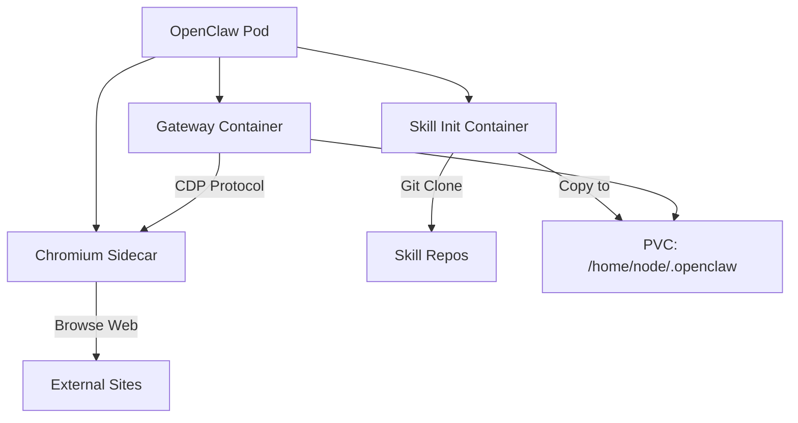

> 💡 **Quick Answer:** Install the community Helm chart with `helm install openclaw oci://ghcr.io/serhanekicii/openclaw-helm/openclaw` to deploy OpenClaw with an optional Chromium sidecar for browser automation and an init container for declarative skill installation.

## The Problem

The official OpenClaw Kustomize manifests are minimal by design. If you need browser automation (Chromium sidecar), declarative skill installation, or standard Helm features like templated values, upgrade history, and rollback — you need a Helm chart.

## The Solution

### Step 1: Install the Community Helm Chart

```bash
# Add the chart (OCI registry)
helm install openclaw oci://ghcr.io/serhanekicii/openclaw-helm/openclaw \
  --namespace openclaw --create-namespace \
  --set secrets.anthropicApiKey="sk-ant-..." \
  --set secrets.gatewayToken="$(openssl rand -hex 32)"
```

### Step 2: Custom Values File

```yaml
# values-production.yaml
replicaCount: 1

image:
  repository: ghcr.io/openclaw/openclaw
  tag: "slim"
  pullPolicy: IfNotPresent

# Gateway configuration
config:
  openclaw:
    gateway:
      mode: local
      bind: loopback
      port: 18789
      auth:
        mode: token
      controlUi:
        enabled: true
    agents:
      defaults:
        workspace: "~/.openclaw/workspace"
      list:
        - id: default
          name: "Production Assistant"
          workspace: "~/.openclaw/workspace"
    cron:
      enabled: true

# Agent instructions
agentsMd: |
  # Production OpenClaw Agent
  You are a DevOps assistant with access to browser automation.
  Use the browser for web scraping, testing, and monitoring dashboards.

# Secrets (use external-secrets in production)
secrets:
  gatewayToken: ""  # Auto-generated if empty
  anthropicApiKey: ""
  openaiApiKey: ""

# Enable Chromium sidecar
chromium:
  enabled: true
  image:
    repository: ghcr.io/anthropics/anthropic-quickstarts
    tag: "chromium-latest"
  resources:
    requests:
      memory: 512Mi
      cpu: 250m
    limits:
      memory: 2Gi
      cpu: "1"

# Declarative skill installation
skills:
  enabled: true
  install:
    - name: web-search
      source: https://github.com/openclaw-skills/web-search
    - name: gmail
      source: https://github.com/openclaw-skills/gmail

# Storage
persistence:
  enabled: true
  size: 10Gi
  storageClass: ""  # Use cluster default

# Resources
resources:
  requests:
    memory: 512Mi
    cpu: 250m
  limits:
    memory: 2Gi
    cpu: "1"

# Security
podSecurityContext:
  fsGroup: 1000
  seccompProfile:
    type: RuntimeDefault

securityContext:
  runAsNonRoot: true
  runAsUser: 1000
  readOnlyRootFilesystem: true
  allowPrivilegeEscalation: false
  capabilities:
    drop: ["ALL"]
```

### Step 3: Deploy with Custom Values

```bash
helm install openclaw oci://ghcr.io/serhanekicii/openclaw-helm/openclaw \
  --namespace openclaw --create-namespace \
  -f values-production.yaml
```

### Chromium Sidecar Architecture



The Chromium sidecar runs headless Chromium accessible via Chrome DevTools Protocol (CDP). OpenClaw connects to it on `localhost:9222` for:
- Web scraping and data extraction
- Dashboard monitoring screenshots
- Form filling and UI testing
- Browser-based authentication flows

### Step 4: Verify Browser Automation

```bash
# Port-forward and access
kubectl port-forward svc/openclaw 18789:18789 -n openclaw

# In OpenClaw session, test browser:
# "Open https://example.com and take a screenshot"
```

### Upgrade and Rollback

```bash
# Upgrade with new values
helm upgrade openclaw oci://ghcr.io/serhanekicii/openclaw-helm/openclaw \
  -n openclaw -f values-production.yaml

# Check history
helm history openclaw -n openclaw

# Rollback to previous
helm rollback openclaw 1 -n openclaw
```

## Common Issues

### Chromium OOM Killed

Chromium is memory-hungry. Increase limits:

```yaml
chromium:
  resources:
    limits:
      memory: 4Gi
```

### Skills Init Container Fails

Check if Git URLs are accessible from the cluster:

```bash
kubectl logs -n openclaw deploy/openclaw -c init-skills
```

### Helm Values Not Applied

Verify rendered manifests:

```bash
helm template openclaw oci://ghcr.io/serhanekicii/openclaw-helm/openclaw \
  -f values-production.yaml | less
```

## Best Practices

- **Use Helm for complex deployments** — Chromium sidecar, skills, multi-env
- **Use Kustomize for simple deployments** — single instance, no browser needed
- **Pin chart versions** — `--version 0.1.0` for reproducible deploys
- **External Secrets for API keys** — don't pass secrets via `--set` in CI/CD
- **Chromium memory budget** — allocate 1-4GB depending on concurrent pages
- **Skill pinning** — specify Git refs for skills to avoid breaking changes

## Key Takeaways

- The community Helm chart adds Chromium sidecar and declarative skill installation
- Chromium enables browser automation via CDP on localhost:9222
- Use `values.yaml` overlays per environment (dev/staging/prod)
- Helm provides upgrade history and one-command rollback
- Pin chart and image versions for production stability
