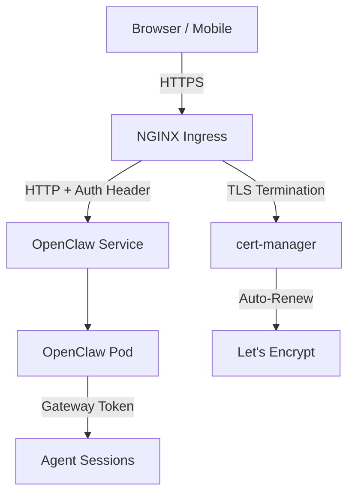

> 💡 **Quick Answer:** Change the OpenClaw gateway bind from `loopback` to `0.0.0.0`, create an Ingress with TLS termination via cert-manager, and configure `allowedOrigins` in `openclaw.json` to match your domain. Never expose OpenClaw without TLS and gateway auth enabled.

## The Problem

The default OpenClaw Kubernetes deployment binds the gateway to loopback (`127.0.0.1`), which only works with `kubectl port-forward`. To access OpenClaw from a browser, mobile app, or other services in the cluster, you need proper Ingress with TLS — but misconfiguring the bind address or CORS origins can either break access or create security holes.

## The Solution

### Step 1: Install Prerequisites

```bash
# Install NGINX Ingress Controller
helm repo add ingress-nginx https://kubernetes.github.io/ingress-nginx
helm install ingress-nginx ingress-nginx/ingress-nginx \
  --namespace ingress-nginx --create-namespace

# Install cert-manager for automatic TLS certificates
helm repo add jetstack https://charts.jetstack.io
helm install cert-manager jetstack/cert-manager \
  --namespace cert-manager --create-namespace \
  --set crds.enabled=true
```

### Step 2: Create ClusterIssuer for Let's Encrypt

```yaml
# cluster-issuer.yaml
apiVersion: cert-manager.io/v1
kind: ClusterIssuer
metadata:
  name: letsencrypt-prod
spec:
  acme:
    server: https://acme-v02.api.letsencrypt.org/directory
    email: admin@example.com
    privateKeySecretRef:
      name: letsencrypt-prod-key
    solvers:
      - http01:
          ingress:
            class: nginx
```

### Step 3: Update OpenClaw ConfigMap

Change the gateway bind from loopback to allow pod-level access:

```yaml
# configmap.yaml
apiVersion: v1
kind: ConfigMap
metadata:
  name: openclaw-config
  namespace: openclaw
data:
  openclaw.json: |
    {
      "gateway": {
        "bind": "0.0.0.0",
        "port": 18789,
        "auth": true
      },
      "controlUI": {
        "allowedOrigins": [
          "https://openclaw.example.com"
        ]
      }
    }
```

> ⚠️ **Critical:** Always keep `gateway.auth: true` when binding to non-loopback. The gateway token is your authentication layer.

### Step 4: Create the Ingress Resource

```yaml
# ingress.yaml
apiVersion: networking.k8s.io/v1
kind: Ingress
metadata:
  name: openclaw-ingress
  namespace: openclaw
  annotations:
    cert-manager.io/cluster-issuer: letsencrypt-prod
    nginx.ingress.kubernetes.io/proxy-body-size: "50m"
    nginx.ingress.kubernetes.io/proxy-read-timeout: "3600"
    nginx.ingress.kubernetes.io/proxy-send-timeout: "3600"
    # WebSocket support for real-time agent communication
    nginx.ingress.kubernetes.io/proxy-http-version: "1.1"
    nginx.ingress.kubernetes.io/configuration-snippet: |
      proxy_set_header Upgrade $http_upgrade;
      proxy_set_header Connection "upgrade";
spec:
  ingressClassName: nginx
  tls:
    - hosts:
        - openclaw.example.com
      secretName: openclaw-tls
  rules:
    - host: openclaw.example.com
      http:
        paths:
          - path: /
            pathType: Prefix
            backend:
              service:
                name: openclaw
                port:
                  number: 18789
```

### Step 5: Apply and Verify

```bash
kubectl apply -f cluster-issuer.yaml
kubectl apply -f configmap.yaml
kubectl apply -f ingress.yaml
kubectl rollout restart deployment/openclaw -n openclaw

# Wait for certificate
kubectl get certificate -n openclaw -w

# Test access
curl -I https://openclaw.example.com
```



### Alternative: Tailscale Serve

For private access without public DNS, use Tailscale:

```yaml
# tailscale-sidecar.yaml
apiVersion: apps/v1
kind: Deployment
metadata:
  name: openclaw
  namespace: openclaw
spec:
  template:
    spec:
      containers:
        - name: openclaw
          # ... existing config
        - name: tailscale
          image: ghcr.io/tailscale/tailscale:latest
          env:
            - name: TS_AUTHKEY
              valueFrom:
                secretKeyRef:
                  name: tailscale-auth
                  key: TS_AUTHKEY
            - name: TS_SERVE_CONFIG
              value: |
                {
                  "TCP": {"443": {"HTTPS": true}},
                  "Web": {
                    "openclaw.tail-abc.ts.net:443": {
                      "Handlers": {"/": {"Proxy": "http://127.0.0.1:18789"}}
                    }
                  }
                }
          securityContext:
            capabilities:
              add: ["NET_ADMIN"]
```

## Common Issues

### Certificate Not Issuing

```bash
# Check cert-manager logs
kubectl logs -n cert-manager deploy/cert-manager

# Check certificate status
kubectl describe certificate openclaw-tls -n openclaw

# Common fix: DNS not pointing to Ingress IP yet
kubectl get svc -n ingress-nginx ingress-nginx-controller -o jsonpath='{.status.loadBalancer.ingress[0].ip}'
```

### WebSocket Connection Dropping

The default NGINX proxy timeout is 60 seconds. OpenClaw agent sessions need long-lived WebSocket connections:

```yaml
annotations:
  nginx.ingress.kubernetes.io/proxy-read-timeout: "3600"
  nginx.ingress.kubernetes.io/proxy-send-timeout: "3600"
```

### CORS Errors in Control UI

The Control UI checks `allowedOrigins`. Make sure the domain matches exactly:

```json
{
  "controlUI": {
    "allowedOrigins": ["https://openclaw.example.com"]
  }
}
```

### 502 Bad Gateway After Bind Change

If you changed bind to `0.0.0.0` but the pod hasn't restarted:

```bash
kubectl rollout restart deployment/openclaw -n openclaw
kubectl logs -n openclaw deploy/openclaw -f
```

## Best Practices

- **Never expose without TLS** — gateway tokens travel in headers; HTTPS is mandatory
- **Use `allowedOrigins`** — restricts which domains can access the Control UI
- **Keep gateway auth enabled** — the token is the only auth layer between the internet and your agent
- **Set proxy timeouts high** — agent sessions can run for minutes; default 60s kills them
- **Rate limit** — add `nginx.ingress.kubernetes.io/limit-rps: "10"` to prevent abuse
- **IP allowlisting** — use `nginx.ingress.kubernetes.io/whitelist-source-range` for restricted access

## Key Takeaways

- Change gateway bind from `loopback` to `0.0.0.0` to allow Ingress routing
- Always pair non-loopback bind with TLS termination and gateway auth
- Configure WebSocket proxy timeouts (3600s) for long-running agent sessions
- Set `allowedOrigins` in `openclaw.json` to match your Ingress domain
- For private networks, Tailscale Serve is simpler than public Ingress + cert-manager
