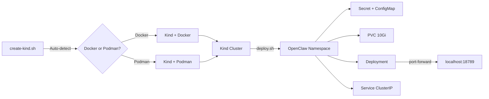

> 💡 **Quick Answer:** Run `./scripts/k8s/create-kind.sh` to create a local Kind cluster (auto-detects Docker or Podman), then `export ANTHROPIC_API_KEY="..." && ./scripts/k8s/deploy.sh` to deploy OpenClaw. Access via `kubectl port-forward svc/openclaw 18789:18789 -n openclaw`.

## The Problem

You want to test OpenClaw on Kubernetes before deploying to a real cluster, but setting up a full K8s environment is heavy. You need a lightweight, disposable local cluster that works with either Docker or Podman and tears down cleanly when you're done.

## The Solution

### Step 1: Install Prerequisites

```bash
# Install Kind
go install sigs.k8s.io/kind@latest
# Or via package manager
brew install kind  # macOS
```

```bash
# Verify container runtime
docker info  # or podman info
kubectl version --client
kind version
```

### Step 2: Create the Kind Cluster

The OpenClaw bootstrap script auto-detects your container engine:

```bash
./scripts/k8s/create-kind.sh
```

Under the hood, it creates a single-node cluster:

```yaml
kind: Cluster
apiVersion: kind.x-k8s.io/v1alpha4
nodes:
- role: control-plane
  labels:
    openclaw.dev/role: control-plane
  # Uncomment to expose services on host ports:
  # extraPortMappings:
  # - containerPort: 30080
  #   hostPort: 8080
  #   protocol: TCP
```

The script handles:
- **Engine detection** — tries Podman first, falls back to Docker
- **Existing cluster check** — skips creation if already running
- **Node readiness** — waits up to 120s for all nodes to be Ready
- **Context switching** — sets `kubectl` context to `kind-openclaw`

### Step 3: Deploy OpenClaw

```bash
export ANTHROPIC_API_KEY="sk-ant-..."
./scripts/k8s/deploy.sh
```

The deploy script:
1. Creates the `openclaw` namespace
2. Generates a gateway token and stores it in a Kubernetes Secret
3. Applies all manifests via Kustomize
4. Waits for rollout to complete

```bash
# Access the gateway
kubectl port-forward svc/openclaw 18789:18789 -n openclaw
open http://localhost:18789

# Get the gateway token
kubectl get secret openclaw-secrets -n openclaw \
  -o jsonpath='{.data.OPENCLAW_GATEWAY_TOKEN}' | base64 -d
```

### Step 4: Verify Deployment

```bash
# Check all resources
kubectl get all -n openclaw

# Expected output:
# NAME                           READY   STATUS    RESTARTS   AGE
# pod/openclaw-xxx-yyy           1/1     Running   0          60s
#
# NAME               TYPE        CLUSTER-IP     PORT(S)     AGE
# service/openclaw   ClusterIP   10.96.x.x      18789/TCP   60s
#
# NAME                       READY   UP-TO-DATE   AVAILABLE   AGE
# deployment.apps/openclaw   1/1     1            1           60s

# Check logs
kubectl logs -n openclaw deploy/openclaw -f
```



### Expose via Host Ports (Optional)

For testing without port-forward, uncomment `extraPortMappings` in the Kind config:

```yaml
nodes:
- role: control-plane
  extraPortMappings:
  - containerPort: 30789
    hostPort: 18789
    protocol: TCP
```

Then change the Service to NodePort:

```yaml
apiVersion: v1
kind: Service
metadata:
  name: openclaw
spec:
  type: NodePort
  ports:
    - port: 18789
      nodePort: 30789
```

### Teardown

```bash
# Remove OpenClaw only
./scripts/k8s/deploy.sh --delete

# Destroy the entire cluster
./scripts/k8s/create-kind.sh --delete
```

## Common Issues

### "Podman is installed but not responding"

Start the Podman machine:

```bash
podman machine start
```

### Kind Cluster Creation Hangs

Usually a resource issue. Ensure Docker/Podman has enough memory (≥4GB):

```bash
docker info | grep "Total Memory"
```

### PVC Stuck in Pending

Kind uses the `standard` StorageClass with `rancher.io/local-path` provisioner by default. If it's missing:

```bash
kubectl get sc
# Should show 'standard (default)'
```

## Best Practices

- **Use Kind for testing only** — not for production workloads
- **Name clusters descriptively** — `./scripts/k8s/create-kind.sh --name openclaw-dev`
- **Clean up after testing** — Kind clusters consume container resources
- **Use `--show-token`** — `./scripts/k8s/deploy.sh --show-token` prints the token for quick local testing
- **Test manifest changes locally** — always verify in Kind before pushing to production clusters

## Key Takeaways

- Kind creates disposable local K8s clusters in seconds using Docker or Podman
- The OpenClaw bootstrap scripts auto-detect your container engine
- Deploy with a single command: `export API_KEY=... && ./scripts/k8s/deploy.sh`
- Access via `kubectl port-forward` or host port mappings
- Tear down completely with `--delete` on both scripts
