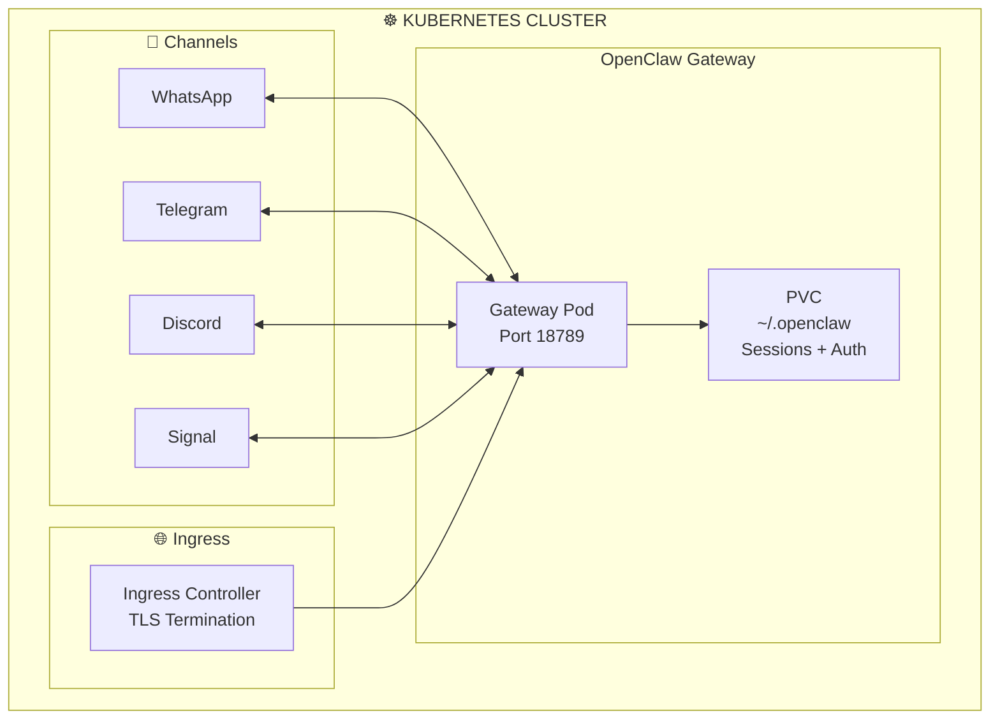

> 💡 **Quick Answer:** Create a Deployment with the `openclaw/openclaw:latest` image, mount a PVC for `~/.openclaw` state, inject your AI provider API key via a Secret, and expose port 18789. OpenClaw is a single binary that connects your chat apps (WhatsApp, Telegram, Discord) to AI agents — think of it as a self-hosted bridge between messaging and LLMs.
>
> ```yaml
> containers:
>   - name: openclaw
>     image: node:22-slim
>     command: ["sh", "-c", "npm i -g openclaw@latest && openclaw gateway --port 18789"]
>     ports: [{containerPort: 18789}]
> ```
>
> **Key concept:** OpenClaw runs a Gateway process that bridges messaging channels to AI agents. One pod serves all channels simultaneously.
>
> **Gotcha:** WhatsApp pairing requires an interactive QR scan on first setup. Use `kubectl exec` to run `openclaw channels login` for the initial pairing, then the session persists in the PVC.

## The Problem

Running AI chatbots across multiple messaging platforms is complex:

- **Each platform** has its own API, SDK, and authentication flow
- **Session state** (WhatsApp auth, conversation history) must persist across restarts
- **Multiple channels** (WhatsApp + Telegram + Discord) need a unified routing layer
- **Self-hosting** gives you data control but requires infrastructure management

## The Solution

Deploy OpenClaw on Kubernetes as a single Gateway pod that connects all your messaging channels to AI agents, with persistent storage for state and Kubernetes-native scaling.

## Architecture Overview



## Step 1: Create the Namespace and Secrets

```yaml
# openclaw-namespace.yaml
apiVersion: v1
kind: Namespace
metadata:
  name: openclaw
---
apiVersion: v1
kind: Secret
metadata:
  name: openclaw-secrets
  namespace: openclaw
type: Opaque
stringData:
  ANTHROPIC_API_KEY: "sk-ant-your-key-here"
  # Or for OpenAI:
  # OPENAI_API_KEY: "sk-your-key-here"
```

## Step 2: Create Persistent Storage

```yaml
# openclaw-pvc.yaml
apiVersion: v1
kind: PersistentVolumeClaim
metadata:
  name: openclaw-state
  namespace: openclaw
spec:
  accessModes: [ReadWriteOnce]
  resources:
    requests:
      storage: 5Gi
  storageClassName: standard
```

## Step 3: Create the OpenClaw Configuration

```yaml
# openclaw-config.yaml
apiVersion: v1
kind: ConfigMap
metadata:
  name: openclaw-config
  namespace: openclaw
data:
  openclaw.json: |
    {
      "gateway": {
        "port": 18789
      },
      "channels": {
        "telegram": {
          "enabled": true
        },
        "discord": {
          "enabled": true
        },
        "whatsapp": {
          "enabled": true,
          "allowFrom": ["+15555550123"]
        }
      },
      "messages": {
        "groupChat": {
          "requireMention": true,
          "mentionPatterns": ["@openclaw"]
        }
      }
    }
```

## Step 4: Deploy OpenClaw

```yaml
# openclaw-deployment.yaml
apiVersion: apps/v1
kind: Deployment
metadata:
  name: openclaw-gateway
  namespace: openclaw
  labels:
    app: openclaw
spec:
  replicas: 1    # Single replica — OpenClaw manages its own state
  strategy:
    type: Recreate    # Prevent two pods binding WhatsApp simultaneously
  selector:
    matchLabels:
      app: openclaw
  template:
    metadata:
      labels:
        app: openclaw
    spec:
      containers:
        - name: openclaw
          image: node:22-slim
          command:
            - sh
            - -c
            - |
              npm install -g openclaw@latest
              openclaw gateway --port 18789
          ports:
            - name: http
              containerPort: 18789
          env:
            - name: HOME
              value: /home/openclaw
            - name: OPENCLAW_STATE_DIR
              value: /home/openclaw/.openclaw
            - name: OPENCLAW_CONFIG_PATH
              value: /home/openclaw/.openclaw/openclaw.json
          envFrom:
            - secretRef:
                name: openclaw-secrets
          volumeMounts:
            - name: state
              mountPath: /home/openclaw/.openclaw
            - name: config
              mountPath: /home/openclaw/.openclaw/openclaw.json
              subPath: openclaw.json
          resources:
            requests:
              cpu: 250m
              memory: 512Mi
            limits:
              cpu: "1"
              memory: 1Gi
          livenessProbe:
            httpGet:
              path: /
              port: 18789
            initialDelaySeconds: 30
            periodSeconds: 30
          readinessProbe:
            httpGet:
              path: /
              port: 18789
            initialDelaySeconds: 10
            periodSeconds: 10
      volumes:
        - name: state
          persistentVolumeClaim:
            claimName: openclaw-state
        - name: config
          configMap:
            name: openclaw-config
---
apiVersion: v1
kind: Service
metadata:
  name: openclaw
  namespace: openclaw
spec:
  selector:
    app: openclaw
  ports:
    - name: http
      port: 80
      targetPort: 18789
  type: ClusterIP
```

## Step 5: Configure Ingress with TLS

```yaml
# openclaw-ingress.yaml
apiVersion: networking.k8s.io/v1
kind: Ingress
metadata:
  name: openclaw
  namespace: openclaw
  annotations:
    cert-manager.io/cluster-issuer: letsencrypt-prod
spec:
  ingressClassName: nginx
  tls:
    - hosts: [openclaw.example.com]
      secretName: openclaw-tls
  rules:
    - host: openclaw.example.com
      http:
        paths:
          - path: /
            pathType: Prefix
            backend:
              service:
                name: openclaw
                port:
                  number: 80
```

## Step 6: Initial Channel Pairing

```bash
# Pair WhatsApp (requires interactive QR code scan)
kubectl exec -it -n openclaw deploy/openclaw-gateway -- openclaw channels login

# Check gateway status
kubectl exec -n openclaw deploy/openclaw-gateway -- openclaw status

# View logs
kubectl logs -n openclaw deploy/openclaw-gateway -f
```

## Common Issues

### Issue 1: WhatsApp session lost after pod restart

```bash
# Ensure PVC is mounted correctly and state persists
kubectl exec -n openclaw deploy/openclaw-gateway -- ls -la /home/openclaw/.openclaw/

# Check PVC is bound
kubectl get pvc -n openclaw

# If session is lost, re-pair:
kubectl exec -it -n openclaw deploy/openclaw-gateway -- openclaw channels login
```

### Issue 2: Gateway not responding to messages

```bash
# Check gateway logs for errors
kubectl logs -n openclaw deploy/openclaw-gateway --tail=50

# Verify the gateway is running
kubectl exec -n openclaw deploy/openclaw-gateway -- openclaw gateway status

# Check API key is set
kubectl exec -n openclaw deploy/openclaw-gateway -- env | grep API_KEY
```

### Issue 3: npm install slow on startup

```bash
# Build a custom image to avoid reinstalling on every restart
# See the "OpenClaw Custom Docker Image" recipe for details
```

## Best Practices

1. **Use Recreate strategy** — Only one pod should own WhatsApp/Signal sessions at a time
2. **Persist all state** — Mount the entire `~/.openclaw` directory to a PVC
3. **Use Secrets for API keys** — Never put API keys in ConfigMaps or environment variables in plain YAML
4. **Build a custom image** — Pre-install OpenClaw to avoid npm install on every restart
5. **Set resource limits** — OpenClaw is lightweight (~256MB RAM typical) but set limits to prevent runaway
6. **Use Ingress with TLS** — The Control UI should be protected; add authentication middleware

## Key Takeaways

- **OpenClaw** is a single-process gateway that bridges messaging apps to AI agents
- **One pod** serves all channels (WhatsApp, Telegram, Discord, Signal) simultaneously
- **Persistent storage** is essential for WhatsApp/Signal auth sessions and conversation history
- **Recreate deployment strategy** prevents dual-binding issues with messaging sessions
- **Interactive pairing** is needed once for WhatsApp/Signal; sessions persist in the PVC
- **The Control UI** on port 18789 provides a web dashboard for chat and configuration
