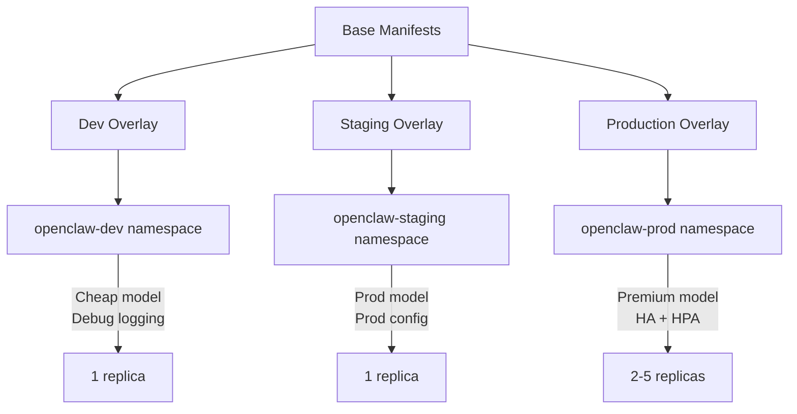

> 💡 **Quick Answer:** Use Kustomize overlays to manage OpenClaw deployments across environments. The base contains shared manifests (Deployment, Service, PVC), while overlays customize `openclaw.json`, resource limits, replica counts, and secrets per environment — no Helm chart needed.

## The Problem

Running OpenClaw in dev, staging, and production requires different configurations: dev needs debug logging and cheap models, staging mirrors production settings, and production needs HA replicas, strict resource limits, and premium model access. Copy-pasting manifests across environments leads to configuration drift and missed updates.

## The Solution

### Directory Structure

```
openclaw-k8s/
├── base/
│   ├── kustomization.yaml
│   ├── deployment.yaml
│   ├── service.yaml
│   ├── pvc.yaml
│   └── configmap.yaml
└── overlays/
    ├── dev/
    │   ├── kustomization.yaml
    │   ├── configmap-patch.yaml
    │   └── deployment-patch.yaml
    ├── staging/
    │   ├── kustomization.yaml
    │   ├── configmap-patch.yaml
    │   └── deployment-patch.yaml
    └── production/
        ├── kustomization.yaml
        ├── configmap-patch.yaml
        ├── deployment-patch.yaml
        └── hpa.yaml
```

### Base Manifests

```yaml
# base/kustomization.yaml
apiVersion: kustomize.config.k8s.io/v1beta1
kind: Kustomization
resources:
  - deployment.yaml
  - service.yaml
  - pvc.yaml
  - configmap.yaml
commonLabels:
  app: openclaw
  app.kubernetes.io/name: openclaw
```

```yaml
# base/deployment.yaml
apiVersion: apps/v1
kind: Deployment
metadata:
  name: openclaw
spec:
  replicas: 1
  selector:
    matchLabels:
      app: openclaw
  template:
    metadata:
      labels:
        app: openclaw
    spec:
      securityContext:
        runAsUser: 1000
        runAsGroup: 1000
        fsGroup: 1000
      containers:
        - name: openclaw
          image: ghcr.io/openclaw/openclaw:latest
          ports:
            - containerPort: 18789
          envFrom:
            - secretRef:
                name: openclaw-secrets
          volumeMounts:
            - name: config
              mountPath: /home/node/.openclaw/openclaw.json
              subPath: openclaw.json
            - name: config
              mountPath: /home/node/.openclaw/workspace/AGENTS.md
              subPath: AGENTS.md
            - name: data
              mountPath: /home/node/.openclaw
          resources:
            requests:
              cpu: 100m
              memory: 256Mi
            limits:
              cpu: 500m
              memory: 512Mi
          securityContext:
            readOnlyRootFilesystem: true
            allowPrivilegeEscalation: false
            capabilities:
              drop: ["ALL"]
      volumes:
        - name: config
          configMap:
            name: openclaw-config
        - name: data
          persistentVolumeClaim:
            claimName: openclaw-data
```

```yaml
# base/configmap.yaml
apiVersion: v1
kind: ConfigMap
metadata:
  name: openclaw-config
data:
  openclaw.json: |
    {
      "gateway": {
        "bind": "loopback",
        "port": 18789,
        "auth": true
      }
    }
  AGENTS.md: |
    # OpenClaw Agent
    You are a helpful AI assistant.
```

### Dev Overlay

```yaml
# overlays/dev/kustomization.yaml
apiVersion: kustomize.config.k8s.io/v1beta1
kind: Kustomization
resources:
  - ../../base
namespace: openclaw-dev
namePrefix: dev-
patches:
  - path: configmap-patch.yaml
  - path: deployment-patch.yaml
```

```yaml
# overlays/dev/configmap-patch.yaml
apiVersion: v1
kind: ConfigMap
metadata:
  name: openclaw-config
data:
  openclaw.json: |
    {
      "gateway": {
        "bind": "loopback",
        "port": 18789,
        "auth": true
      },
      "defaultModel": "openrouter/google/gemini-2.5-flash",
      "logging": {
        "level": "debug"
      }
    }
  AGENTS.md: |
    # OpenClaw Dev Agent
    You are a development assistant. Be verbose with debugging output.
    Environment: dev — safe to experiment.
```

```yaml
# overlays/dev/deployment-patch.yaml
apiVersion: apps/v1
kind: Deployment
metadata:
  name: openclaw
spec:
  replicas: 1
  template:
    spec:
      containers:
        - name: openclaw
          resources:
            requests:
              cpu: 50m
              memory: 128Mi
            limits:
              cpu: 250m
              memory: 256Mi
```

### Production Overlay

```yaml
# overlays/production/kustomization.yaml
apiVersion: kustomize.config.k8s.io/v1beta1
kind: Kustomization
resources:
  - ../../base
  - hpa.yaml
namespace: openclaw-prod
namePrefix: prod-
patches:
  - path: configmap-patch.yaml
  - path: deployment-patch.yaml
```

```yaml
# overlays/production/configmap-patch.yaml
apiVersion: v1
kind: ConfigMap
metadata:
  name: openclaw-config
data:
  openclaw.json: |
    {
      "gateway": {
        "bind": "0.0.0.0",
        "port": 18789,
        "auth": true
      },
      "defaultModel": "anthropic/claude-sonnet-4-20250514",
      "controlUI": {
        "allowedOrigins": ["https://openclaw.company.com"]
      }
    }
```

```yaml
# overlays/production/deployment-patch.yaml
apiVersion: apps/v1
kind: Deployment
metadata:
  name: openclaw
spec:
  replicas: 2
  template:
    spec:
      containers:
        - name: openclaw
          image: ghcr.io/openclaw/openclaw:2026.3.1
          resources:
            requests:
              cpu: 500m
              memory: 512Mi
            limits:
              cpu: "2"
              memory: 1Gi
      topologySpreadConstraints:
        - maxSkew: 1
          topologyKey: kubernetes.io/hostname
          whenUnsatisfiable: DoNotSchedule
          labelSelector:
            matchLabels:
              app: openclaw
```

```yaml
# overlays/production/hpa.yaml
apiVersion: autoscaling/v2
kind: HorizontalPodAutoscaler
metadata:
  name: openclaw-hpa
spec:
  scaleTargetRef:
    apiVersion: apps/v1
    kind: Deployment
    name: prod-openclaw
  minReplicas: 2
  maxReplicas: 5
  metrics:
    - type: Resource
      resource:
        name: cpu
        target:
          type: Utilization
          averageUtilization: 70
```

### Deploy Commands

```bash
# Dev
kubectl apply -k overlays/dev/

# Staging
kubectl apply -k overlays/staging/

# Production
kubectl apply -k overlays/production/

# Diff before applying
kubectl diff -k overlays/production/
```



## Common Issues

### ConfigMap Patch Not Merging Correctly

Kustomize uses strategic merge for ConfigMaps. If your patch replaces the entire `data` field instead of merging keys, use `$patch: replace`:

```yaml
# Force full replacement of data block
apiVersion: v1
kind: ConfigMap
metadata:
  name: openclaw-config
data:
  $patch: replace
  openclaw.json: |
    { ... complete config ... }
```

### PVC Name Conflicts Across Environments

The `namePrefix` in kustomization.yaml prefixes all resources. The PVC becomes `dev-openclaw-data`, `prod-openclaw-data` — each environment gets independent storage.

### Secrets Not Prefixed

Create secrets per namespace manually since they contain sensitive data:

```bash
kubectl create secret generic openclaw-secrets \
  -n openclaw-prod \
  --from-literal=OPENCLAW_GATEWAY_TOKEN="$(openssl rand -hex 32)" \
  --from-literal=ANTHROPIC_API_KEY="sk-ant-..."
```

## Best Practices

- **Pin production images** — use specific tags (`2026.3.1`) not `latest`
- **Separate namespaces** — isolate environments completely
- **GitOps integration** — point ArgoCD at each overlay directory
- **Secrets out of Git** — use External Secrets Operator or sealed-secrets for API keys
- **Test with diff** — always run `kubectl diff -k` before applying production changes
- **Resource limits mandatory** — prevent OpenClaw from consuming excessive cluster resources

## Key Takeaways

- Kustomize overlays keep environment-specific config separate from shared base manifests
- Use `namePrefix` and `namespace` to isolate dev/staging/production completely
- Pin container image tags in production, use `latest` only in dev
- Integrate with ArgoCD by pointing Application resources at overlay directories
- Keep secrets out of Git — create them imperatively or use External Secrets Operator
