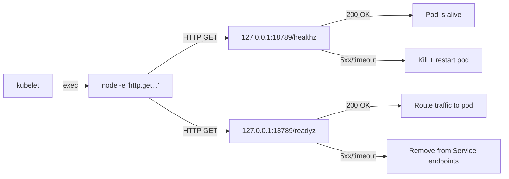

> 💡 **Quick Answer:** OpenClaw exposes `/healthz` (liveness) and `/readyz` (readiness) on loopback. Since the gateway binds to `127.0.0.1`, use `exec` probes with inline Node.js HTTP checks instead of `httpGet` probes.

## The Problem

Standard Kubernetes `httpGet` probes don't work when the application binds to loopback — the kubelet sends probes from the node network, not from inside the pod. OpenClaw's default bind is loopback for security, so you need exec-based probes that run inside the container.

## The Solution

### Exec-Based Health Probes

The official deployment uses inline Node.js to check health endpoints:

```yaml
containers:
  - name: gateway
    livenessProbe:
      exec:
        command:
          - node
          - -e
          - >-
            require('http').get('http://127.0.0.1:18789/healthz',
            r => process.exit(r.statusCode < 400 ? 0 : 1))
            .on('error', () => process.exit(1))
      initialDelaySeconds: 60
      periodSeconds: 30
      timeoutSeconds: 10
    readinessProbe:
      exec:
        command:
          - node
          - -e
          - >-
            require('http').get('http://127.0.0.1:18789/readyz',
            r => process.exit(r.statusCode < 400 ? 0 : 1))
            .on('error', () => process.exit(1))
      initialDelaySeconds: 15
      periodSeconds: 10
      timeoutSeconds: 5
```

### Why These Timing Values

| Parameter | Liveness | Readiness | Reason |
|-----------|----------|-----------|--------|
| `initialDelaySeconds` | 60 | 15 | Gateway needs ~45s to fully boot |
| `periodSeconds` | 30 | 10 | Liveness is coarse; readiness is responsive |
| `timeoutSeconds` | 10 | 5 | Allow for busy gateway under load |

### Probe Endpoints



- **`/healthz`** — Is the process alive? If this fails, kubelet kills the pod
- **`/readyz`** — Is the gateway ready to accept requests? If this fails, the Service stops routing traffic

### Alternative: httpGet with Non-Loopback Bind

If you bind the gateway to `0.0.0.0` (e.g., for Ingress), you can use simpler `httpGet` probes:

```yaml
# Only works when gateway.bind is NOT loopback
livenessProbe:
  httpGet:
    path: /healthz
    port: 18789
  initialDelaySeconds: 60
  periodSeconds: 30
readinessProbe:
  httpGet:
    path: /readyz
    port: 18789
  initialDelaySeconds: 15
  periodSeconds: 10
```

### Startup Probe for Slow Initialization

If the gateway takes longer than 60s to start (large workspace, many skills):

```yaml
startupProbe:
  exec:
    command:
      - node
      - -e
      - >-
        require('http').get('http://127.0.0.1:18789/healthz',
        r => process.exit(r.statusCode < 400 ? 0 : 1))
        .on('error', () => process.exit(1))
  failureThreshold: 30
  periodSeconds: 10
  # Allows up to 300s (5 min) for startup
```

## Common Issues

### Liveness Probe Killing Pod During Long Agent Sessions

Liveness probes check if the gateway process is healthy, not if an agent session is responsive. If the gateway itself becomes unresponsive (memory pressure, Node.js event loop blocked):

```bash
# Check if OOM is the cause
kubectl describe pod -n openclaw -l app=openclaw | grep -A5 "Last State"

# Increase memory limits if OOM
resources:
  limits:
    memory: 4Gi
```

### Readiness Probe Failing After Deploy

The 15s initial delay may be too short on resource-constrained clusters:

```bash
kubectl describe pod -n openclaw -l app=openclaw | grep -A10 Conditions
# If Ready=False, increase initialDelaySeconds to 30
```

### Exec Probe Overhead

Each exec probe spawns a Node.js process (~50ms). With 10s period readiness, that's 6 processes/minute. Negligible for single pods, but consider for high-replica deployments.

## Best Practices

- **Use exec probes with loopback bind** — the default and most secure approach
- **Switch to httpGet with non-loopback** — simpler and lower overhead
- **Add startup probe for large workspaces** — prevents premature liveness kills during init
- **Don't set aggressive liveness timing** — 30s period is fine; 5s causes false restarts
- **Monitor probe metrics** — Prometheus `kube_pod_container_status_restarts_total`

## Key Takeaways

- OpenClaw's loopback bind requires exec-based probes, not httpGet
- Liveness checks `/healthz` (kill if dead), readiness checks `/readyz` (route if ready)
- Initial delay of 60s for liveness, 15s for readiness matches gateway boot time
- Add a startup probe if initialization exceeds 60 seconds
- Switch to httpGet probes when using non-loopback bind for Ingress
