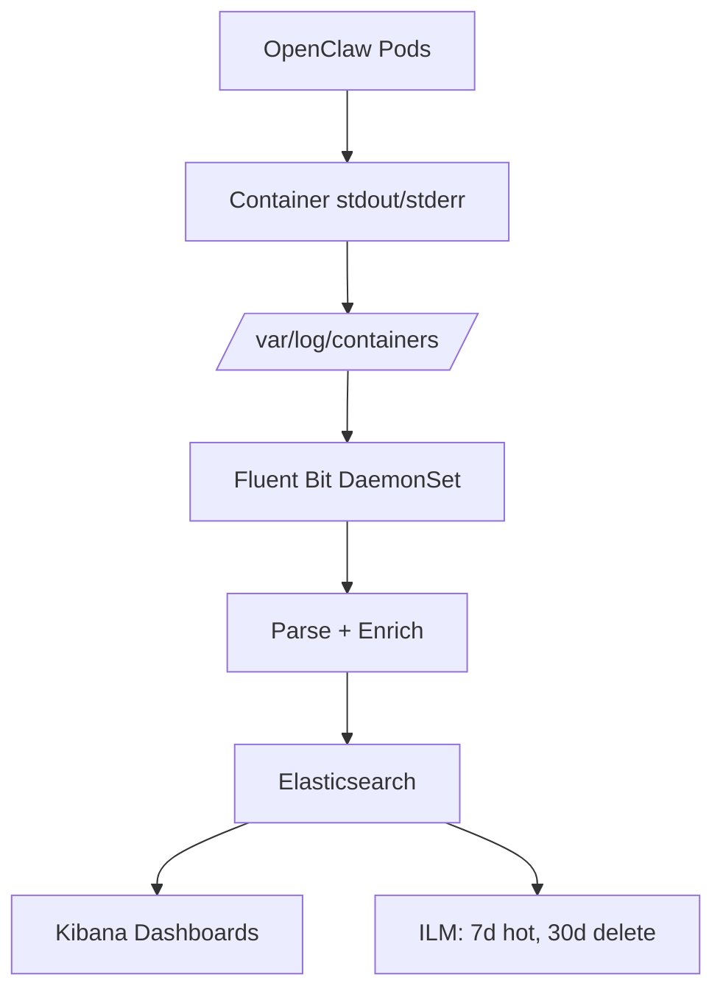

> 💡 **Quick Answer:** Deploy Fluent Bit as a DaemonSet to collect OpenClaw container logs, parse structured JSON fields, and ship to Elasticsearch for searchable audit trails and debugging.

## The Problem

OpenClaw agents process messages across multiple channels, spawn sub-agents, and execute tools. Without centralized logging, debugging failed sessions, tracking tool execution, or auditing agent behavior requires manually checking individual pod logs before they rotate.

## The Solution

Use Fluent Bit to collect, parse, and forward OpenClaw logs to Elasticsearch, with Kibana dashboards for visualization.

### Fluent Bit ConfigMap for OpenClaw Parsing

```yaml
apiVersion: v1
kind: ConfigMap
metadata:
  name: fluent-bit-config
  namespace: logging
data:
  fluent-bit.conf: |
    [SERVICE]
        Flush         5
        Log_Level     info
        Parsers_File  parsers.conf

    [INPUT]
        Name              tail
        Tag               kube.*
        Path              /var/log/containers/openclaw-*.log
        Parser            docker
        Refresh_Interval  10
        Mem_Buf_Limit     5MB

    [FILTER]
        Name                kubernetes
        Match               kube.*
        Kube_URL            https://kubernetes.default.svc:443
        Kube_Tag_Prefix     kube.var.log.containers.
        Merge_Log           On
        K8S-Logging.Parser  On

    [FILTER]
        Name    modify
        Match   kube.*
        Add     cluster production
        Add     app openclaw

    [OUTPUT]
        Name            es
        Match           kube.*
        Host            elasticsearch.logging.svc.cluster.local
        Port            9200
        Index           openclaw-logs
        Type            _doc
        Logstash_Format On
        Logstash_Prefix openclaw
        Retry_Limit     3
        tls             On
        tls.verify      Off

  parsers.conf: |
    [PARSER]
        Name        docker
        Format      json
        Time_Key    time
        Time_Format %Y-%m-%dT%H:%M:%S.%L
        Time_Keep   On

    [PARSER]
        Name        openclaw
        Format      regex
        Regex       ^\[(?<timestamp>[^\]]+)\] \[(?<level>\w+)\] \[(?<component>\w+)\] (?<message>.*)$
        Time_Key    timestamp
        Time_Format %Y-%m-%dT%H:%M:%S.%LZ
```

### Fluent Bit DaemonSet

```yaml
apiVersion: apps/v1
kind: DaemonSet
metadata:
  name: fluent-bit
  namespace: logging
spec:
  selector:
    matchLabels:
      app: fluent-bit
  template:
    metadata:
      labels:
        app: fluent-bit
    spec:
      serviceAccountName: fluent-bit
      containers:
        - name: fluent-bit
          image: fluent/fluent-bit:3.1
          resources:
            requests:
              cpu: 50m
              memory: 64Mi
            limits:
              cpu: 200m
              memory: 128Mi
          volumeMounts:
            - name: varlog
              mountPath: /var/log
              readOnly: true
            - name: config
              mountPath: /fluent-bit/etc/
      volumes:
        - name: varlog
          hostPath:
            path: /var/log
        - name: config
          configMap:
            name: fluent-bit-config
```

### Elasticsearch Index Template

```json
{
  "index_patterns": ["openclaw-*"],
  "template": {
    "settings": {
      "number_of_shards": 1,
      "number_of_replicas": 1,
      "index.lifecycle.name": "openclaw-ilm",
      "index.lifecycle.rollover_alias": "openclaw"
    },
    "mappings": {
      "properties": {
        "level": { "type": "keyword" },
        "component": { "type": "keyword" },
        "channel": { "type": "keyword" },
        "session_id": { "type": "keyword" },
        "agent_id": { "type": "keyword" },
        "message": { "type": "text" },
        "tool_name": { "type": "keyword" },
        "duration_ms": { "type": "long" },
        "@timestamp": { "type": "date" }
      }
    }
  }
}
```

### ILM Policy for Log Retention

```json
{
  "policy": {
    "phases": {
      "hot": {
        "actions": {
          "rollover": {
            "max_size": "5gb",
            "max_age": "7d"
          }
        }
      },
      "warm": {
        "min_age": "7d",
        "actions": {
          "shrink": { "number_of_shards": 1 },
          "forcemerge": { "max_num_segments": 1 }
        }
      },
      "delete": {
        "min_age": "30d",
        "actions": { "delete": {} }
      }
    }
  }
}
```

### Kibana Dashboard Queries

```
# Find all errors from OpenClaw
level: "error" AND kubernetes.labels.app: "openclaw"

# Track tool executions
component: "tool" AND tool_name: "exec"

# Session activity by channel
channel: "discord" AND component: "session"

# Failed API calls
level: "error" AND message: "API" AND duration_ms: >5000
```



## Common Issues

- **Missing logs after pod restart** — Fluent Bit reads from `/var/log/containers/`; logs persist on node even after pod deletion
- **High memory on Fluent Bit** — set `Mem_Buf_Limit` to prevent OOM; reduce `Refresh_Interval` for lower throughput
- **Elasticsearch disk full** — configure ILM policy with 30-day delete phase; monitor with `_cat/allocation`
- **JSON parse failures** — ensure OpenClaw outputs structured JSON logs; set `Merge_Log On` in Kubernetes filter

## Best Practices

- Use ILM policies to auto-manage index lifecycle (hot → warm → delete)
- Filter only OpenClaw container logs (path pattern `openclaw-*.log`) to reduce noise
- Add cluster/namespace labels for multi-cluster log aggregation
- Set up Kibana alerts for error rate spikes
- Rotate indices daily for manageable shard sizes

## Key Takeaways

- Fluent Bit DaemonSet captures all OpenClaw logs without agent modification
- Structured JSON logs enable field-level search in Kibana
- ILM policies prevent Elasticsearch disk exhaustion
- Centralized logs are essential for debugging multi-agent setups
- Kibana dashboards provide real-time visibility into agent behavior
