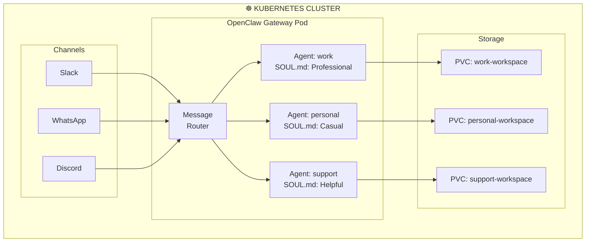

> 💡 **Quick Answer:** Define multiple agents in `openclaw.json` under `agents.list[]`, each with its own `agentId`, `workspace`, and `agentDir`. Use `bindings` to route specific channels or senders to specific agents. Each agent gets isolated sessions, memory, and persona files (SOUL.md, USER.md).
>
> ```json
> {
>   "agents": {
>     "list": [
>       { "agentId": "work", "workspace": "/workspaces/work" },
>       { "agentId": "personal", "workspace": "/workspaces/personal" }
>     ],
>     "bindings": [
>       { "agentId": "work", "channel": "slack" },
>       { "agentId": "personal", "channel": "whatsapp" }
>     ]
>   }
> }
> ```
>
> **Key concept:** Each agent is a fully isolated brain with its own workspace, sessions, memory, and persona. One Gateway process routes messages to the right agent.
>
> **Gotcha:** Auth profiles are per-agent. Never share `agentDir` across agents—it causes session collisions.

## The Problem

Organizations and power users need multiple AI agents with different personas:

- **Work agent** on Slack with access to internal tools, formal tone
- **Personal agent** on WhatsApp with casual tone and personal context
- **Support agent** on Discord handling community questions
- All running from a **single Kubernetes deployment** for efficiency

## The Solution

OpenClaw's multi-agent routing lets you run multiple isolated agents in one Gateway pod, each with its own workspace, persona, and channel bindings.

## Architecture Overview



## Step 1: Create Workspaces

```yaml
# multi-agent-pvcs.yaml
apiVersion: v1
kind: PersistentVolumeClaim
metadata:
  name: openclaw-work
  namespace: openclaw
spec:
  accessModes: [ReadWriteOnce]
  resources:
    requests:
      storage: 2Gi
---
apiVersion: v1
kind: PersistentVolumeClaim
metadata:
  name: openclaw-personal
  namespace: openclaw
spec:
  accessModes: [ReadWriteOnce]
  resources:
    requests:
      storage: 2Gi
---
apiVersion: v1
kind: PersistentVolumeClaim
metadata:
  name: openclaw-support
  namespace: openclaw
spec:
  accessModes: [ReadWriteOnce]
  resources:
    requests:
      storage: 2Gi
```

## Step 2: Configure Multi-Agent Routing

```yaml
# openclaw-multiagent-config.yaml
apiVersion: v1
kind: ConfigMap
metadata:
  name: openclaw-config
  namespace: openclaw
data:
  openclaw.json: |
    {
      "gateway": {
        "port": 18789
      },
      "agents": {
        "list": [
          {
            "agentId": "work",
            "workspace": "/workspaces/work",
            "agentDir": "/home/openclaw/.openclaw/agents/work/agent",
            "model": "anthropic/claude-sonnet-4-20250514"
          },
          {
            "agentId": "personal",
            "workspace": "/workspaces/personal",
            "agentDir": "/home/openclaw/.openclaw/agents/personal/agent",
            "model": "anthropic/claude-sonnet-4-20250514"
          },
          {
            "agentId": "support",
            "workspace": "/workspaces/support",
            "agentDir": "/home/openclaw/.openclaw/agents/support/agent",
            "model": "anthropic/claude-haiku-35-20241022"
          }
        ],
        "bindings": [
          { "agentId": "work", "channel": "slack" },
          { "agentId": "personal", "channel": "whatsapp" },
          { "agentId": "support", "channel": "discord" }
        ]
      }
    }
```

## Step 3: Deploy with Multiple Volume Mounts

```yaml
# openclaw-multiagent-deployment.yaml
apiVersion: apps/v1
kind: Deployment
metadata:
  name: openclaw-gateway
  namespace: openclaw
spec:
  replicas: 1
  strategy:
    type: Recreate
  selector:
    matchLabels:
      app: openclaw
  template:
    metadata:
      labels:
        app: openclaw
    spec:
      initContainers:
        # Initialize workspace files for each agent
        - name: init-workspaces
          image: node:22-slim
          command:
            - sh
            - -c
            - |
              for ws in /workspaces/work /workspaces/personal /workspaces/support; do
                mkdir -p "$ws/memory"
                [ -f "$ws/AGENTS.md" ] || echo "# Agent Workspace" > "$ws/AGENTS.md"
              done
              # Set personas
              [ -f /workspaces/work/SOUL.md ] || cat > /workspaces/work/SOUL.md << 'EOF'
              # Work Agent
              Professional, concise, and focused. Expert in software engineering.
              EOF
              [ -f /workspaces/personal/SOUL.md ] || cat > /workspaces/personal/SOUL.md << 'EOF'
              # Personal Agent
              Casual, friendly, and helpful. Like chatting with a knowledgeable friend.
              EOF
              [ -f /workspaces/support/SOUL.md ] || cat > /workspaces/support/SOUL.md << 'EOF'
              # Support Agent
              Patient, thorough, and empathetic. Expert at troubleshooting.
              EOF
          volumeMounts:
            - name: work-ws
              mountPath: /workspaces/work
            - name: personal-ws
              mountPath: /workspaces/personal
            - name: support-ws
              mountPath: /workspaces/support
      containers:
        - name: openclaw
          image: node:22-slim
          command: ["sh", "-c", "npm i -g openclaw@latest && openclaw gateway"]
          ports:
            - containerPort: 18789
          envFrom:
            - secretRef:
                name: openclaw-secrets
          volumeMounts:
            - name: state
              mountPath: /home/openclaw/.openclaw
            - name: config
              mountPath: /home/openclaw/.openclaw/openclaw.json
              subPath: openclaw.json
            - name: work-ws
              mountPath: /workspaces/work
            - name: personal-ws
              mountPath: /workspaces/personal
            - name: support-ws
              mountPath: /workspaces/support
          resources:
            requests:
              cpu: 500m
              memory: 768Mi
            limits:
              cpu: "2"
              memory: 2Gi
      volumes:
        - name: state
          persistentVolumeClaim:
            claimName: openclaw-state
        - name: config
          configMap:
            name: openclaw-config
        - name: work-ws
          persistentVolumeClaim:
            claimName: openclaw-work
        - name: personal-ws
          persistentVolumeClaim:
            claimName: openclaw-personal
        - name: support-ws
          persistentVolumeClaim:
            claimName: openclaw-support
```

## Step 4: Verify Agent Routing

```bash
# List configured agents
kubectl exec -n openclaw deploy/openclaw-gateway -- openclaw agents list --bindings

# Check sessions per agent
kubectl exec -n openclaw deploy/openclaw-gateway -- openclaw sessions list

# Test sending a message to a specific agent
kubectl exec -n openclaw deploy/openclaw-gateway -- openclaw send --agent work "Hello from Kubernetes"
```

## Common Issues

### Issue 1: Messages going to wrong agent

```bash
# Check bindings configuration
kubectl exec -n openclaw deploy/openclaw-gateway -- cat /home/openclaw/.openclaw/openclaw.json | jq '.agents.bindings'

# Bindings are matched in order — more specific bindings should come first
# Example: bind specific Discord guild before catch-all
"bindings": [
  { "agentId": "support", "channel": "discord", "groupId": "123456" },
  { "agentId": "personal", "channel": "discord" }
]
```

### Issue 2: Agent workspace permissions

```bash
# Ensure the OpenClaw process can write to workspace directories
kubectl exec -n openclaw deploy/openclaw-gateway -- ls -la /workspaces/

# Fix permissions if needed
kubectl exec -n openclaw deploy/openclaw-gateway -- chmod -R 755 /workspaces/
```

## Best Practices

1. **One workspace per agent** — Never share workspaces; they contain persona and memory files
2. **Use specific bindings** — Route by channel + sender/group for fine-grained control
3. **Different models per agent** — Use cheaper models (Haiku) for support, powerful ones (Opus) for work
4. **Separate PVCs per workspace** — Enables independent backup and lifecycle management
5. **Version control workspaces** — Use GitOps to manage SOUL.md, AGENTS.md, and skills

## Key Takeaways

- **Multi-agent routing** runs multiple isolated AI personas in one Gateway pod
- **Bindings** route messages from specific channels/senders to specific agents
- **Each agent** has its own workspace, sessions, memory, and persona (SOUL.md)
- **Per-agent PVCs** ensure workspace isolation and independent persistence
- **Different models** can be assigned per agent for cost optimization
