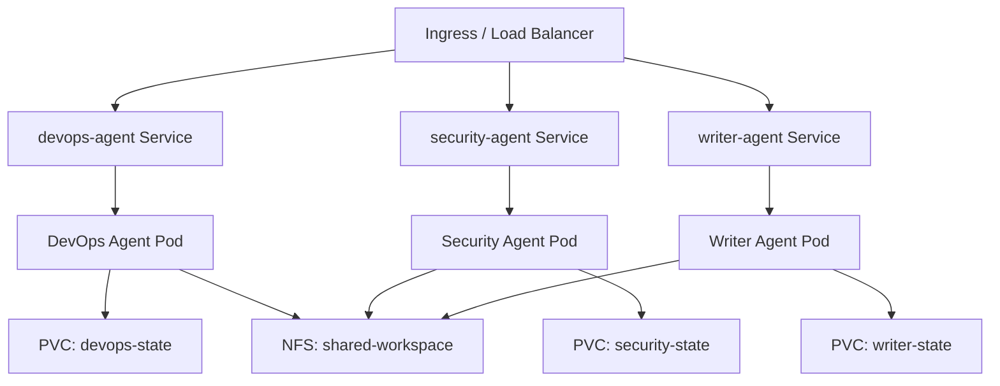

> 💡 **Quick Answer:** Deploy multiple OpenClaw instances as separate Deployments, each with specialized AGENTS.md, different default models, and dedicated PVCs. Use a shared NFS volume for inter-agent file sharing, and configure sub-agent spawning for cross-agent task delegation.

## The Problem

A single OpenClaw agent can't be expert at everything. Complex organizations need specialized agents: one for DevOps (deployments, monitoring, incident response), one for security (scanning, compliance, audit), and one for content (documentation, blog posts). Each needs different instructions, skills, and model configurations.

## The Solution

### Architecture



### Kustomize Structure

```yaml
# base/kustomization.yaml
apiVersion: kustomize.config.k8s.io/v1beta1
kind: Kustomization
resources:
  - deployment.yaml
  - service.yaml
  - pvc.yaml
```

### DevOps Agent

```yaml
# agents/devops/configmap.yaml
apiVersion: v1
kind: ConfigMap
metadata:
  name: devops-agent-config
data:
  openclaw.json: |
    {
      "gateway": {
        "bind": "0.0.0.0",
        "port": 18789,
        "auth": true
      },
      "defaultModel": "anthropic/claude-sonnet-4-20250514",
      "agents": {
        "list": [{
          "id": "devops",
          "name": "DevOps Agent"
        }]
      }
    }
  AGENTS.md: |
    # DevOps Agent

    You are a senior DevOps engineer specializing in:
    - Kubernetes cluster management
    - CI/CD pipelines (GitHub Actions, ArgoCD)
    - Monitoring and alerting (Prometheus, Grafana)
    - Incident response and triage

    ## Tools
    - kubectl access via service account
    - Prometheus API queries
    - GitHub API for PR/deployment status

    ## Escalation
    Delegate security scans to the security agent.
    Delegate documentation to the writer agent.
```

### Security Agent

```yaml
# agents/security/configmap.yaml
apiVersion: v1
kind: ConfigMap
metadata:
  name: security-agent-config
data:
  openclaw.json: |
    {
      "gateway": {
        "bind": "0.0.0.0",
        "port": 18789,
        "auth": true
      },
      "defaultModel": "anthropic/claude-opus-4",
      "agents": {
        "list": [{
          "id": "security",
          "name": "Security Agent"
        }]
      }
    }
  AGENTS.md: |
    # Security Agent

    You are a senior security engineer specializing in:
    - Container image vulnerability scanning
    - RBAC audit and compliance
    - Network policy analysis
    - CIS Kubernetes Benchmark

    ## Tools
    - Trivy for image scanning
    - kubeaudit for cluster assessment
    - RBAC analysis via kubectl

    ## Rules
    - Flag HIGH/CRITICAL CVEs immediately
    - Report compliance status weekly
    - Never modify RBAC without human approval
```

### Shared NFS Volume

For inter-agent file sharing (reports, scan results):

```yaml
# shared-pvc.yaml
apiVersion: v1
kind: PersistentVolumeClaim
metadata:
  name: shared-workspace
spec:
  accessModes:
    - ReadWriteMany  # NFS required
  storageClassName: nfs-client
  resources:
    requests:
      storage: 10Gi
```

```yaml
# In each deployment
volumeMounts:
  - name: shared
    mountPath: /home/node/.openclaw/workspace/shared
volumes:
  - name: shared
    persistentVolumeClaim:
      claimName: shared-workspace
```

### Deploy All Agents

```bash
# Apply each agent's manifests
kubectl apply -k agents/devops/ -n openclaw
kubectl apply -k agents/security/ -n openclaw
kubectl apply -k agents/writer/ -n openclaw
kubectl apply -f shared-pvc.yaml -n openclaw

# Verify
kubectl get pods -n openclaw
# NAME                              READY   STATUS
# devops-agent-xxx                  1/1     Running
# security-agent-xxx                1/1     Running
# writer-agent-xxx                  1/1     Running
```

### Inter-Agent Communication

Agents communicate through:

1. **Shared filesystem** — write files to `/shared/` directory
2. **Sub-agent spawning** — one agent delegates tasks to another
3. **Webhook triggers** — agent A triggers webhook on agent B

```yaml
# DevOps agent can trigger security scan via webhook
hooks:
  security-scan-complete:
    prompt: "Security scan results are ready at /shared/scan-results/. Review and summarize."
```

## Common Issues

### NFS Permission Denied

Ensure all agents run as the same UID or use `fsGroup`:

```yaml
securityContext:
  fsGroup: 1000  # Same across all agents
```

### Resource Contention

Set resource quotas per agent to prevent one from starving others:

```yaml
apiVersion: v1
kind: ResourceQuota
metadata:
  name: agent-quota
spec:
  hard:
    requests.cpu: "2"
    requests.memory: 4Gi
    limits.cpu: "4"
    limits.memory: 8Gi
```

### Model Cost Explosion

Use different models per agent based on need:
- DevOps: Claude Sonnet (balanced)
- Security: Claude Opus (complex reasoning)
- Writer: Gemini Flash (high throughput, low cost)

## Best Practices

- **One agent per domain** — clear responsibility boundaries
- **Shared workspace for collaboration** — NFS or S3-backed PVC
- **Different models per agent** — match cost to complexity
- **Separate PVCs for state** — each agent's memory is private
- **Common secrets** — share API keys via single Secret referenced by all
- **ResourceQuotas** — prevent any single agent from consuming all cluster resources

## Key Takeaways

- Deploy specialized agents as separate Kubernetes Deployments
- Each agent gets its own ConfigMap (instructions), PVC (state), and model config
- Shared NFS volume enables inter-agent file sharing
- Use different models per agent to optimize cost vs capability
- ResourceQuotas prevent resource contention between agents
