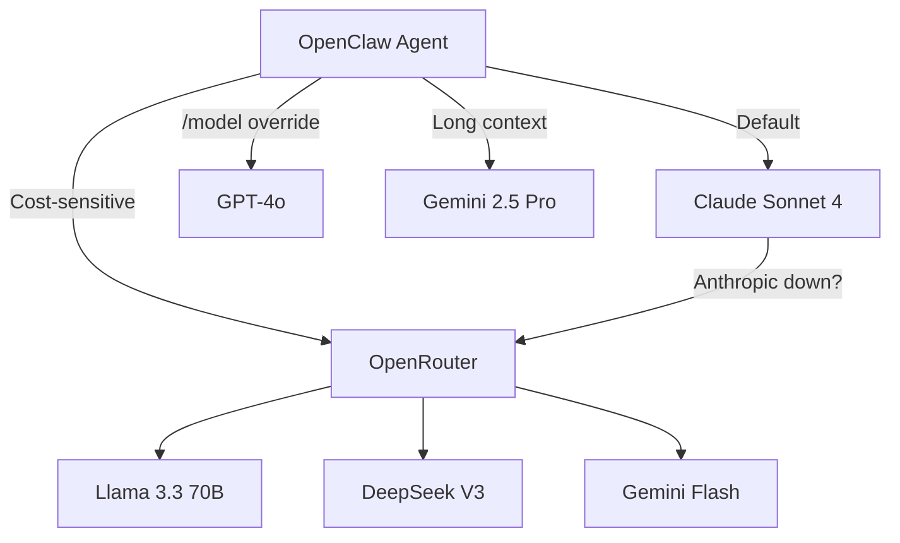

> 💡 **Quick Answer:** Store API keys for multiple providers (Anthropic, OpenAI, Gemini, OpenRouter) in a Kubernetes Secret, set a `defaultModel` in `openclaw.json`, and use `/model` or per-session overrides to switch between providers. OpenRouter gives access to 100+ models through a single API key.

## The Problem

Different AI tasks benefit from different models — Claude for complex reasoning, GPT-4o for fast responses, Gemini for long-context analysis, and open-source models via OpenRouter for cost-sensitive workloads. Managing multiple provider API keys, configuring fallbacks, and controlling costs across a Kubernetes deployment requires careful secret management and configuration.

## The Solution

### Step 1: Create Multi-Provider Secret

```bash
kubectl create secret generic openclaw-secrets \
  -n openclaw \
  --from-literal=OPENCLAW_GATEWAY_TOKEN="$(openssl rand -hex 32)" \
  --from-literal=ANTHROPIC_API_KEY="sk-ant-api03-..." \
  --from-literal=OPENAI_API_KEY="sk-proj-..." \
  --from-literal=GEMINI_API_KEY="AIza..." \
  --from-literal=OPENROUTER_API_KEY="sk-or-v1-..."
```

### Step 2: Configure Model Routing

```yaml
# configmap.yaml
apiVersion: v1
kind: ConfigMap
metadata:
  name: openclaw-config
  namespace: openclaw
data:
  openclaw.json: |
    {
      "gateway": {
        "bind": "loopback",
        "port": 18789,
        "auth": true
      },
      "defaultModel": "anthropic/claude-sonnet-4-20250514",
      "models": {
        "allowlist": [
          "anthropic/claude-sonnet-4-20250514",
          "anthropic/claude-opus-4",
          "openai/gpt-4o",
          "openai/o1",
          "gemini/gemini-2.5-pro",
          "openrouter/google/gemini-2.5-flash",
          "openrouter/meta-llama/llama-3.3-70b-instruct",
          "openrouter/deepseek/deepseek-chat-v3-0324"
        ]
      }
    }
```

### Step 3: Mount All Secrets as Environment Variables

```yaml
# deployment.yaml
apiVersion: apps/v1
kind: Deployment
metadata:
  name: openclaw
  namespace: openclaw
spec:
  template:
    spec:
      containers:
        - name: openclaw
          image: ghcr.io/openclaw/openclaw:latest
          envFrom:
            - secretRef:
                name: openclaw-secrets
          volumeMounts:
            - name: config
              mountPath: /home/node/.openclaw/openclaw.json
              subPath: openclaw.json
            - name: data
              mountPath: /home/node/.openclaw
```

### Model Selection Patterns

**Per-session override** — switch model for current conversation:

```
/model anthropic/claude-opus-4
```

**Cost-tiered approach:**

| Use Case | Model | Cost/1M tokens |
|----------|-------|----------------|
| Quick Q&A | `openrouter/google/gemini-2.5-flash` | ~$0.10 |
| Code review | `anthropic/claude-sonnet-4-20250514` | ~$3.00 |
| Complex reasoning | `anthropic/claude-opus-4` | ~$15.00 |
| Long context (1M+) | `gemini/gemini-2.5-pro` | ~$1.25 |

**OpenRouter as universal fallback:**

OpenRouter proxies to 100+ models with a single API key. Useful for:
- Trying models before committing to direct API keys
- Accessing models without individual provider accounts
- Automatic fallback when primary providers have outages



## Common Issues

### "Model not found" Error

The model string must match exactly. Check available models:

```bash
# In OpenClaw session
/models

# Or via CLI
kubectl exec -n openclaw deploy/openclaw -- openclaw models
```

### API Key Not Picked Up After Secret Update

Kubernetes doesn't auto-restart pods when secrets change:

```bash
kubectl rollout restart deployment/openclaw -n openclaw
```

### Rate Limiting from Provider

Spread traffic across providers or use OpenRouter's automatic routing:

```json
{
  "defaultModel": "openrouter/anthropic/claude-sonnet-4-20250514"
}
```

OpenRouter handles rate limiting and retries across multiple provider endpoints.

### Cost Runaway

Monitor usage via `/status` in sessions. Set hard limits in OpenRouter dashboard:
- Monthly budget caps
- Per-request cost limits
- Model-level spending alerts

## Best Practices

- **Use allowlists** — restrict which models agents can access to prevent surprise costs
- **Default to mid-tier** — Claude Sonnet or GPT-4o balances quality and cost
- **OpenRouter for experimentation** — test models before adding direct API keys
- **Rotate API keys** — use External Secrets Operator to auto-rotate from a vault
- **Monitor per-session** — use `/status` to track token usage and model distribution
- **Separate keys per environment** — dev uses cheap models, production uses premium

## Key Takeaways

- Store multiple provider API keys in a single Kubernetes Secret
- Set `defaultModel` in `openclaw.json` and use allowlists to control access
- Use `/model` for per-session overrides when different tasks need different models
- OpenRouter provides access to 100+ models through one API key with automatic fallbacks
- Always restart pods after secret updates — Kubernetes doesn't auto-reload them
