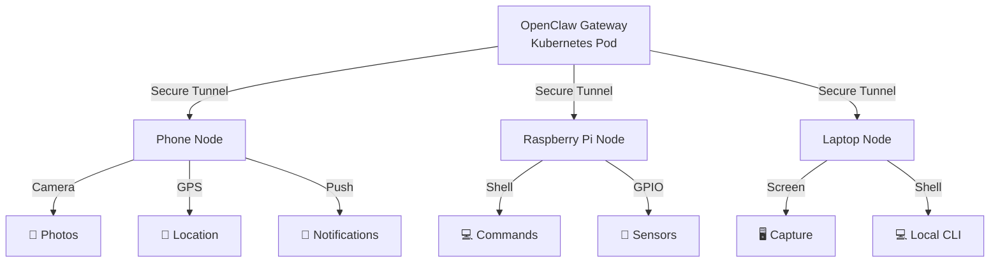

> 💡 **Quick Answer:** Install OpenClaw on edge devices (phones, Raspberry Pi, laptops), generate a pairing code via `openclaw pairing`, approve it from your Kubernetes-hosted gateway, and your agent gains access to cameras, GPS, screen capture, shell commands, and notifications on the paired device — all mediated through the central K8s gateway.

## The Problem

AI agents confined to a Kubernetes pod can't interact with the physical world. They can't take photos, check your location, control home automation, run commands on your laptop, or send push notifications to your phone. To be truly useful as a personal assistant, an agent needs controlled access to devices beyond the cluster.

## The Solution

### Architecture Overview



### Step 1: Ensure Gateway Is Reachable

The Kubernetes gateway needs to be accessible from edge devices. Use one of:

```yaml
# Option A: Ingress (public)
# See openclaw-ingress-tls-kubernetes recipe

# Option B: Tailscale (private mesh)
# Install Tailscale sidecar in the OpenClaw pod

# Option C: NodePort (lab environments)
apiVersion: v1
kind: Service
metadata:
  name: openclaw-nodeport
  namespace: openclaw
spec:
  type: NodePort
  selector:
    app: openclaw
  ports:
    - port: 18789
      nodePort: 30789
```

### Step 2: Pair a Raspberry Pi

On the Raspberry Pi:

```bash
# Install OpenClaw
curl -fsSL https://get.openclaw.ai | sh

# Configure to connect to your K8s gateway
openclaw configure \
  --gateway-url https://openclaw.example.com \
  --gateway-token "your-gateway-token"

# Start pairing
openclaw pairing
# Displays: Pairing code: ABC-123-XYZ
```

On your OpenClaw session (via K8s):

```
# The agent sees the pairing request
> Approve pairing request from "raspberry-pi-kitchen"? [yes/no]
yes
```

Or via CLI:

```bash
kubectl exec -n openclaw deploy/openclaw -- openclaw nodes pending
kubectl exec -n openclaw deploy/openclaw -- openclaw nodes approve --id raspberry-pi-kitchen
```

### Step 3: Pair a Mobile Phone

Install the OpenClaw companion app and scan the QR code from the Control UI, or enter the gateway URL and token manually.

The phone node provides:
- **Camera** — front/back photo and video capture
- **Location** — GPS coordinates with configurable accuracy
- **Notifications** — push alerts with priority levels
- **Screen** — screenshot capture (Android)

### Step 4: Use Paired Nodes from Agent

Once paired, the agent can interact with devices through tools:

```markdown
# Agent can now do:

## Camera
"Take a photo of the front door"
→ nodes(action=camera_snap, node="raspberry-pi-front", facing="back")

## Location
"Where is my phone?"
→ nodes(action=location_get, node="phone-pixel")

## Commands
"Check disk space on the Pi"
→ nodes(action=run, node="raspberry-pi-kitchen", command=["df", "-h"])

## Notifications
"Remind me to check the oven"
→ nodes(action=notify, node="phone-pixel", title="Oven Check", body="Time to check the oven!")
```

### Step 5: Security with NetworkPolicy

Restrict which pods can communicate with the OpenClaw gateway:

```yaml
apiVersion: networking.k8s.io/v1
kind: NetworkPolicy
metadata:
  name: openclaw-node-traffic
  namespace: openclaw
spec:
  podSelector:
    matchLabels:
      app: openclaw
  policyTypes:
    - Ingress
  ingress:
    # Allow paired nodes via Ingress controller
    - from:
        - namespaceSelector:
            matchLabels:
              name: ingress-nginx
      ports:
        - port: 18789
    # Allow in-cluster services
    - from:
        - namespaceSelector:
            matchLabels:
              name: openclaw
```

### Home Automation Example

Raspberry Pi with GPIO + camera as a smart home hub:

```yaml
# ConfigMap with home automation instructions
data:
  AGENTS.md: |
    # Home Assistant Agent

    ## Paired Devices
    - raspberry-pi-kitchen: Camera + temperature sensor
    - raspberry-pi-front: Front door camera + motion sensor
    - phone-pixel: My phone for notifications

    ## Routines
    - Morning: Check front door camera, report weather
    - Evening: Lock check (camera on front door)
    - Motion alert: Snap photo, notify phone if unknown person

    ## Rules
    - Never share camera footage in group chats
    - Only notify phone for HIGH priority events
    - Log all camera captures to memory/security/
```

## Common Issues

### Node Shows "Offline"

```bash
# Check node status
kubectl exec -n openclaw deploy/openclaw -- openclaw nodes status

# On the edge device, check connection
openclaw node status
openclaw node reconnect
```

### Camera Permission Denied (Mobile)

The companion app needs camera permissions. On Android/iOS, grant them in Settings → Apps → OpenClaw.

### High Latency on Remote Commands

Node commands go through the gateway. For latency-sensitive operations:
- Keep the gateway geographically close to nodes
- Use Tailscale for direct mesh connections
- Set appropriate `commandTimeoutMs` values

### Pairing Code Expired

Pairing codes expire after 10 minutes. Regenerate:

```bash
# On the edge device
openclaw pairing --refresh
```

## Best Practices

- **Approve nodes explicitly** — never auto-approve pairing requests
- **Name nodes descriptively** — `raspberry-pi-kitchen` not `node-1`
- **Limit command scope** — configure which commands are allowed per node
- **Encrypt in transit** — always use TLS between nodes and gateway
- **Audit node actions** — log all camera/command/location requests
- **Revoke unused nodes** — remove paired devices that are no longer active

## Key Takeaways

- Paired nodes extend OpenClaw beyond the K8s cluster to physical devices
- Phones provide camera, GPS, and push notifications; Raspberry Pi provides shell and GPIO
- Gateway must be network-reachable from edge devices (Ingress, Tailscale, or NodePort)
- Always approve pairing explicitly and audit device interactions
- NetworkPolicies restrict traffic to the gateway pod from known sources only
