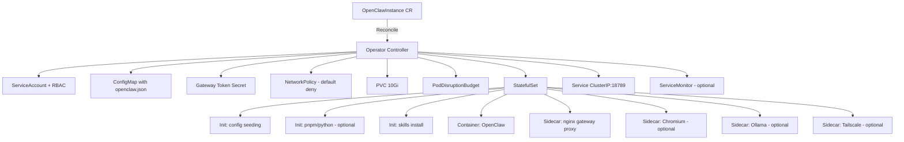

> 💡 **Quick Answer:** Install the OpenClaw Operator with `helm install openclaw-operator oci://ghcr.io/openclaw-rocks/charts/openclaw-operator -n openclaw-operator-system --create-namespace`, then deploy agents via a single `OpenClawInstance` CRD. The operator manages 9+ Kubernetes resources per agent: StatefulSet, Service, RBAC, NetworkPolicy, PVC, PDB, ConfigMap, gateway token Secret, and optional sidecars (Chromium, Ollama, Tailscale).

## The Problem

Deploying AI agents to Kubernetes involves more than a Deployment and a Service. You need network isolation, secret management, persistent storage, health monitoring, optional browser automation, config rollouts, and backup/restore — all wired correctly. Managing this manually across multiple agents is error-prone, especially when agents need to adapt their own configuration at runtime.

## The Solution

The [OpenClaw Kubernetes Operator](https://github.com/openclaw-rocks/k8s-operator) encodes all these concerns into a single `OpenClawInstance` custom resource. One CRD → production-ready agent.

### Step 1: Install the Operator

```bash
# Install via Helm (recommended)
helm install openclaw-operator \
  oci://ghcr.io/openclaw-rocks/charts/openclaw-operator \
  --namespace openclaw-operator-system \
  --create-namespace
```

### Step 2: Create API Key Secret

```yaml
# secret.yaml
apiVersion: v1
kind: Secret
metadata:
  name: openclaw-api-keys
type: Opaque
stringData:
  ANTHROPIC_API_KEY: "sk-ant-..."
  # Or any AI provider:
  # OPENAI_API_KEY: "sk-..."
```

### Step 3: Deploy an Agent

```yaml
# openclawinstance.yaml
apiVersion: openclaw.rocks/v1alpha1
kind: OpenClawInstance
metadata:
  name: my-agent
spec:
  envFrom:
    - secretRef:
        name: openclaw-api-keys
  config:
    mergeMode: merge
    raw:
      agents:
        defaults:
          model:
            primary: "anthropic/claude-sonnet-4-20250514"
          sandbox: true
      session:
        scope: "per-sender"
  storage:
    persistence:
      enabled: true
      size: 10Gi
```

```bash
kubectl apply -f secret.yaml -f openclawinstance.yaml

# Verify
kubectl get openclawinstances
# NAME       PHASE     AGE
# my-agent   Running   2m

kubectl get pods
# NAME         READY   STATUS    AGE
# my-agent-0   2/2     Running   2m  (openclaw + gateway-proxy)
```

### What the Operator Creates

From that single CRD, the operator reconciles:



### Enable Browser Automation (Chromium Sidecar)

```yaml
spec:
  chromium:
    enabled: true
    image:
      repository: chromedp/headless-shell
      tag: "stable"
    resources:
      requests:
        cpu: "250m"
        memory: "512Mi"
      limits:
        cpu: "1000m"
        memory: "2Gi"
    persistence:
      enabled: true    # Retain cookies/sessions across restarts
      size: "1Gi"
    extraArgs:
      - "--user-agent=Mozilla/5.0 (Windows NT 10.0; Win64; x64) AppleWebKit/537.36"
```

The operator automatically:
- Injects `CHROMIUM_URL` into the main container
- Configures browser profiles for both "default" and "chrome" profile names
- Applies anti-bot-detection flags
- Sets up shared memory and health probes

### Enable Local LLMs (Ollama Sidecar)

```yaml
spec:
  ollama:
    enabled: true
    models:
      - llama3.2
      - nomic-embed-text
    gpu: 1
    storage:
      sizeLimit: 30Gi
    resources:
      limits:
        cpu: "4"
        memory: "16Gi"
```

### Install Skills Declaratively

```yaml
spec:
  skills:
    - "@anthropic/mcp-server-fetch"                    # ClawHub
    - "npm:@openclaw/matrix"                           # npm package
    - "pack:openclaw-rocks/skills/image-gen@v1.0.0"    # GitHub skill pack
```

### Agent Self-Configuration

Agents can autonomously install skills, patch config, and adapt their environment:

```yaml
spec:
  selfConfigure:
    enabled: true
    allowedActions:
      - skills          # Install/remove skills at runtime
      - config          # Patch openclaw.json
      - workspaceFiles  # Add workspace files
      - envVars         # Add environment variables
```

The agent creates an `OpenClawSelfConfig` resource:

```yaml
apiVersion: openclaw.rocks/v1alpha1
kind: OpenClawSelfConfig
metadata:
  name: add-fetch-skill
spec:
  instanceRef: my-agent
  addSkills:
    - "@anthropic/mcp-server-fetch"
```

Every request is validated against the instance's allowlist policy. Protected config keys cannot be overwritten.

### Auto-Update with Rollback

```yaml
spec:
  autoUpdate:
    enabled: true
    checkInterval: "24h"
    backupBeforeUpdate: true
    rollbackOnFailure: true
    healthCheckTimeout: "10m"
```

The operator polls for new semver releases, backs up the PVC, rolls out, and auto-rolls back if health checks fail. Failed versions are tracked and skipped. A circuit breaker pauses after 3 consecutive rollbacks.

### Backup and Restore (S3)

```yaml
# Create S3 credentials secret in operator namespace
apiVersion: v1
kind: Secret
metadata:
  name: s3-backup-credentials
  namespace: openclaw-operator-system
stringData:
  S3_ENDPOINT: "https://s3.us-east-1.amazonaws.com"
  S3_BUCKET: "my-openclaw-backups"
  S3_ACCESS_KEY_ID: "<key>"
  S3_SECRET_ACCESS_KEY: "<secret>"
---
# Enable scheduled backups on the instance
spec:
  backup:
    schedule: "0 2 * * *"    # Daily at 2 AM UTC
    retentionDays: 7
```

Restore into a new instance from any snapshot:

```yaml
spec:
  restoreFrom: "backups/my-tenant/my-agent/2026-01-15T10:30:00Z"
```

### Tailscale Integration (No Ingress Needed)

```yaml
spec:
  tailscale:
    enabled: true
    mode: serve          # "serve" (tailnet only) or "funnel" (public)
    authKeySecretRef:
      name: tailscale-auth
    authSSO: true
    hostname: my-agent
```

### Ingress with Basic Auth

```yaml
spec:
  networking:
    ingress:
      enabled: true
      className: nginx
      hosts:
        - host: my-agent.example.com
      security:
        basicAuth:
          enabled: true
          username: admin
```

### HPA Auto-Scaling

```yaml
spec:
  availability:
    autoScaling:
      enabled: true
      minReplicas: 1
      maxReplicas: 10
      targetCPUUtilization: 80
```

### Full Production Example

```yaml
apiVersion: openclaw.rocks/v1alpha1
kind: OpenClawInstance
metadata:
  name: production-agent
spec:
  envFrom:
    - secretRef:
        name: openclaw-api-keys
  config:
    mergeMode: merge
    raw:
      agents:
        defaults:
          model:
            primary: "anthropic/claude-sonnet-4-20250514"
          sandbox: true
      session:
        scope: "per-sender"
  storage:
    persistence:
      enabled: true
      size: 20Gi
      storageClass: fast-ssd
  chromium:
    enabled: true
    persistence:
      enabled: true
    resources:
      limits:
        memory: "2Gi"
  skills:
    - "@anthropic/mcp-server-fetch"
  selfConfigure:
    enabled: true
    allowedActions: [skills, config, workspaceFiles]
  autoUpdate:
    enabled: true
    checkInterval: "24h"
    backupBeforeUpdate: true
    rollbackOnFailure: true
  backup:
    schedule: "0 2 * * *"
    retentionDays: 7
  observability:
    metrics:
      enabled: true
      serviceMonitor:
        enabled: true
      prometheusRule:
        enabled: true
      grafanaDashboard:
        enabled: true
  networking:
    ingress:
      enabled: true
      className: nginx
      hosts:
        - host: agent.example.com
      tls:
        - secretName: agent-tls
          hosts:
            - agent.example.com
      security:
        basicAuth:
          enabled: true
```

## Security (Hardened by Default)

The operator ships secure out of the box:

- **Non-root execution**: UID 1000, root blocked by webhook
- **Read-only root filesystem**: writable only via PVC at `~/.openclaw/`
- **All capabilities dropped** + seccomp RuntimeDefault
- **Default-deny NetworkPolicy**: only DNS (53) + HTTPS (443) egress
- **No automatic SA token mounting** (unless selfConfigure is enabled)
- **Validating webhook**: blocks root, reserved init names, invalid skills

## Common Issues

### Pod Stuck in Pending

```bash
# Check PVC binding
kubectl get pvc -l app.kubernetes.io/instance=my-agent

# Check events
kubectl describe pod my-agent-0

# Common: StorageClass doesn't exist or no capacity
```

### Gateway Token for Control UI

```bash
# Retrieve the auto-generated token
kubectl get secret my-agent-gateway-token -o jsonpath='{.data.token}' | base64 -d

# Access Control UI through Ingress:
# https://agent.example.com/#token=<your-token>
```

### Config Changes Not Applying

Config changes trigger automatic rolling updates via SHA-256 hash annotation. If stuck:

```bash
# Check the config hash
kubectl get pods my-agent-0 -o jsonpath='{.metadata.annotations.openclaw\.rocks/config-hash}'

# Force restart
kubectl rollout restart statefulset my-agent
```

### Merge Mode Gotcha

In `mergeMode: merge`, removing a key from the CR does NOT remove it from PVC config. To clean stale keys, temporarily switch to `overwrite`, apply, then switch back.

## Best Practices

- **Use `mergeMode: merge`** — preserves runtime agent changes (memory, sessions)
- **Enable `backupBeforeUpdate`** — safety net for auto-updates
- **Pin skill versions** — use `pack:org/repo/skill@v1.0.0` for reproducibility
- **Enable Prometheus monitoring** — the operator emits reconciliation metrics + 7 built-in alerts
- **Use Tailscale for dev** — no Ingress/LoadBalancer needed, SSO auth built-in
- **Set `orphan: true`** on storage (default) — PVCs survive CR deletion
- **One agent per namespace** — clean RBAC boundaries

## Key Takeaways

- One `OpenClawInstance` CRD → 9+ managed Kubernetes resources
- Hardened by default: non-root, read-only FS, drop all caps, default-deny NetworkPolicy
- Agents can self-configure via `OpenClawSelfConfig` CRD with allowlist validation
- Auto-update with rollback protection and circuit breaker
- S3 backup/restore with scheduled snapshots and cross-namespace cloning
- Optional sidecars: Chromium (browser), Ollama (local LLMs), Tailscale (mesh networking)
- Config changes auto-trigger rolling updates via content hashing
