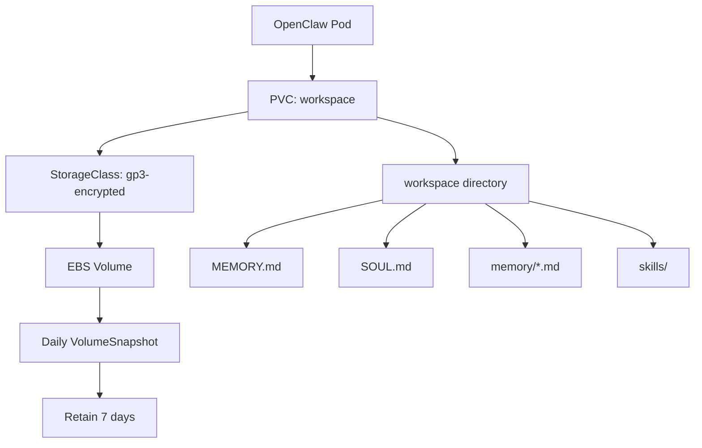

> 💡 **Quick Answer:** Use PersistentVolumeClaims with appropriate StorageClasses to persist OpenClaw workspace data (memory files, skills, configuration) across pod restarts.

## The Problem

OpenClaw stores its identity, memory, and workspace files at `~/.openclaw`. Without persistent storage, pod restarts or rescheduling wipe all agent memory and configuration, resetting the agent to a blank state.

## The Solution

Mount a PVC at the OpenClaw workspace directory with the right StorageClass for your environment.

### Basic PVC Setup

```yaml
apiVersion: v1
kind: PersistentVolumeClaim
metadata:
  name: openclaw-workspace
  namespace: openclaw
spec:
  accessModes:
    - ReadWriteOnce
  storageClassName: gp3-encrypted
  resources:
    requests:
      storage: 10Gi
---
apiVersion: apps/v1
kind: Deployment
metadata:
  name: openclaw
  namespace: openclaw
spec:
  replicas: 1
  selector:
    matchLabels:
      app: openclaw
  template:
    metadata:
      labels:
        app: openclaw
    spec:
      securityContext:
        runAsUser: 1000
        runAsGroup: 1000
        fsGroup: 1000
      containers:
        - name: openclaw
          image: ghcr.io/openclaw/openclaw:latest
          volumeMounts:
            - name: workspace
              mountPath: /home/node/.openclaw
            - name: tmp
              mountPath: /tmp
          resources:
            requests:
              cpu: 250m
              memory: 512Mi
            limits:
              cpu: "2"
              memory: 2Gi
      volumes:
        - name: workspace
          persistentVolumeClaim:
            claimName: openclaw-workspace
        - name: tmp
          emptyDir:
            sizeLimit: 1Gi
```

### StorageClass Selection Guide

```yaml
# AWS EBS gp3 — good default for single-AZ
apiVersion: storage.k8s.io/v1
kind: StorageClass
metadata:
  name: gp3-encrypted
provisioner: ebs.csi.aws.com
parameters:
  type: gp3
  encrypted: "true"
  throughput: "125"
  iops: "3000"
reclaimPolicy: Retain
volumeBindingMode: WaitForFirstConsumer
allowVolumeExpansion: true
---
# NFS — for multi-replica ReadWriteMany access
apiVersion: storage.k8s.io/v1
kind: StorageClass
metadata:
  name: nfs-openclaw
provisioner: nfs.csi.k8s.io
parameters:
  server: nfs-server.storage.svc.cluster.local
  share: /exports/openclaw
reclaimPolicy: Retain
mountOptions:
  - nfsvers=4.1
  - hard
  - timeo=600
```

### Volume Snapshot for Quick Backups

```yaml
apiVersion: snapshot.storage.k8s.io/v1
kind: VolumeSnapshot
metadata:
  name: openclaw-snap-20260226
  namespace: openclaw
spec:
  volumeSnapshotClassName: csi-aws-vsc
  source:
    persistentVolumeClaimName: openclaw-workspace
---
# Restore from snapshot
apiVersion: v1
kind: PersistentVolumeClaim
metadata:
  name: openclaw-workspace-restored
  namespace: openclaw
spec:
  accessModes:
    - ReadWriteOnce
  storageClassName: gp3-encrypted
  resources:
    requests:
      storage: 10Gi
  dataSource:
    name: openclaw-snap-20260226
    kind: VolumeSnapshot
    apiGroup: snapshot.storage.k8s.io
```

### CronJob for Scheduled Snapshots

```yaml
apiVersion: batch/v1
kind: CronJob
metadata:
  name: openclaw-snapshot
  namespace: openclaw
spec:
  schedule: "0 2 * * *"  # Daily at 2 AM
  jobTemplate:
    spec:
      template:
        spec:
          serviceAccountName: snapshot-creator
          containers:
            - name: snapshot
              image: bitnami/kubectl:latest
              command:
                - /bin/sh
                - -c
                - |
                  DATE=$(date +%Y%m%d)
                  cat <<EOF | kubectl apply -f -
                  apiVersion: snapshot.storage.k8s.io/v1
                  kind: VolumeSnapshot
                  metadata:
                    name: openclaw-snap-${DATE}
                    namespace: openclaw
                  spec:
                    volumeSnapshotClassName: csi-aws-vsc
                    source:
                      persistentVolumeClaimName: openclaw-workspace
                  EOF
                  # Clean up snapshots older than 7 days
                  kubectl get volumesnapshot -n openclaw \
                    --sort-by=.metadata.creationTimestamp \
                    -o name | head -n -7 | xargs -r kubectl delete -n openclaw
          restartPolicy: OnFailure
```



## Common Issues

- **Permission denied on mount** — set `fsGroup: 1000` in pod securityContext to match OpenClaw's UID
- **Pod stuck Pending after reschedule** — WaitForFirstConsumer binding means PV is AZ-locked; use topology-aware scheduling
- **Slow filesystem on NFS** — use `hard` mount option and increase `timeo`; avoid NFS for high-IOPS workloads
- **PVC full** — enable `allowVolumeExpansion: true` on StorageClass; monitor with alerts

## Best Practices

- Use `reclaimPolicy: Retain` to prevent accidental data loss
- Enable volume expansion on StorageClass for growth
- Schedule daily VolumeSnapshots with 7-day retention
- Separate workspace PVC from tmp (use emptyDir for /tmp)
- Monitor PVC usage with Prometheus `kubelet_volume_stats_used_bytes`
- Use encrypted StorageClass in production (secrets in workspace)

## Key Takeaways

- PVC at `/home/node/.openclaw` preserves agent memory across restarts
- StorageClass choice depends on access pattern (RWO vs RWX) and cloud provider
- VolumeSnapshots provide quick, space-efficient backups
- `fsGroup` must match OpenClaw container UID for write access
- Retain policy + snapshots = defense against accidental deletion
