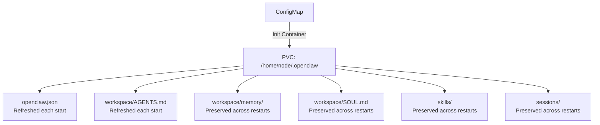

> 💡 **Quick Answer:** OpenClaw stores agent state, memory, skills, and config in `/home/node/.openclaw`, backed by a 10Gi PVC. An init container seeds the config from a ConfigMap on every start without overwriting existing workspace data. Use `Recreate` strategy (not RollingUpdate) since the PVC is RWO.

## The Problem

OpenClaw agents build up state over time — memory files, learned preferences, workspace files, installed skills. Losing this state on pod restart means losing your agent's personality, context, and work history. You need persistent storage that survives pod restarts, node failures, and upgrades, while also seeding initial config on first deploy.

## The Solution

### PVC Definition

```yaml
apiVersion: v1
kind: PersistentVolumeClaim
metadata:
  name: openclaw-home-pvc
  labels:
    app: openclaw
spec:
  accessModes:
    - ReadWriteOnce
  resources:
    requests:
      storage: 10Gi
```

### Init Container Config Seeding

The init container copies config files from the ConfigMap to the PVC on every start:

```yaml
initContainers:
  - name: init-config
    image: busybox:1.37
    command:
      - sh
      - -c
      - |
        cp /config/openclaw.json /home/node/.openclaw/openclaw.json
        mkdir -p /home/node/.openclaw/workspace
        cp /config/AGENTS.md /home/node/.openclaw/workspace/AGENTS.md
    volumeMounts:
      - name: openclaw-home
        mountPath: /home/node/.openclaw
      - name: config
        mountPath: /config
```

This design:
- **Always refreshes** `openclaw.json` and `AGENTS.md` from ConfigMap
- **Preserves** agent memory (`memory/`), workspace files, and skills
- **Creates** workspace directory if first run

### PVC Contents Structure

```
/home/node/.openclaw/           (PVC mount)
├── openclaw.json               (seeded by init container)
├── workspace/
│   ├── AGENTS.md               (seeded by init container)
│   ├── SOUL.md                 (created by agent)
│   ├── USER.md                 (created by agent)
│   ├── MEMORY.md               (created by agent)
│   └── memory/
│       ├── 2026-03-19.md       (daily notes)
│       └── heartbeat-state.json
├── skills/                     (installed skills)
├── sessions/                   (active sessions)
└── state/                      (gateway state)
```



### Deployment Strategy: Recreate

Since the PVC uses `ReadWriteOnce`, only one pod can mount it at a time:

```yaml
spec:
  strategy:
    type: Recreate  # Not RollingUpdate!
```

`RollingUpdate` would deadlock — new pod can't mount the PVC until old pod releases it.

### Storage Class Selection

Choose based on your environment:

```yaml
# Cloud providers — use SSD-backed storage
spec:
  storageClassName: gp3    # AWS EBS gp3
  storageClassName: pd-ssd  # GCP Persistent Disk
  storageClassName: managed-premium  # Azure

# On-prem — NFS for multi-node, local-path for single-node
spec:
  storageClassName: nfs-client
  storageClassName: local-path  # Kind, k3s
```

### Backup Strategy

```bash
# Option 1: Snapshot (cloud providers)
kubectl create -f - <<EOF
apiVersion: snapshot.storage.k8s.io/v1
kind: VolumeSnapshot
metadata:
  name: openclaw-backup-$(date +%Y%m%d)
  namespace: openclaw
spec:
  volumeSnapshotClassName: csi-snapclass
  source:
    persistentVolumeClaimName: openclaw-home-pvc
EOF

# Option 2: Copy to local
kubectl cp openclaw/openclaw-xxx:/home/node/.openclaw/workspace ./backup/

# Option 3: Agent-driven GitOps (recommended)
# Agent commits workspace changes to Git automatically
```

### Resize PVC

```bash
# Check if StorageClass supports expansion
kubectl get sc -o jsonpath='{.items[*].allowVolumeExpansion}'

# Resize
kubectl patch pvc openclaw-home-pvc -n openclaw \
  -p '{"spec":{"resources":{"requests":{"storage":"20Gi"}}}}'
```

## Common Issues

### Pod Stuck in Pending (PVC Not Binding)

```bash
kubectl describe pvc openclaw-home-pvc -n openclaw
# Check Events for provisioner errors

# Kind/k3s: ensure local-path provisioner is installed
kubectl get sc
```

### Data Lost After Helm Uninstall

PVCs with `reclaimPolicy: Delete` get destroyed. Change to `Retain`:

```bash
kubectl patch pv <pv-name> -p '{"spec":{"persistentVolumeReclaimPolicy":"Retain"}}'
```

### Config Changes Not Taking Effect

The init container overwrites `openclaw.json` on every start. Edit the ConfigMap, then restart:

```bash
kubectl edit configmap openclaw-config -n openclaw
kubectl rollout restart deployment/openclaw -n openclaw
```

## Best Practices

- **Use `Recreate` strategy** — RWO PVC requires it; RollingUpdate will deadlock
- **Backup before upgrades** — snapshot PVC or `kubectl cp` workspace before major changes
- **GitOps for workspace** — let the agent commit changes to Git for version-controlled state
- **Size appropriately** — 10Gi is generous; monitor usage with `kubectl exec -- du -sh /home/node/.openclaw`
- **Init container for config only** — never let init container touch `memory/` or `skills/`
- **Retain PVCs** — set reclaim policy to Retain to survive accidental namespace deletion

## Key Takeaways

- OpenClaw state lives in a single PVC mounted at `/home/node/.openclaw`
- Init container seeds config from ConfigMap without overwriting agent-generated files
- Use `Recreate` deployment strategy with RWO PVCs
- Back up with VolumeSnapshots (cloud) or agent-driven GitOps (recommended)
- Choose SSD-backed storage classes for responsive agent sessions
