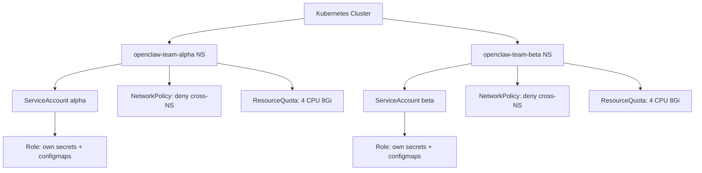

> 💡 **Quick Answer:** Use Kubernetes RBAC with dedicated ServiceAccounts per OpenClaw agent and namespace isolation to enforce multi-tenant boundaries in shared clusters.

## The Problem

Running multiple OpenClaw agents in a shared Kubernetes cluster without proper RBAC creates security risks — agents could access other teams' secrets, resources, or messaging channels.

## The Solution

Create per-tenant namespaces with scoped ServiceAccounts and RBAC policies that restrict each OpenClaw agent to its own resources.

### Namespace-Per-Team Structure

```yaml
apiVersion: v1
kind: Namespace
metadata:
  name: openclaw-team-alpha
  labels:
    openclaw.ai/tenant: team-alpha
    pod-security.kubernetes.io/enforce: restricted
---
apiVersion: v1
kind: Namespace
metadata:
  name: openclaw-team-beta
  labels:
    openclaw.ai/tenant: team-beta
    pod-security.kubernetes.io/enforce: restricted
```

### Scoped ServiceAccount and Role

```yaml
apiVersion: v1
kind: ServiceAccount
metadata:
  name: openclaw-agent
  namespace: openclaw-team-alpha
---
apiVersion: rbac.authorization.k8s.io/v1
kind: Role
metadata:
  name: openclaw-agent-role
  namespace: openclaw-team-alpha
rules:
  - apiGroups: [""]
    resources: ["configmaps", "secrets"]
    verbs: ["get", "list", "watch", "create", "update", "patch"]
  - apiGroups: [""]
    resources: ["pods", "pods/log"]
    verbs: ["get", "list", "watch"]
  - apiGroups: [""]
    resources: ["persistentvolumeclaims"]
    verbs: ["get", "list"]
---
apiVersion: rbac.authorization.k8s.io/v1
kind: RoleBinding
metadata:
  name: openclaw-agent-binding
  namespace: openclaw-team-alpha
roleRef:
  apiGroup: rbac.authorization.k8s.io
  kind: Role
  name: openclaw-agent-role
subjects:
  - kind: ServiceAccount
    name: openclaw-agent
    namespace: openclaw-team-alpha
```

### Deny Cross-Namespace Access with ClusterRole Aggregation

```yaml
apiVersion: rbac.authorization.k8s.io/v1
kind: ClusterRole
metadata:
  name: openclaw-deny-cluster-wide
rules: []
# Explicitly empty — agents get NO cluster-level access
# All permissions come from namespace-scoped Roles only
```

### OpenClaw Deployment with Tenant Isolation

```yaml
apiVersion: apps/v1
kind: Deployment
metadata:
  name: openclaw-agent
  namespace: openclaw-team-alpha
spec:
  replicas: 1
  selector:
    matchLabels:
      app: openclaw
      tenant: team-alpha
  template:
    metadata:
      labels:
        app: openclaw
        tenant: team-alpha
    spec:
      serviceAccountName: openclaw-agent
      automountServiceAccountToken: false
      securityContext:
        runAsNonRoot: true
        runAsUser: 1000
        fsGroup: 1000
        seccompProfile:
          type: RuntimeDefault
      containers:
        - name: openclaw
          image: ghcr.io/openclaw/openclaw:latest
          securityContext:
            allowPrivilegeEscalation: false
            capabilities:
              drop: ["ALL"]
            readOnlyRootFilesystem: true
          env:
            - name: OPENCLAW_TENANT
              value: "team-alpha"
          envFrom:
            - secretRef:
                name: openclaw-credentials
          volumeMounts:
            - name: workspace
              mountPath: /home/node/.openclaw
            - name: tmp
              mountPath: /tmp
      volumes:
        - name: workspace
          persistentVolumeClaim:
            claimName: openclaw-workspace-alpha
        - name: tmp
          emptyDir:
            sizeLimit: 500Mi
```

### ResourceQuota per Tenant

```yaml
apiVersion: v1
kind: ResourceQuota
metadata:
  name: openclaw-quota
  namespace: openclaw-team-alpha
spec:
  hard:
    requests.cpu: "2"
    requests.memory: 4Gi
    limits.cpu: "4"
    limits.memory: 8Gi
    persistentvolumeclaims: "3"
    pods: "5"
    secrets: "10"
```



## Common Issues

- **Agent accessing other namespaces** — never bind ClusterRoles; use namespace-scoped Roles only
- **Secret leakage between tenants** — set `automountServiceAccountToken: false` and mount only needed secrets
- **Resource starvation** — apply ResourceQuota per namespace to prevent noisy neighbors
- **Pod security violations** — use Pod Security Standards (`restricted` profile) on tenant namespaces

## Best Practices

- One namespace per team/tenant with dedicated ServiceAccount
- Use `restricted` Pod Security Standard on all OpenClaw namespaces
- Apply ResourceQuota and LimitRange per namespace
- Combine with NetworkPolicies for network-level isolation
- Audit RBAC permissions quarterly with `kubectl auth can-i --list`
- Use labels for tenant identification and policy enforcement

## Key Takeaways

- Namespace-scoped Roles prevent cross-tenant access
- ServiceAccount per agent ensures least-privilege
- ResourceQuota prevents resource monopolization
- Pod Security Standards enforce container hardening
- Combined with NetworkPolicies, this creates defense-in-depth multi-tenancy
