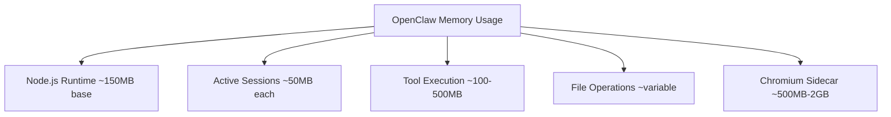

> 💡 **Quick Answer:** Start with 512Mi/250m requests, 2Gi/1 CPU limits for the gateway. Add 1-2Gi for Chromium sidecar. Use VPA to right-size after a week of real usage data. The init container needs minimal resources (64Mi/100m limits).

## The Problem

OpenClaw resource needs vary dramatically: a simple chatbot uses 200MB, while an agent running browser automation, multiple concurrent sessions, and heavy tool use can consume 4GB+. Under-provisioning causes OOMKills and slow responses; over-provisioning wastes cluster resources.

## The Solution

### Resource Profiles

#### Light — Single user, text-only

```yaml
resources:
  requests:
    memory: 256Mi
    cpu: 100m
  limits:
    memory: 512Mi
    cpu: 500m
```

#### Standard — The official default

```yaml
resources:
  requests:
    memory: 512Mi
    cpu: 250m
  limits:
    memory: 2Gi
    cpu: "1"
```

#### Heavy — Browser automation + multi-agent

```yaml
# Gateway container
resources:
  requests:
    memory: 1Gi
    cpu: 500m
  limits:
    memory: 4Gi
    cpu: "2"
# Chromium sidecar
resources:
  requests:
    memory: 1Gi
    cpu: 500m
  limits:
    memory: 2Gi
    cpu: "1"
```

### What Consumes Resources



| Component | Memory | CPU | Notes |
|-----------|--------|-----|-------|
| Node.js base | 150MB | idle ~50m | Always present |
| Per session | 50MB | burst ~200m | Conversation context |
| Shell exec | 100-500MB | burst ~500m | Depends on command |
| Browser page | 200-500MB | burst ~1 CPU | Per active tab |
| Skill loading | 50MB | one-time | Cached after first load |

### Init Container Resources

The init container runs briefly and needs minimal resources:

```yaml
initContainers:
  - name: init-config
    resources:
      requests:
        memory: 32Mi
        cpu: 50m
      limits:
        memory: 64Mi
        cpu: 100m
```

### Right-Sizing with VPA

Deploy Vertical Pod Autoscaler to get recommendations:

```yaml
apiVersion: autoscaling.k8s.io/v1
kind: VerticalPodAutoscaler
metadata:
  name: openclaw-vpa
  namespace: openclaw
spec:
  targetRef:
    apiVersion: apps/v1
    kind: Deployment
    name: openclaw
  updatePolicy:
    updateMode: "Off"  # Recommendation only
  resourcePolicy:
    containerPolicies:
      - containerName: gateway
        minAllowed:
          cpu: 100m
          memory: 256Mi
        maxAllowed:
          cpu: "4"
          memory: 8Gi
```

```bash
# Check recommendations after ~1 week
kubectl get vpa openclaw-vpa -n openclaw -o jsonpath='{.status.recommendation}'
```

### Storage Sizing

| Usage Pattern | PVC Size | Notes |
|--------------|----------|-------|
| Basic chatbot | 1Gi | Minimal state |
| Personal assistant | 5Gi | Memory, skills, logs |
| DevOps agent | 10Gi | Default — repos, logs, artifacts |
| Multi-agent team | 20Gi | Shared workspace, many skills |

## Common Issues

### OOMKilled — Memory Limit Too Low

```bash
kubectl describe pod -n openclaw -l app=openclaw | grep -A3 "Last State"
# OOMKilled → increase memory limit

# Check actual usage
kubectl top pod -n openclaw
```

### CPU Throttling — Slow Responses

```bash
# Check throttling
kubectl exec -n openclaw deploy/openclaw -- cat /sys/fs/cgroup/cpu.stat
# Look for nr_throttled > 0
```

Increase CPU limit or switch to burstable QoS (no CPU limit):

```yaml
resources:
  requests:
    cpu: 250m
    memory: 512Mi
  limits:
    memory: 2Gi
    # No CPU limit → burstable, can burst to node capacity
```

## Best Practices

- **Start with standard profile** — 512Mi/250m requests, 2Gi/1 CPU limits
- **Use VPA in recommendation mode** — right-size after real usage data
- **Consider burstable CPU** — omit CPU limits for bursty workloads
- **Always set memory limits** — prevent OOM from affecting other pods
- **Size init container separately** — 64Mi is plenty for config copy
- **Monitor with `kubectl top`** — check actual vs requested regularly

## Key Takeaways

- OpenClaw base usage is ~150MB; each session adds ~50MB
- Browser automation (Chromium sidecar) needs 1-2GB additional memory
- Use VPA in recommendation mode to right-size after real usage
- Consider burstable QoS (no CPU limit) for responsive agent sessions
- The official default (512Mi/250m → 2Gi/1CPU) works for most single-user deployments
