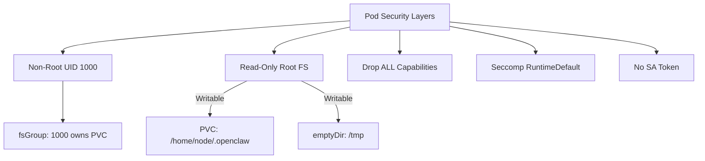

> 💡 **Quick Answer:** OpenClaw's official manifests already include read-only root filesystem, `drop: ALL` capabilities, non-root UID 1000, seccomp RuntimeDefault, and disabled service account token. This recipe explains each layer and how to verify compliance with Pod Security Standards.

## The Problem

OpenClaw agents can execute shell commands, access files, and interact with external APIs. Running such a powerful tool without proper pod-level security creates risk: container escape, privilege escalation, or unauthorized cluster access. The official manifests include hardening by default — but you need to understand what each layer does and how to verify it.

## The Solution

### Security Layers in the Official Deployment

The OpenClaw deployment manifest includes these security controls:

```yaml
apiVersion: apps/v1
kind: Deployment
metadata:
  name: openclaw
spec:
  template:
    spec:
      # Disable service account token injection
      automountServiceAccountToken: false
      securityContext:
        # All volumes owned by UID/GID 1000
        fsGroup: 1000
        # Seccomp profile at pod level
        seccompProfile:
          type: RuntimeDefault
      containers:
        - name: gateway
          securityContext:
            # Must run as non-root
            runAsNonRoot: true
            runAsUser: 1000
            runAsGroup: 1000
            # No privilege escalation (no setuid)
            allowPrivilegeEscalation: false
            # Immutable container filesystem
            readOnlyRootFilesystem: true
            # Drop ALL Linux capabilities
            capabilities:
              drop:
                - ALL
```

### What Each Control Does

| Control | Purpose | Risk Mitigated |
|---------|---------|---------------|
| `runAsNonRoot: true` | Prevents running as UID 0 | Container escape via root |
| `readOnlyRootFilesystem: true` | Container FS is immutable | Malware persistence |
| `drop: ALL` | Removes all Linux capabilities | Privilege escalation |
| `allowPrivilegeEscalation: false` | Blocks `setuid` binaries | Privilege escalation |
| `seccompProfile: RuntimeDefault` | Restricts syscalls | Kernel exploits |
| `automountServiceAccountToken: false` | No K8s API access | Cluster compromise |
| `fsGroup: 1000` | PVC files owned by app user | Permission issues |

### Writable Volumes

Since the root filesystem is read-only, OpenClaw needs writable mounts:

```yaml
volumeMounts:
  # Agent state, config, workspace
  - name: openclaw-home
    mountPath: /home/node/.openclaw
  # Temporary files (scratch space)
  - name: tmp-volume
    mountPath: /tmp
volumes:
  - name: openclaw-home
    persistentVolumeClaim:
      claimName: openclaw-home-pvc
  - name: tmp-volume
    emptyDir: {}
```

- **PVC** (`/home/node/.openclaw`) — persists agent state, memory, workspace
- **emptyDir** (`/tmp`) — ephemeral scratch, cleared on pod restart

### Init Container Security

The init container that copies config files also runs hardened:

```yaml
initContainers:
  - name: init-config
    image: busybox:1.37
    securityContext:
      runAsUser: 1000
      runAsGroup: 1000
    resources:
      requests:
        memory: 32Mi
        cpu: 50m
      limits:
        memory: 64Mi
        cpu: 100m
```

### Verify Pod Security Standards Compliance

```bash
# Check against Restricted PSS level
kubectl label namespace openclaw \
  pod-security.kubernetes.io/enforce=restricted \
  pod-security.kubernetes.io/warn=restricted

# Deploy and verify — should create without warnings
kubectl apply -k scripts/k8s/manifests -n openclaw

# Audit existing pods
kubectl get pods -n openclaw -o json | \
  jq '.items[].spec.containers[].securityContext'
```



### Additional Hardening: Pod Security Policy (PSA)

Label the namespace to enforce restricted Pod Security Standards:

```yaml
apiVersion: v1
kind: Namespace
metadata:
  name: openclaw
  labels:
    pod-security.kubernetes.io/enforce: restricted
    pod-security.kubernetes.io/enforce-version: latest
    pod-security.kubernetes.io/audit: restricted
    pod-security.kubernetes.io/warn: restricted
```

### Resource Limits

The deployment includes proper resource constraints:

```yaml
resources:
  requests:
    memory: 512Mi
    cpu: 250m
  limits:
    memory: 2Gi
    cpu: "1"
```

These prevent a runaway agent from consuming cluster resources. Adjust based on workload:
- **Light usage** (single user, simple tasks): 256Mi / 250m
- **Heavy usage** (browser automation, multi-agent): 2Gi / 2 CPU
- **With Chromium sidecar**: Add 1Gi / 500m for the browser container

## Common Issues

### CrashLoopBackOff with Read-Only FS

If OpenClaw tries to write outside the mounted volumes:

```bash
kubectl logs -n openclaw deploy/openclaw --previous
# Look for: "Read-only file system" errors
```

Fix: Ensure `/home/node/.openclaw` and `/tmp` are mounted as writable volumes.

### Permission Denied on PVC

If `fsGroup` doesn't match the running user:

```bash
kubectl exec -n openclaw deploy/openclaw -- ls -la /home/node/.openclaw
# Should show uid=1000 gid=1000
```

### Seccomp Blocks Required Syscall

Rare, but possible with browser automation or certain Node.js operations:

```bash
kubectl logs -n openclaw deploy/openclaw | grep -i seccomp
# If blocked, use a custom seccomp profile instead of RuntimeDefault
```

## Best Practices

- **Never relax security for convenience** — add writable volume mounts instead of disabling read-only FS
- **Keep `automountServiceAccountToken: false`** — OpenClaw doesn't need K8s API access
- **Pin init container images** — use `busybox:1.37` not `busybox:latest`
- **Audit regularly** — run `kubectl get pods -o json | jq '.spec.securityContext'`
- **Use PSA namespace labels** — enforce restricted level cluster-wide
- **Set resource limits** — prevent runaway agent sessions from starving other workloads

## Key Takeaways

- OpenClaw's official manifests include 7 layers of pod security hardening
- Read-only root filesystem with PVC + emptyDir for writable paths
- Non-root UID 1000 with all Linux capabilities dropped
- Service account token disabled — no K8s API access from the pod
- Compliant with Kubernetes Restricted Pod Security Standards
- Verify compliance with PSA namespace labels
