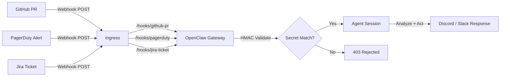

> 💡 **Quick Answer:** Expose the OpenClaw webhook endpoint via Ingress at `/hooks/<name>`, configure hook handlers in `openclaw.json` with HMAC secret validation, and let the agent process GitHub PRs, Jira tickets, PagerDuty alerts, or any HTTP event — all running securely inside your Kubernetes cluster.

## The Problem

DevOps teams need AI-assisted automation for incident response, PR reviews, and ticket triage. Traditional webhook processors require custom code, deployment pipelines, and maintenance. OpenClaw can handle these events natively — but you need proper Kubernetes networking, secret management, and hook configuration to make it production-ready.

## The Solution

### Step 1: Configure Webhook Hooks

Define hooks in your OpenClaw ConfigMap:

```yaml
# configmap.yaml
apiVersion: v1
kind: ConfigMap
metadata:
  name: openclaw-config
  namespace: openclaw
data:
  openclaw.json: |
    {
      "gateway": {
        "bind": "0.0.0.0",
        "port": 18789,
        "auth": true
      },
      "hooks": {
        "github-pr": {
          "secret": "${GITHUB_WEBHOOK_SECRET}",
          "channel": "discord",
          "target": "devops-alerts",
          "prompt": "A GitHub webhook event arrived. Analyze the PR: check for security issues, suggest improvements, and summarize changes. Event payload: {{body}}"
        },
        "pagerduty": {
          "secret": "${PAGERDUTY_WEBHOOK_SECRET}",
          "channel": "discord",
          "target": "on-call",
          "prompt": "PagerDuty incident received. Triage the alert, check recent deployments, and suggest remediation steps. Alert: {{body}}"
        },
        "jira-ticket": {
          "secret": "${JIRA_WEBHOOK_SECRET}",
          "prompt": "New Jira ticket created. Analyze the description, suggest acceptance criteria, estimate complexity, and identify related tickets. Ticket: {{body}}"
        }
      }
    }
```

### Step 2: Store Webhook Secrets

```bash
kubectl create secret generic openclaw-secrets \
  -n openclaw \
  --from-literal=OPENCLAW_GATEWAY_TOKEN="$(openssl rand -hex 32)" \
  --from-literal=ANTHROPIC_API_KEY="sk-ant-..." \
  --from-literal=GITHUB_WEBHOOK_SECRET="whsec_github_..." \
  --from-literal=PAGERDUTY_WEBHOOK_SECRET="whsec_pd_..." \
  --from-literal=JIRA_WEBHOOK_SECRET="whsec_jira_..."
```

### Step 3: Expose Webhook Ingress

```yaml
# ingress-webhooks.yaml
apiVersion: networking.k8s.io/v1
kind: Ingress
metadata:
  name: openclaw-webhooks
  namespace: openclaw
  annotations:
    cert-manager.io/cluster-issuer: letsencrypt-prod
    nginx.ingress.kubernetes.io/proxy-body-size: "10m"
    # Rate limit webhooks to prevent abuse
    nginx.ingress.kubernetes.io/limit-rps: "20"
    nginx.ingress.kubernetes.io/limit-burst-multiplier: "5"
spec:
  ingressClassName: nginx
  tls:
    - hosts:
        - hooks.openclaw.example.com
      secretName: openclaw-webhooks-tls
  rules:
    - host: hooks.openclaw.example.com
      http:
        paths:
          - path: /hooks
            pathType: Prefix
            backend:
              service:
                name: openclaw
                port:
                  number: 18789
```

### Step 4: Configure External Services

**GitHub Webhook:**
```bash
# In your GitHub repo → Settings → Webhooks → Add webhook
# Payload URL: https://hooks.openclaw.example.com/hooks/github-pr
# Content type: application/json
# Secret: whsec_github_...
# Events: Pull requests, Push
```

**PagerDuty Webhook:**
```bash
# PagerDuty → Services → your-service → Integrations
# Add Generic Webhook V3
# URL: https://hooks.openclaw.example.com/hooks/pagerduty
```



### Step 5: Agent Instructions for Webhook Handling

Update `AGENTS.md` in the ConfigMap:

```markdown
# OpenClaw DevOps Agent

## Webhook Handling

When you receive a webhook event:

### GitHub PRs
1. Read the diff summary from the payload
2. Check for security issues (hardcoded secrets, SQL injection, XSS)
3. Check for common K8s misconfigs (missing resource limits, latest tags)
4. Post a summary to #devops-alerts with approve/request-changes recommendation

### PagerDuty Incidents
1. Extract service name and alert details
2. Check recent deployments (last 2 hours)
3. Query Prometheus for related metrics spikes
4. Post triage summary to #on-call with severity assessment

### Jira Tickets
1. Parse title and description
2. Suggest acceptance criteria
3. Estimate story points (S/M/L/XL)
4. Tag with relevant component labels
```

## Common Issues

### Webhook Returns 403

HMAC validation failed. Verify the secret matches:

```bash
# Test locally with the correct secret
curl -X POST https://hooks.openclaw.example.com/hooks/github-pr \
  -H "Content-Type: application/json" \
  -H "X-Hub-Signature-256: sha256=$(echo -n '{"test":true}' | openssl dgst -sha256 -hmac 'whsec_github_...' | awk '{print $2}')" \
  -d '{"test":true}'
```

### Webhook Timeout

Large payloads or slow LLM responses can exceed Ingress timeouts:

```yaml
annotations:
  nginx.ingress.kubernetes.io/proxy-read-timeout: "120"
```

### Events Not Reaching Agent

Check OpenClaw logs for hook processing:

```bash
kubectl logs -n openclaw deploy/openclaw -f | grep -i hook
```

## Best Practices

- **Always validate HMAC signatures** — never accept unauthenticated webhooks
- **Rate limit webhook endpoints** — prevent DoS via NGINX annotations
- **Separate Ingress for webhooks** — different domain/path from the Control UI
- **Use specific event filters** — configure GitHub to send only PR events, not all events
- **Log webhook payloads** — store in agent memory for debugging and audit trails
- **Set timeouts generously** — LLM analysis takes seconds; Ingress defaults (60s) may not be enough

## Key Takeaways

- OpenClaw hooks process webhook events with HMAC validation built in
- Expose webhooks via dedicated Ingress with rate limiting and TLS
- Store webhook secrets in Kubernetes Secrets alongside API keys
- Configure agent instructions (AGENTS.md) with specific handling per event type
- Rate limit and separate webhook Ingress from Control UI access
